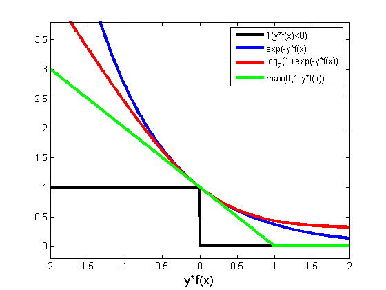

FIXME

## 损失

损失函数(loss function)是用来估量你模型的预测值$f(x)$与真实值$ Y $之间的不一致程度，它是一个非负实值函数,通常使用$L(Y, f(x))$来表示，损失函数越小，模型的鲁棒性就越好。损失函数是经验风险函数的核心部分，也是结构风险函数重要组成部分。模型的结构风险函数包括了经验风险项和正则项，通常可以表示成如下式子：

$$
\theta^* = \arg \min_\theta \frac{1}{N}{}\sum_{i=1}^{N} L(y_i, f(x_i; \theta)) + \lambda\ \Phi(\theta)
$$

其中，前面的均值函数表示的是经验风险函数，$L$代表的是损失函数，后面的$\Phi$是正则化项(regularizer)或者叫惩罚项(penalty term)，它可以是$L1$，也可以是$L2$，或者其他的正则函数。整个式子表示的意思是找到使目标函数最小时的$\theta$值。下面主要列出几种常见的损失函数。

### 1 对数损失函数(logistic回归)

有些人可能觉得logistic回归的损失函数就是平方损失，其实并不是。平方损失函数可以通过线性回归在假设样本是高斯分布的条件下推导得到，而logistic回归得到的并不是平方损失。在logistic回归的推导中，它假设样本服从伯努利分布(0-1分布)，然后求得满足该分布的似然函数，接着取对数求极值。这里需要注意，logistic回归没有求似然函数的极大值，而是将经验风险函数变为负似然函数，即$\mathop{max} F(y,f(x))\rightarrow\mathop{min}-F(y,f(x))$，把求极大化转化为求极小值。从损失函数的视角来看，它就成了$\mathop{log}$损失函数：

$$
L(Y,P(Y|X))=−\mathop{log} P(Y|X)
$$

直接求极大似然估计一般比较困难，而取对数可以方便极大似然估计的计算，所以通常先取对数再求导找极值点。损失函数$L(Y, P(Y|X))$表达的是样本$X$在分类$Y$的情况下，使概率$P(Y|X)$达到最大值。换言之，就是利用已知的样本分布，找到最有可能(即最大概率)导致这种分布的参数值；或者说什么样的参数才能使我们观测到目前这组数据的概率最大。因为$\mathop{log}$函数是单调递增的，所以$logP(Y|X)$也会达到最大值，因此在前面加上负号之后，最大化$P(Y|X)$就等价于最小化$L$了。
logistic回归的表达式如下：

$$
P(Y=y|x)=\frac{1}{1+exp(−yf(x))}
$$

将它带入到上式，通过推导可以得到logistic的损失函数表达式，如下：

$$
L(y,P(Y=y|x))=log(1+exp(−yf(x)))
$$

logistic回归最后得到的目标式如下：

$$
J(\theta) = - \frac{1}{m}[ \sum_{i=1}^m y_i \log h_{\theta}(x_i) + (1-y_i) \log(1-h_{\theta}(x_i))]
$$

如果是二分类的话，则$m$值等于$2$，如果是多分类，$m$就是相应的类别总数。这里需要解释一下：之所以有人认为logistic回归是平方损失，是因为在使用梯度下降来最优解时，它的迭代式子与平方损失求导后的式子非常相似，从而给人一种直观上的错觉。

### 2 平方损失函数(最小二乘法, Ordinary Least Squares )

最小二乘法是线性回归的一种，它将问题转化成一个凸优化问题。在线性回归中，假设样本和噪声都服从高斯分布(为什么假设成高斯分布呢？其实这里隐藏了一个小知识点，就是中心极限定理，可以参考[central limit theorem])，最后通过极大似然估计(MLE)可以推导出最小二乘式。最小二乘的基本原则是：最优拟合直线应该是使输出结果到回归直线的距离和最小的直线，即平方和最小。换言之，最小二乘法是基于距离的，而这个距离就是我们用得最多的欧几里得距离。为它会选择使用欧式距离作为误差度量(Mean squared error，MSE)，主要有以下几个原因：

1. 简单，计算方便；
2. 欧氏距离是一种很好的相似性度量标准；
3. 在不同的表示域变换后特征性质不变。

平方损失(Square loss)的标准形式如下：

$$
L(Y,f(X))=(Y−f(X))^2
$$

当样本个数为$n$时，此时的损失函数变为：

$$
L(Y, f(X)) = \sum _{i=1}^{n}(y_i- f(x_i))^2
$$

$Y-f(X)$表示的是残差，整个式子表示的是残差的平方和，而我们的目的就是最小化这个目标函数值(注：该式子未加入正则项)，也就是最小化残差的平方和(residual sum of squares，RSS)。

 而在实际应用中，通常会使用均方差(MSE)作为一项衡量指标，公式如下：

$$
MSE=\frac{1}{n}\sum_{i=1}^n(y_i−f(x_i))^2
$$

### 3 指数损失函数(Adaboost)

学过Adaboost算法的人都知道，它是前向分步加法算法的特例，是一个加和模型，损失函数就是指数函数。在Adaboost中，经过$m$次迭代之后，可以得到$f_m(x)$:

$$
f_m (x) = f_{m-1}(x) + \alpha_m G_m(x)
$$

Adaboost每次迭代的目的是为了找到最小化下列式子的参数$\alpha$和$G$：

$$
\arg \min_{\alpha, G} = \sum_{i=1}^{N} exp[-y_{i} (f_{m-1}(x_i) + \alpha_m G_m(x_{i}))]
$$

而指数损失函数(exp-loss)的标准形式如下

$$
L(y, f(x)) = \exp[-yf(x)]
$$

可以看出，Adaboost的目标式就是指数损失，在给定$ n $个样本的情况下，Adaboost的损失函数为：

$$
L(y, f(x)) = \frac{1}{n}\sum_{i=1}^{n}\exp[-y_if(x_i)]
$$

### 4 Hinge损失函数(SVM)

在机器学习算法中，Hinge损失函数与SVM是息息相关的。在线性支持向量机中，最优化问题可以等价于下列式子：

$$
\min_{w,b} \ \sum_{i}^{N} [1 - y_i(w\cdot x_i + b)]_{+} + \lambda||w||^2
$$

下面来对式子做个变形，令：

$$
[1 - y_i(w\cdot x_i + b)]_{+} = \xi_{i}
$$
于是，原式就变成了：
$$
\min_{w,b} \ \sum_{i}^{N} \xi_i + \lambda||w||^2
$$
如若取$λ=\frac{1}{2C}$，式子就可以表示成：
$$
\min_{w,b} \frac{1}{C}\left ( \frac{1}{2}\ ||w||^2 + C \sum_{i}^{N} \xi_i\right )
$$
可以看出，该式与下式非常相似：
$$
\frac{1}{m} \sum_{i=1}^{m} l(w \cdot x_i + b, y_i) + ||w||^2  
$$
前半部分中的$l$就是Hinge损失函数，而后面部分相当于$L2$正则项。

Hinge损失函数的标准形式
$$
L(y,\tilde{y})=\mathop{max}(0,1−y\tilde{y}),y=±1
$$
可以看出，当$|y|>=1$时，$L(y)=0$。

### 5 其它损失函数

除了以上这几种损失函数，常用的还有：

##### 5.1 0-1损失函数
$$
L(Y,f(x)) = \begin{cases} 1 & {Y \neq 0} \\ 0 & {Y = 0} \\ \end{cases}
$$
##### 5.2 绝对值损失函数
$$
L(Y,f(X))=|Y-f(X)|
$$
下面来看看几种损失函数的可视化图像：

