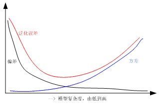
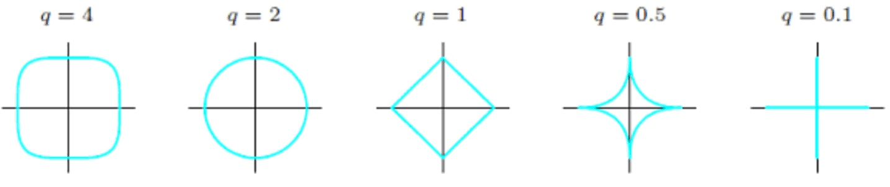
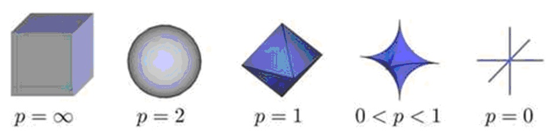
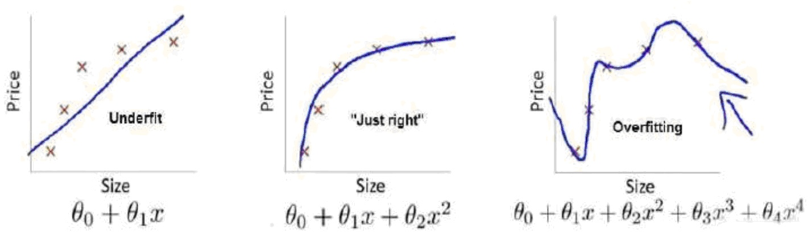
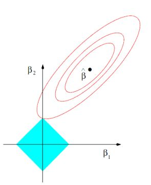

FIXME
# 基本概念

# 正则化(weight decay)

正则化是一种有效的防止过拟合、提高模型泛化能力的方法，在机器学习和深度学习算法中应用非常广泛，本文从机器学习正则化着手，首先阐述了正则化技术的一般作用和概念，然后针对L1和L2范数正则从4个方面深入理解，最后对常用的典型算法应用进行了分析和总结，后续文章将分析深度学习中的正则化技术。

## 1 正则化作用及其常见术语

正则化技术广泛应用在机器学习和深度学习算法中，其本质作用是防止过拟合、提高模型泛化能力的一种技术手段。过拟合简单理解就是训练的算法模型太过复杂了，过分考虑了当前的样本结构。在早期的机器学习领域一般只是将范数惩罚叫做正则化技术，而在深度学习领域认为：能够显著减少方差，而不过度增加偏差的策略都可以认为是正则化技术。

以上提到的方差和偏差的定义如下：

偏差：
$$
bais(\hat{\theta}_m)=E(\hat{\theta}_m)-\theta
$$
其中期望作用在所有数据上，$\theta$是用于定义数据生成分布的$\theta$的真实值。如果$bias(\hat{\theta}_m)=0$，那么估计量$\hat{\theta}_m$被称为是无偏的(unbiased)，这意味着$E(\hat{\theta}_m)=\theta$。

方差：
$$
Var(\hat{\theta}) = \dfrac{1}{m} \sum \limits_{i=1}^{m}(x^{(i)}-\hat{\mu})^2
$$
其中$x^{(i)}$为样本变量，$\hat{\mu}$是总体均值，$m$是样本总数。

因而推广的正则化技术还有有：扩增样本集、EarlyStop、Dropout、集成学习、多任务学习、对抗训练、参数共享等(具体见“花书”)。对于机器学习领域正则化技术可以从以下几个不同角度进行理解：

1. 正则化等价于结构风险最小化，通过在经验风险项后加上模型复杂度的正则化项或惩罚项，达到经验风险和模型复杂度都较小的模型目的。

   经验风险：机器学习中的风险是指模型与真实解之间的误差的积累，经验风险是指使用训练出来的模型进行预测或者分类存在的误差的积累，可以简单理解为训练误差，经验风险最小化即为训练误差最小。

   结构风险：结构风险定义为经验风险与置信风险(置信是指可信程度)的和，置信风险越大，模型推广能力越差。可以简单认为结构风险是经验风险后面多加了一项表示模型复杂度的函数项，从而可以保证模型分类精度(经验风险)的同时，降低模型复杂度，提高泛化能力。
   $$
   R(f) = \frac{1}{n}\sum\limits_{i = 1}^n{L({y_i,f({x_i})})} + \lambda \Omega (f)
   $$
   其中，$R( f )$表示结构风险，$L( {y_i ,f(x_i)} )$表示第$i$个样本的经验风险，$\Omega (f)$是表征模型复杂度的正则项，$\lambda$是正则化参数。根据奥卡姆剃刀定律，“如无必要，勿增实体”，即认为相对简单的模型泛化能力更好。而模型泛化能力强、泛化误差小就表示模型推广能力强，通俗理解就是在训练集中训练得到的优秀模型能够很好的适用于实际测试数据，而不仅仅是减少训练误差或者测试误差。泛化误差定义如下：
   $$
   E = Bias (X) + Var(X) + Noise
   $$
   其中，$E$表示泛化误差，$Bias$代表偏差，$Var$代表方差，$Noise$代表噪声。

   

   从上图可以看出，随着训练程度加深，模型复杂度会增加，偏差减少，方差增大，而泛化误差呈现$U$型变化，对于一个“好的系统”通常要求误差小，正则化的作用就是适当控制模型复杂度，从而使泛化误差曲线取最小值。

2. 正则化等价于带约束的目标函数中的约束项

   以平方误差损失函数和$L2$范数为例，优化问题的数学模型如下：

   $$
   J(\theta) = \sum\limits_{i = 1}^n {({y_i-\theta^Tx_i})^2}
   \\s.t.\begin{array}{*{20}c} {} & {\| \theta \|} \\ \end{array}_2^2 \le C
   $$

   针对上述带约束条件的优化问题，采用拉格朗日乘积算子法可以转化为无约束优化问题，即

   $$
   J( \theta) = \sum\limits_{i = 1}^n {( {y_i - \theta^T x_i } )^2 } + \lambda ( {\| \theta \|_2^2 - C} )
   $$

   由于参数$C$为常数，可以忽略，故上述公式和标准的正则化公式完全一致。

3. 从贝叶斯角度考虑，正则项等价于引入参数的模型先验概率，可以简单理解为对最大似然估计引入先验概率，从而转化为最大后验估计，其中的先验概率对应正则项这部分内容后面详细讲

## 2 机器学习正则化技术基本概念

正则化也可以称为规则化、权重衰减技术，不同的领域叫法不一样，数学上常称为范数，例如$L1$和$L2$范数，统计学领域叫做惩罚项、罚因子，以信号降噪为例：

$$
x(i)^* = \arg \mathop {\min }\limits_{x(i)} \{ F(x(i)) = \frac{1}{2}||y(i) - x(i)||_2^2 + \lambda R(x(i))\}
$$

其中，$x(i) $既可以是原始信号，也可以是小波或者傅立叶变换等的系数，$R(x(i))$是罚函数(范数罚)，$\lambda$是正则项(惩罚项)，$y(i)$是传感器采集到的含噪信号，$I = \{ 0,...,N - 1\}$ ，$N$为信号点数，$x(i)^*$为降噪后的输出，上述公式中的正则化技术作用和机器学习中的完全一样。

下面给出范数的数学公式，方便后面分析：

1.  $p$范数：

$$
L_p = (\sum\limits_{i = 1}^n | x_i  |^p )^{\textstyle{1 \over p}}
$$

2. $L0$范数：0范数表示向量中非零元素的个数(即为其稀疏度)

3. $L1$范数：即向量元素绝对值之和，$p$范数取1则为1范数

$$
\|x\|_1 = \sum\limits_{i = 1}^n \|{x_i}\|
$$

4. $L2$范数：即向量元素绝对值的平方和再开方，也称为欧几里得距离，$p$范数取2则为2范数

$$
\|x\|_2 = \sqrt {\sum\limits_{i = 1}^n \|x_i \|^2 }
$$

5. $\infty$范数: 即所有向量元素绝对值中的最大值，$p$范数取$\infty$则为$\infty$范数

$$
\|x\|_\infty = \mathop {max }\limits_i \|x_i\|
$$

6. $-\infty$范数：即所有向量元素绝对值中的最小值，$p$范数取$-\infty$则为$-\infty$范数

$$
\|x\|_{-\infty} = \mathop {min}\limits_i \|x_i\|
$$

假设向量长度为2维，则有下列图形：

从上述各图可以看出：$q$或$p$越小，曲线越贴近坐标轴，$q$或$p$越大，曲线越远离坐标轴，并且棱角越明显，当$q$或$p$取0时，完全和坐标轴贴合，当$q$或$p$取$\infty$时，呈现正方体形状。同时也可以看出，采用不同的范数作为正则项，会得到完全不同的算法模型结果，故而对于不同要求的模型，应该采用不同的范数作为正则项。

## 3 机器学习正则化技术的深度理解

为了更好的理解正则化技术原理，下面从4个方面进行深度分析，希望对大家理解有帮助。
### 3.1 简单数值假设分析法

此处以$L2$范数讲解，下面的各图形来自吴恩达的机器学习课程。

首先需要明确：左边的曲线拟合是欠拟合，中间的曲线拟合是刚好合适，右边的曲线拟合是过拟合。对于右边的拟合曲线，有

$$
h_\theta (x) = \theta _0 + \theta _1 x_1 + \theta _2 x_2^2 + \theta _3 x_3^3 + \theta _4 x_4^4
$$

从上式可以看出，由于$\theta _3$和$\theta _4$对应了高阶，导致拟合曲线是4阶曲线，出现了过拟合。正则化的目的是适当缩减 $\theta _3$和$\theta _4$的值，例如都为0.0001，则上述曲线本质上等价于

$$
h_\theta(x) = \theta _0 + \theta _1 x_1 + \theta _2 x_2^2
$$

也就是变成了中间的刚好合适的拟合曲线。对$\theta_3$和$\theta_4$增加$L2$正则项后的代价函数表达式为：

$$
J(\theta) = \mathop {\min }\limits_\theta \frac{1}{n}\sum\limits_{i = 1}^n ((h_\theta(x^i) - y^i)^2 + 1000\theta _3^2 + 1000\theta _4^2 )
$$

从上式可以看出，$\theta_3^2$和$\theta_4^2$均大于0，并乘上了1000，要使$J(\theta)$最小，会迫使模型学习到的$\theta_3$和$\theta _4$非常小，因为只有在$\theta_3$和$\theta _4$非常小的情况下整个代价函数值才会取较小值。在实际开发中，是对所有参数进行正则化，为了使代价函数尽可能的小，所有的参数$\theta$的值(不包括$\theta_0$)都会在一定程度上减小，但是减少程度会不一样，从而实现了权重衰减、简化模型复杂度的作用。

### 3.2 图形分析法

此处采用$L1$和$L2$范数讲解，

1. $L2$范数正则
   $$
   J(\beta) = \sum\limits_{i = 1}^n (y_i-\beta^T x_i)^2 + \lambda\|\beta\|_2^2
   $$
   

   蓝色的圆形空间表示$L2$范数空间，设为$\beta _1^2 + \beta _2^2 = r^2$ ，可以看出，当$r$从0逐渐增大时，该圆形也逐渐增大，红色的线表示原始代价函数解空间即$\sum\limits_{i = 1}^n {(y_i-\beta^Tx_i)^2}$，此处为了方便绘图，设参数只有2维。红色圆环上的任何一点都表示一个可行解，即$\hat\beta$代表最佳解空间。

   由于初中数学知识可知，当正则项$\beta _1^2 + \beta _2^2 = r^2$和原代价函数项$\sum\limits_{i = 1}^n (y_i-\beta^Tx_i)^2$这两个空间有交集时候，即代表了一个$J(\beta)$的解，当不存在正则项时候，$\lambda$为0，$J(\beta)$的解即为$\sum\limits_{i = 1}^n(y_i-\beta^T x_i)^2$的解，表示解空间没有受到任何约束，通过样本集训练，不容易直接收敛到最优值$\hat \beta$，出现过拟合，然而在增加了正则项后，随着不断增加$r$取值，原始解空间会被不断压缩，如果选择的$\lambda$合适，则可以将最优点压缩到$\hat \beta$处，从而得到合适的模型。上面就是$L2$范数正则可以避免过拟合的图示。

2. $L1$范数正则
   $$
   J(\beta) = \sum\limits_{i = 1}^n (y_i - \beta ^T x_i)^2 + \lambda \sum\limits_{j = 1}^d \|\beta_j\|
   $$
   

   同上述$L2$范数正则分析一致，$L1$范数对应的解空间图形为菱形，作用和$L2$范数一致。

   需要注意：$L2$范数与原代价函数的交点处所得到的参数$\beta$可以无限缩小，但是一定不会为0，然而$L1$范数与原代价函数的交点一般在坐标轴上，从而使得某些$\beta_i = 0$，得到稀疏解(当然，并没有绝对保证一定交于坐标轴，但是通过实验发现，大部分都可以得到稀疏解)。同时观察上一节的$L_0$范数的解空间图形发现：如果使用$L_0$范数正则，则可以保证一定得到稀疏解，但是由于$L_0$范数的实际求解是NP问题，难以计算，故在实际应用中一般都是采用L1范数代替$L_0$范数得到稀疏解，可以简单认为$L_1$范数是$L_0$范数的凸近似。

### 3.3 公式推导分析法

此处采用损失函数为误差平方和、正则项为$L1$和$L2$范数的线性回归为例讲解。增加$L2$正则项后其代价函数为：

$$
J(\theta) =\frac{1}{2m}[\sum\limits_{i = 1}^m (y_i - h_\theta (x_i))^2 + \lambda \sum\limits_{j = 1}^n \theta_j^2]
$$

其中$m$为样本个数，$n$为特征个数，$\sum\limits_{i = 1}^m (y_i - h_\theta (x_i))^2$为原代价函数，$\sum\limits_{j = 1}^n \theta_j^2$为$L2$范数。为了最小化代价函数，直接对各$\theta_j$进行求导然后等于0即可求得估计值(具体推导请查阅其他文献)，可得：

$$
\theta_j : = \theta_j (1-\frac{\alpha \lambda}{m}) + \frac{\alpha}{m}\sum\limits_{i = 1}^m (y_i-h_\theta (x_i))\frac{\partial{h_\theta (x_i)}}{\partial{\theta_j}}
$$

从上式可以看出：$\alpha$为步长，$0<1-\frac{\alpha\lambda}{m}<1$，很明显$L2$范数的作用就是对每一个$\theta_j$进行了一定程度的缩减。

对于$L1$正则项后其代价函数为：

$$
J(\theta) = \frac{1}{2m}[\sum\limits_{i = 1}^m (y_i - h_\theta (x_i))^2 + \lambda\sum\limits_{j = 1}^n \|\theta_j\|]
$$

直接对各$\theta_j$进行求导然后等于0即可求得估计值：

$$
\theta_j : = \theta_j-\frac{\alpha \lambda}{m}{\mathop{\rm sgn}} (\theta_j)+\frac{\alpha}{m}\sum\limits_{i = 1}^m (y_i - h_\theta (x_i)) \frac{\partial{h_\theta (x_i)}}{\partial{\theta_j}}
$$

$$
\mathop{\rm sgn} (\theta_j) = \begin{cases} 1 & {\theta_j > 0} \\ 0 & {\theta_j = 0} \\ { - 1} & {\theta_j < 0} \\ \end{cases}
$$

从上式可以看出：当上一轮$\theta_j$大于0时，下一次更新$\theta_j$一定减少，当上一轮$\theta_j$小于0时，下一次更新$\theta_j$一定增加，也就是说每一轮训练$\theta_j$都是一定往0方向靠近，最终可得近似的稀疏解。

从上述公式可以看出，在$\| {\theta_j } \|<1$情况下，由于$L2$范数正则作用，每次$\theta_j$都是减少$\frac{\alpha \lambda}{m}\theta_j$，而L1范数正则作用下，每次$\theta_j$都是减少$\frac{\alpha \lambda}{m}{\mathop{\rm sgn}} (\theta_j )$，很明显参数优化速度$L1$快于$L2$。
