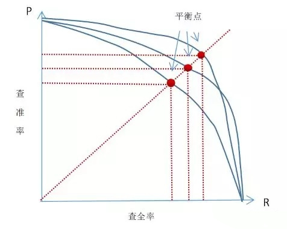
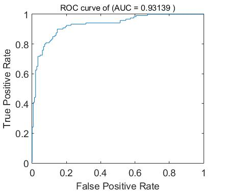
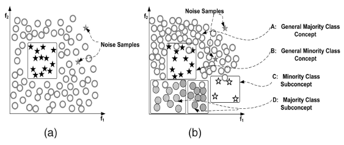
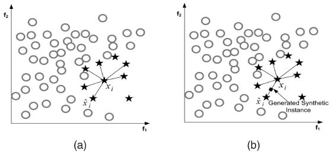
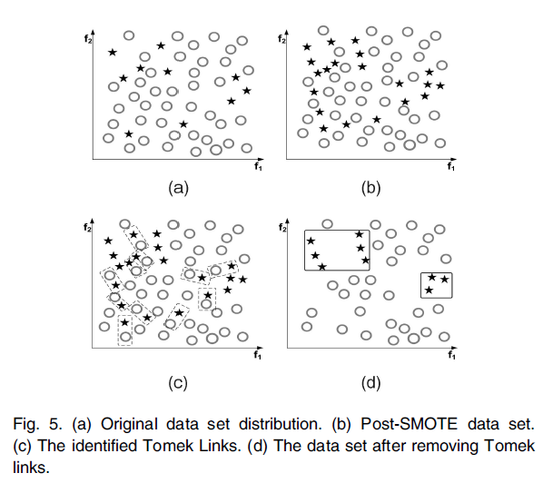
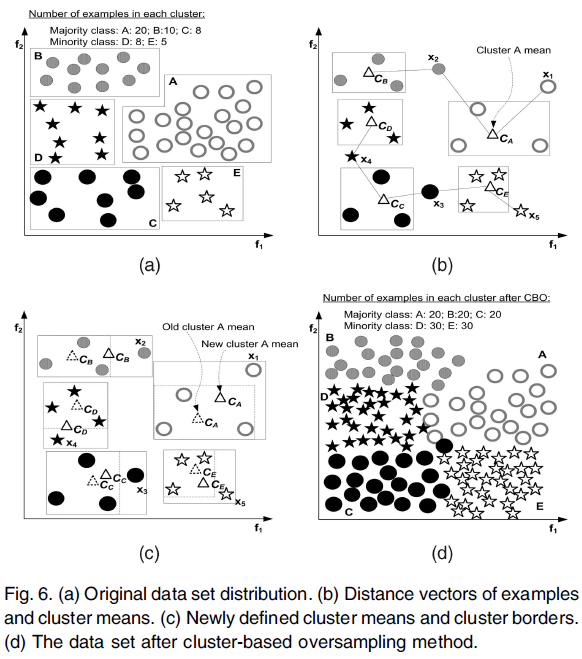
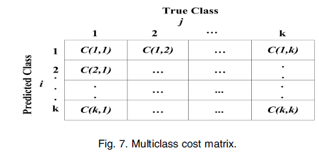

# 应用技巧

本章节介绍机器学习中的一些应用技巧。

## 非均衡数据

非均衡数据（Inbanlanced data）被定义为，在有监督学习当中，对于分类问题，不同分类的训练数据的数量占数据总量的比例不同，有一些分类占总数据量的比例过小。而学术和工业中使用的大部分模型，都基于数据分布是均匀的这种假设。这种时候，由于占比较少的分类得不到足够有效的训练，无法提取对于分类有用的信息，因而出现分类错误的情况。所以在少数类上，模型经常无法做出准确的判断。

特别是在少数事件检测类问题，如信用卡诈骗，癌症检测，产品缺陷检测等，由于问题本身的属性，要检测的目标样本占总体样本的比例较小，导致模型racall偏低，无法有效工作。

> 为什么这类问题中，目标样本偏少呢？
>
> 试想，如果某年的体检，患癌人数超过了50%，那么这已经不是一个简单的概率统计问题了。。。

### 一些衡量指标的介绍

介绍非均衡数据的解决方式之前，先来了解一下准确率（accuracy），精确率（precision），召回（recall）和f分值（f-score）的概念。

以癌症检测为例，样本为阳性，实际有癌症表示为Positive，简写为P，样本为阴性，实际无癌症表示为Negative，简写为N，判断准确为True，判断错误为False，则下述表格可以表示一个模型对样本判断的情况：

|            | 模型判断有癌症（P）  | 模型判断无癌症（N）  |
| ---------- | -------------------- | -------------------- |
| 实际有癌症 | True Positive（TP）  | False Negative（FN） |
| 实际无癌症 | False Positive（FP） | True Negative（TN）  |

表中的内容解释如下：

- True Positive（TP）：表示样本实际有癌症，而且模型判断有癌症，也就是模型结果是正确的，病人需要及时治疗。
- False Positive（FP）：表示样本实际无癌症，但是模型判断有癌症，也就是模型错误的把没有癌症的病人判断为有癌症，这种时候，医生最终会对病人表示很抱歉。
- False Negative（FN）：表示实际有癌症，但是模型判断没有癌症，这是最糟糕的情况，病人很有可能会延误最佳治疗时机，已经不是表示抱歉能够弥补得了。
- True Negative（TN）：实际无癌症，模型判断也没有癌症，这是最喜闻乐见的情况。

准确率（accuracy）定位为，模型判断结果与实际结果吻合的比例：
$$
accuracy = \frac{TP+TN}{TP+FP+FN+TN}
$$
但是在癌症检测中，这样的衡量标准是有问题的。做个假设，体检数据有1W份，其中只有一个癌症案例。那么如果我们构建一个模型，针对任何输入都输出无癌症，则这个模型中$TN=9999, FN=1$， 其他均为0。最终这个模型的准确率为$accuracy=9999/10000=99.99\%$。看上去这个模型的结果已经吊打绝大部分同类模型了。但是，我们知道，这个结果是没有任何意义的。

那么什么样的结果才有意义呢？

为了应对这种情况，我们引入精确率（precision），召回（recall）的概念，定义：
$$
\begin{aligned}
precision &= \frac{TP}{TP+FP} \\
recall &= \frac{TP}{TP+FN}
\end{aligned}
$$

解释如下：

- 精确度（precision）定义为模型判定为正的样本中有多少实际为正。以上述例子解释，模型找到的癌症患者中，有多少确实是有癌症的。
- 召回（recall）定位为模型判定为正的样本，占实际为正的样本的比例。以癌症例子解释，模型找到的患者，占实际患癌症的患者的比例。

回到刚才的例子，可以很明确的看到，这里的例子$precision=recall=0$，上述假设的模型确实没有任何意义。这两个指标很好的衡量了模型的性能。

同时，可以看出，这两者是相互矛盾的一对参数。查准率可以认为是”宁缺毋滥”，适合对准确率要求高的应用，例如商品推荐，网页检索等。查全率可以认为是”宁错杀一百，不放过1个”，适合类似于检查走私、逃犯信息等。

针对不同的模型，使用这两个指标进行衡量的时候，需要综合考虑两个参数的值。一种方式为PR曲线，如下图：

通过调整最终结果的阈值，记录$preision, recall$的变化并绘制曲线。当存在交叉时，可以计算曲线围住面积。

平衡点（BEP）是另外一种度量方式，取$preision=recall$。

很多时候，用两个指标来衡量模型并不方便，特别是不同的模型进行比较的时候，而平衡点又过于简化，丢掉了很多有意义的特征比较。为此，引入f分（f-score）的概念，最常用的是f1（f1-score），定义如下：
$$
\begin{aligned}
f1 &= 2\times\frac{precision\times recall}{precision + recall} \\
    &=\frac{2}{\frac{1}{precision}+ \frac{1}{recall}}\\
    &= 2\times\frac{TP}{2\times TP + FN+FP}
\end{aligned}
$$
更一般的f分定义为：
$$
\begin{aligned}
f_{score} &= (1+\beta^2)\times\frac{precision\times recall}{\beta^2\times precision + recall} \\
    &=\frac{1+\beta^2}{\frac{1}{precision}+ \frac{\beta^2}{recall}}\\
\end{aligned}
$$
根据不同的目的，选择不同的$\beta$值，以使最终的标准倾向于recall或者precision。

统计学中$f_{0.5},f_2$也是比较常用的衡量标准，可以看出$f_{0.5}$中，precision的权重较大，而$f_2$中，recall的权重较大。

另外一个比较重要的性能指标为ROC（AUC）曲线。

定义真正例率（True Positive Rate，TPR）和假正例率（False Positive Rate，FPR）如下：
$$
\begin{aligned}
TPR &= \frac{TP}{TP+FP} \\
FPR &= \frac{FP}{TN+FP}
\end{aligned}
$$
可以看到，这里TPR与precision的定义是一样的，而FPR则是换了一个角度，从反例出发来考虑。

下图为ROC曲线示意图，现实任务中通常利用有限个测试样例来绘制ROC图，因此产生的曲线一般不会很光滑。

绘图过程很简单：给定m个正例子，n个反例子，根据模型预测结果进行排序，先把分类阈值设为最大，使得所有例子均预测为反例，此时TPR和FPR均为0，在（0，0）处标记一个点，再将分类阈值依次设为每个样例的预测值，即依次将每个例子划分为正例。设前一个坐标为(x,y)，若当前为真正例，对应标记点为(x,y+1/m)，若当前为假正例，则标记点为（x+1/n,y），然后依次连接各点。就得到上图的曲线。多个模型对比中，如果一个模型的曲线完全包住了另外一个模型的曲线，则被包住的模型性能较差。如果曲线有交叉的情况，则要计算曲线围住的面积，即AUC。AUC较大者为优。

### 非均衡问题的分类
非均衡问题有多种形式：

-  intrinsic：数据固有属性，数据集中的正负样本数目不太可能相等

癌症检测类问题就属于这种。

-  extrinsic：由于传输等外部问题造成的非均衡数据集

这种是外部原因，由于种种原因，无法得到足够多的有效数据。

-  relaitive imbalanced：正例数量足够多，但相对于负例，正例相对较少

例如有10W正样本，1000W的负样本，这种时候，正负比例达到1：100，但是这种规模的数据一般来说是足够的。例如十年来全国的体检数据，癌症患者的总数是足够多的。

-  absolute rarity：正例数量非常少，缺少数据

例如只有100正样本，1W负样本的情况，正负比例仍然是1：100，但是100的数据量，对绝大部分的学习任务来说，都不是足够的。例如某年某单位的体检数据，甚至很大可能一个癌症患者都没有（我们最希望的情况）。

- within-class imbalanced：类内部不均衡问题

例如癌症患者中，中老年患者比较多，但是青少年到儿童的比例就很少，那么最后训练出来的模型就不太擅长查找青少年患癌的情况。

而在不同的场景中，又可能会出现多种情况并存，需要具体问题具体分析。

> 这里将需要检测的目标分类样本成为正样本，也就是较少的那部分数据。而在一些讨论非均衡数据的场合，常将数量较少的称为负类，这只是叫法的不同，没有本质区别。

参考下图：

a中圆形和五星就有不平衡的问题，而且仅看这个图，五星是绝对少数。

b中仍然是圆形和五星，看两个分类内部，五星内还分两个簇，类内存在不均衡。

### 非均衡数据的处理

通过对衡量标准的介绍，可以看到，在少数事件检测类的问题中，少数事件本身是最终检测的目的。

对于相对不均衡类的问题，少数类样本仍然是足够的，可以通过一些简单的手段如欠采样来训练模型。但是对于绝对不均衡类的问题，样本太少，可能无法学习到足够的特征进行分类判断。

同时，类内不平衡的问题，由于类内的少数样本不足，可能导致某些样本被错误判断。

解决非均衡数据的方式主要有以下几类：

#### 采样方法

##### 随机过采样和欠采样

- 随机过采样（Random Oversampling）：向少数类中添加数据，可通过复制少数类数据等，使得少数类和多数类数目相等。缺点是添加了重复数据，可能导致数据过拟合（overfit）
- 随机欠采样（Random Undersampling）：从多数类中减掉数据，使得多数类和少数类数目相等。缺点是可能会丢失一些重要的数据。

这是最简单的处理方式。

##### Informed Undersampling

Informed Undersampling主要有3种算法：EasyEnsemble、BalanceCascade、K-nearest neighbour（KNN）主要目的是克服传统随机欠采样导致的数据丢失问题。

- EasyEnsemble：多次欠采样（放回采样）产生多个不同的训练集，进而训练多个不同的分类器，通过组合多个分类器的结果得到最终的结果。
- BalanceCascade：先通过一次欠采样产生训练集，训练一个分类器，对于那些分类正确的多数类样本不放回，然后对这个更小的多数类样本下采样产生训练集，训练第二个分类器，以此类推，最终组合所有分类器的结果得到最终结果。
-   KNN：使用K近邻的方法挑选出一些K个样本，至于什么算是邻近的样本，则需要按照使用的算法和实际场景进行定义。

##### Synthetic Sampling with Data Generation

synthetic minority oversampling technique（SMOTE）算法，算法在minority中，基于特征空间相似度，人工创造一些数据。

具体为针对每一个少数类样本中的数据，选择这个数据临近的k个数据，根据一定的计算公式来计算新的数据，如下图所示：

但是，由于针对所有少数类样本生成数据，可以预见生成的很多新数据，在空间分布上位于少数类内部，所以不能带来足够决定特征分布的信息，因此容易出现过拟合问题。

##### Adaptive Synthetic Sampling

为了克服SMOTE的缺点，Adaptive Synthetic Sampling方法被提出，主要包括：Borderline-SMOTE和Adaptive Synthetic Sampling（ADA-SYN）算法。

- Borderline-SMOTE：对靠近边界的minority样本创造新数据。其与SMOTE的不同是：SMOTE是对每一个minority样本产生综合新样本，而Borderline-SMOTE仅对靠近边界的minority样本创造新数据。
- ADA-SYN：根据majority和minority的密度分布，动态改变权重，决定要generate多少minority的新数据。

##### Sampling with Data Cleaning Techniques

Tomek links用于去除重叠数据，其主要思想是：找出最近距离的2个样本（这2个样本属于不同的类），然后将这2个样本都去除，直到某一样本周围的近邻都是属于同一类。如下图：

图(a)表示原始数据，在原始数据中有数据重叠的现象；图(b)表示SMOTE之后的数据，比(a)中新添加了一些数据；图(a)表示Tomek links被找出；图(d)是删除Tomek links后的数据，可以看出，不同的聚类可以比较明显的分辨出。

##### Cluster-based Sampling Method

基于聚类的采样算法（cluster-based sampling method，CBO）用来解决类内和类间数据的不平衡问题。其利用K-means技术，如下图，可以很好地解释CBO的原理：

首先，利用聚类算法，查找到合理的聚类，将数据划分为不同的簇，这是图中a->b->c的过程。之后根据聚类结果，平衡所有簇以及分类间的样本数目。首先找到样本数目最大的类，这里是样本聚类A，有20个样本，所以圆形的每个簇都需要过采样补齐到20个样本。同时圆形有三个簇，所以圆形的总样本数达到20×3=60个。这时五星有两个簇，则五星每个簇需要达到60/2=30个样本。最终的结果如图d所示。这里，簇内过采样，可以使用SMOTE算法。

##### Integration of Sampling and Boosting

- SMOTEBoost：基于SMOTE和Adaboost.M2的算法，其在boosting的每次迭代中都引入了SMOTE的方法，因此生成的每个分类器都集中于minority类，因为最后集成而得的分类器性能较好。

- DataBoost-IM：其将数据生成技术和Adaboost.M1结合，在没有牺牲majority类准确度的情况下，提高minority的预测率。DataBoost-IM根据类间difficult-to-learn比率去生成综合样本。这种方法在解决强不平衡数据方面有很好的性能，但是可能依赖于较适合的数据生成方法。

#### 代价敏感方法

 采样方法主要考虑正负例的分布，而代价敏感方法主要考虑误分类样本的代价，通过代价矩阵来度量。

##### 代价矩阵

如图：

如上图：C(i, j)表示j类的样本被误分类为i类的代价。

  在二元分类中，C(Min, Maj)表示Majority类的样本被误分类到Minority的代价，C(Maj, Min)表示Minority类的样本被误分类到Majority类的代价，因此C(Maj, Min)>C(Min, Maj)。  最终，判断的标准是使得所有样本的代价和尽可能小。被正确分类，则代价为0。

##### Cost-Sensitive Dataspace Weighting with Adaptive Boosting

3个代码敏感的Boosting函数，AdaC1、AdaC2、AdaC3。  AdaBoost.M1的主要思想是迭代更新训练集的分布。有几种不同的算法，它们的区别是将一个参数变量设置在指数外面、指数里面等。

##### Cost-Sensitive Decision Trees

代价敏感的决策树应用主要有三种形式：

- 代价敏感调整可以用于决策阈值，使用ROC刻画性能取值范围，ROC曲线的特征点用作最后的阈值。
- 对于每个节点的拆分标准，可以作为代价敏感的考虑因素。
- 可以在决策树上应用代价敏感的剪枝。在不平衡数据，直接移除掉概率低于某一特定阈值的节点，会发现移除的数据大多都是minority的数据，因此，应将重点放在概率估计上，使得剪掉的是positive的数据。

##### Cost-Sensitive Neural Networks

代价敏感性在神经网络上的应用主要有4个方面：

- 代价敏感变更可以应用到概率评估上
- 神经网络的输出也可以是代价敏感的
- 代价敏感变更适用于学习参数
- 最小误差函数可以用来预期代价。

#### 基于核的算法和不平衡数据的积极学习算法

##### 基于核函数的采样算法GSVM-RU（Granular Support Vector Machines-Repetitive Undersampling）算法

GSVM算法的思想：

- 通过观察本地子集重要性和全局关联的trade-off分析内部数据的分布。
- 通过使用平行计算提高计算效率。

GSVM-RU算法通过在欠采样过程中迭代学习步骤，充分利用了GSVM。因为在不平衡数据中，minority的数据认为是positive的，而线性SVM通过postive的sample和一些其他的sample训练。SVM将negative的sample标记为支持向量（因此叫做NLSVs），为了使训练集更小，这些negative的数据被移除。基于这个变小了的数据集，一个新的线性SVM和NLSV产生，并且NLSV形成的negative被移除，如此循环，得到多个negative的granular，最后，考虑全局关联的聚集操作被用来从这些迭代的negative granular中选择特定的样本集，将这些负样本和正样本组成训练集训练SVM模型。这样，GSVM-RU模型使用SVM去欠采样，形成多个信息颗粒，这些granular最后组合在一起训练SVM。

（2）有一些已有的对解决不平衡数据的基于核函数的算法的成果，和积极学习算法进行了论述。

需要注意的是，这里讨论的不平衡数据的处理，都是在进行模型构建之前的预处理工作，不涉及模型训练的过程。如果考虑模型的训练过程，则不平衡数据还有其他的一些处理方式，例如后面即将提到的 HardExample。
