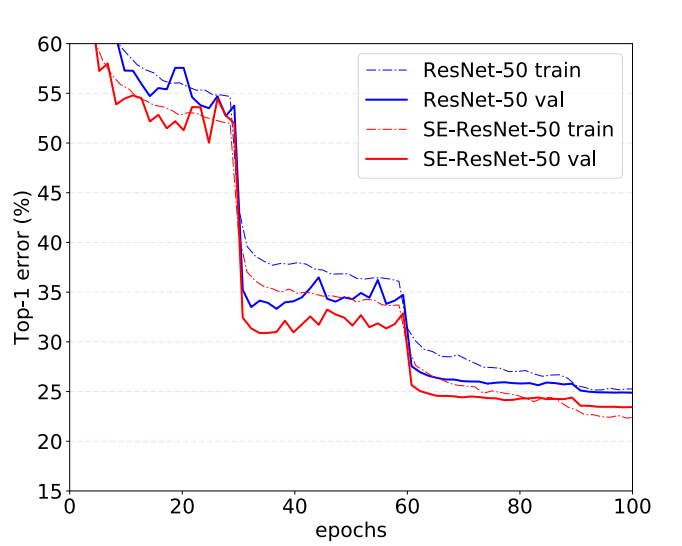

## Early Stop

在模型训练的过程中，随着时间的增长，epoch数增加，通过对训练集的学习，模型在训练集上的loss会越来越低，模型的复杂度随之增加。而当模型复杂度增加到一定的程度之后，在验证集上，模型的loss不再降低，同时验证集上的准确度不再提升甚至下降。也就是，这种时候，模型发生了过拟合的问题，泛化能力降低。

这种情况，避免过拟合出现的方式之一，就是EarlyStop。做法比较简单，就是在验证集准确度不再上升的时候停止训练。这种做法比较符合直观感受，准确度都已经不再提升了，那么继续训练只会浪费计算资源。

执行EarylyStop的一个比较重要的条件就是怎么才能算准确度已经不再提升了呢？事实上，随着训练的进行，经常可以看到类似下图的一个loss下降曲线：

可以明显的看到，在30-60个epoch中间有一段loss是不在下降的，但是过了这一段之后，又有明显的下降。

> 一般这种断崖式的下降，多由于Learning Rate Decay造成。而当Learning Rate Decay已经不再产生明显效果的时候，则需要考虑其他的一些优化手段，或者执行Early Stopping。

一般的做法是，在训练的过程中，记录到目前为止最好的validation accuracy，当连续10次Epoch（或者更多次）没达到最佳accuracy时，则可以认为accuracy不再提高了。此时便可以停止迭代了（Early Stopping）。这种策略也称为“No-improvement-in-n”，n即Epoch的次数，可以根据实际情况取，如10、20、30……
