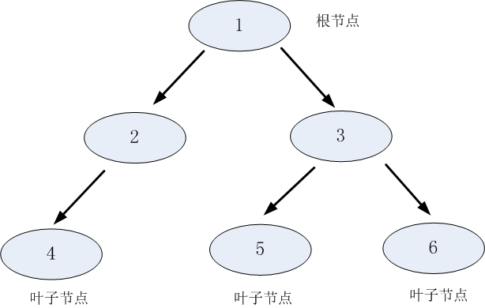
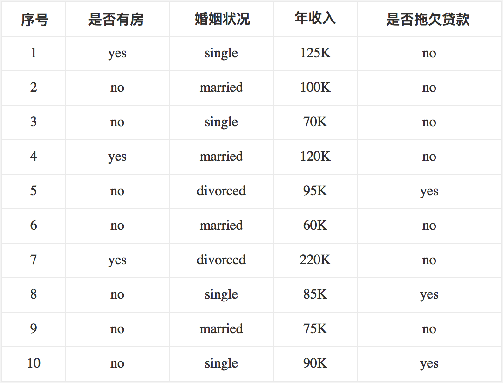
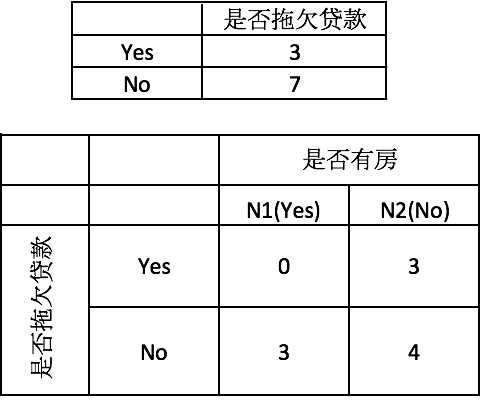

# 决策树

## 什么是决策树

​	决策树(Decision Tree）是在已知各种情况发生概率的基础上，通过构成决策树来求取净现值的期望值大于等于零的概率，评价项目风险，判断其可行性的决策分析方法，是直观运用概率分析的一种图解法。由于这种决策分支画成图形很像一棵树的枝干，故称决策树。在机器学习中，决策树是一个预测模型，他代表的是对象属性与对象值之间的一种映射关系。 父节点和子节点是相对的，说白了子节点由父节点根据某一规则分裂而来，然后子节点作为新的父亲节点继续分裂，直至不能分裂为止。而根节点是没有父节点的节点，即初始分裂节点，叶子节点是没有子节点的节点，如下图所示：

​	决策树利用如上图所示的树结构进行决策，每一个非叶子节点是一个判断条件，每一个叶子节点是结论。从跟节点开始，经过多次判断得出结论。

## **决策树的构建**

1：将所有的数据看成是一个节点；

2：从所有的数据特征中挑选一个数据特征对节点进行分割；

3：生成若干孩子节点，对每一个孩子节点进行判断，如果满足停止分裂的条件，进入步骤4；否则，进入步骤2；

4：设置该节点是子节点，其输出的结果为该节点数量占比最大的类别。

​      从上述步骤可以看出，决策生成过程中有两个重要的问题：

1：数据如何分割

2：如何选择分裂的属性

3：什么时候停止分裂

###	数据分割

​	分裂属性的数据类型分为离散型和连续性两种情况，对于离散型的数据，按照属性值进行分裂，每个属性值对应一个分裂节点；对于连续性属性，一般性的做法是对数据按照该属性进行排序，再将数据分成若干区间，如[0,10]、[10,20]、[20,30]…，一个区间对应一个节点，若数据的属性值落入某一区间则该数据就属于其对应的节点。

### 选择分裂属性

​	决策树采用贪婪思想进行分裂，即选择可以得到最优分裂结果的属性进行分裂。那么怎样才算是最优的分裂结果？最理想的情况当然是能找到一个属性刚好能够将不同类别分开，但是大多数情况下分裂很难一步到位，我们希望每一次分裂之后孩子节点的数据尽量”纯” 。如果属性1分裂后每个节点的两类的数量大致相同，跟根节点的分类结果相比完全没有提高，属性2分裂后每个节点各类的数量相差比较大，则可以认为属性2分裂后的孩子节点比属性1分裂后的孩子节点更纯。

**信息增益**： 用信息增益表示分裂前后跟的数据复杂度和分裂节点数据复杂度的变化值， 假定离散属性$a$有$V$个可能的取值${a1, a2, …, av}$, 若使用$a$来对样本集$D$进行划分，则信息增益计算公式为：

$$
Gain(D, a) = Ent(D) -\sum_{v=1}^V{\frac{|D^v|}{|D|}}Ent(D^v)
$$
​	其中$Ent$表示节点的复杂度，$Ent$越高，说明复杂度越高。信息增益就是分裂前的数据复杂度减去孩子节点的数据复杂度的和，信息增益越大，分裂后的复杂度减小得越多，分类的效果越明显。

​	节点的复杂度可以用以下两种不同的计算方式：

1. “信息熵”（information entropy）是度量样本集合纯度最常用的一种指标。 熵描述了数据的混乱程度，熵越大，混乱程度越高，也就是纯度越低；反之，熵越小，混乱程度越低，纯度越高。 熵的计算公式如下所示：

$$
Ent(D) = - \sum_{k=1}^{|y|}{p_k\log p_k}
$$

2. 基尼值：基尼系数是一种不等性度量，用来度量任何不均匀分布，基尼值越大，数据越不纯。 基尼值计算公式如下：
   $$
   Gini(D) =1 - \sum_{k=1}^{|y|}{p_k^2}
   $$

**信息增益率**：信息增益准则其实是对可取值数目较多的属性有所偏好 ，为减少这种偏好可能带来的不利影响， 可以使用“增益率”(gain ratio)来选择最优划分属性。
$$
Gain\_ratio(D, a) = \frac{Gain(D, a)}{IV(a)}
$$

$$
IV(a) = -\sum_{v=1}^V\frac{|D^v|}{|D|}\log_2\frac{|D^v|}{|D|}
$$

​	从公式中可以看出，$IV(a)$其实能够反映出当选取该属性，分成的$V$类别数越大，$IV(a)$就越大，如果仅仅只用信息增益来选择属性的话，那么我们偏向于选择分成子节点类别大的那个特征。所以我们在选取候选划分属性中找出信息增益高于平均水平的属性（这样保证了大部分好的的特征），再从中选择增益率最高的（又保证了不会出现编号特征这种极端的情况）

### 停止分裂条件###

​	决策树不可能不限制地生长，总有停止分裂的时候，最极端的情况是当节点分裂到只剩下一个数据点时自动结束分裂，但这种情况下树过于复杂，而且预测的经度不高。一般情况下为了降低决策树复杂度和提高预测的经度，会适当提前终止节点的分裂。

　　以下是决策树节点停止分裂的一般性条件：

　　（1）最小节点数

　　当节点的数据量小于一个指定的数量时，不继续分裂。两个原因：一是数据量较少时，再做分裂容易强化噪声数据的作用；二是降低树生长的复杂性。提前结束分裂一定程度上有利于降低过拟合的影响。

　　（2）熵或者基尼值小于阀值。

​     由上述可知，熵和基尼值的大小表示数据的复杂程度，当熵或者基尼值过小时，表示数据的纯度比较大，如果熵或者基尼值小于一定程度数，节点停止分裂。

　　（3）决策树的深度超过了最大深度

　  节点的深度可以理解为节点与决策树跟节点的距离，如根节点的子节点的深度为1，因为这些节点与跟节点的距离为1，子节点的深度要比父节点的深度大1。决策树的深度是所有叶子节点的最大深度，当深度到达指定的上限大小时，停止分裂。

　　（4）所有特征已经使用完毕，不能继续进行分裂。

​     被动式停止分裂的条件，当已经没有可分的属性时，直接将当前节点设置为叶子节点。

## 剪枝 ##

​	剪枝(pruning)是决策树学习算法对付“过拟合”的主要手段，剪枝的基本策略有“预剪枝”（prepruning）和“后剪枝”（post-pruning）。

1. 预剪枝是在决策树生成过程中，若对节点的划分不能带来决策树泛化性能的提升，则停止划分并将当前节点标记为叶节点；  预剪枝降低了过拟合的风险，显著减少了决策树的训练时间开销和预测时间开销。预剪枝基于“贪心”算法，增加了决策树欠拟合的风险。

2. 后剪枝则是先从训练集生成一颗完整的决策树，然后自低向上进行剪枝。后剪枝决策树的欠拟合的风险很小，泛化性能往往优于预剪枝决策树，但训练时间开销相对要大的多。 由完全树$T_0$开始，剪枝部分结点得到$T_1$，再次剪枝部分结点得到$T_2$...直到剩下树根的树$T_k$；在验证数据集上对这$k$个树分别评价，选择损失函数最小的树$Ta$。设树$T$的叶结点个数为$|T|$，$t$是树$T$的叶结点，该叶结点有$Ni$个样本点，其中$k$类的样本点有$N_{ik}$个，$k=1,2,...,K$。$ H_t(T)$为叶结点$t$上的经验熵，$α≥0$为参数，则决策树学习的损失函数可定义为：
   $$
   C_{\alpha}(T) = \sum_{t=1}^{|T|}N_t \cdot H(T) + \alpha |T|
   $$
   其中经验熵为 :
   $$
   H_t(T) = \sum_{t=1}^{|T|}{\frac{N_{tk}}{N_t} \log _{2} \frac{N_{tk}}{N_t}}
   $$
   这时有：
   $$
   C_{\alpha}(T) = C(T) + \alpha |T|
   $$
   $C(T)$表示模型对训练数据集的预测误差，即模型与训练数据集的拟合程度。$|T|$表示模型的复杂度，参数$α≥0$控制两者之间的影响。较大的$α$促使选择较简单的模型（树），较小的$α$促使选择较复杂的模型（树），当$α=0$时意味着只考虑模型与训练数据的拟合程度，不考虑模型复杂度。

   假定当前对以$r$为根的子树剪枝，剪枝后，只保留$r$本身而删掉所有的子结点。 以$r$为根的子树：

   - 剪枝后的损失函数：$ C_\alpha(r) = C(r) + \alpha$
   - 剪枝前的损失函数：$C_\alpha(R) = C(R) + \alpha \cdot |R_{leaf}|$
   - 令二者相等，求得：$\alpha = \frac{C(r) - C(R)}{R_{leaf} -1}$,$\alpha$称为结点$r$的剪枝系数。

   对于给定的决策树$T_0$：

   - 计算所有内部结点的剪枝系数；
   - 查找最小剪枝系数的结点，剪枝得决策树$T_k$；
   - 重复以上步骤，直到决策树$T_k$只有一个结点；
   - 得到决策树序列$T_0,T_1,T_2...T_k$;
   - 使用验证样本集选择最优子树。

## CART

### 构建过程

CART有以下三个特点：

（1）CART既能是分类树，又能是分类树；

（2）当CART是分类树时，采用Gini值作为节点分裂的依据；当CART是回归树时，采用样本的最小方差作为节点分裂的依据；

（3）CART是一棵二叉树。

根据训练数据集，从根结点开始，递归地对每个结点进行以下操作，构建二叉决策树：

1. 设结点的训练数据集为$D$，计算现有特征对该数据集的$Gini$系数。此时，对每一个特征$A$，对其可能取的每个值$a$，根据样本点对$A=a$的测试为“是”或 “否”将$D$分割成$D1$和$D2$两部分，计算$A=a$时的Gini系数。
2. 在所有可能的特征$A$以及它们所有可能的切分点$a$中，选择Gini系数最小的特征及其对应的切分点作为最优特征与最优切分点。依最优特征与最优切分点，从现结点生成两个子结点，将训练数据集依特征分配到两个子结点中去。
3. 对两个子结点递归地调用步骤1~2，直至满足停止条件。
4. 生成CART决策树。

### 举例###

有以下训练集：

	首先对数据集非类标号属性{是否有房，婚姻状况，年收入}分别计算它们的Gini系数增益，取Gini系数增益值最大的属性作为决策树的根节点属性。根节点的Gini系数
$$
Gini(是否拖欠贷款)=1-(\frac3{10})^2-(\frac7{10})^2=0.42
$$
​	当根据是否有房来进行划分时，Gini系数增益计算过程为

$$
Gini(左子节点)=1-(\frac03)^2-(\frac33)^2=0\\
Gini(右子节点)=1-(\frac37)^2-(\frac47)^2=0.4898\\
\Delta\{是否有房\}=0.42-\frac7{10}\times0.4898-\frac3{10}\times0=0.077
$$
​	若按婚姻状况属性来划分，属性婚姻状况有三个可能的取值{married，single，divorced}，计算划分后的分组情况：{married} | {single,divorced}；{single} | {married,divorced}；{divorced} | {single,married}的Gini系数增益。

​	当分组为{married} | {single,divorced}时，$S_l$表示婚姻状况取值为married的分组，$S_r$表示婚姻状况取值为single或者divorced的分组 ：
$$
\Delta\{婚姻状况\}=0.42-\frac4{10}\times0-\frac6{10}\times\big[1-(\frac{3}{6})^2-(\frac{3}{6})^2\big]=0.12
$$
​	当分组为{single} | {married,divorced}时：
$$
\Delta\{婚姻状况\}=0.42-\frac4{10}\times0.5-\frac6{10}\times\big[1-(\frac{1}{6})^2-(\frac{5}{6})^2\big]=0.053
$$
​	当分组为{divorced} | {single,married}时：
$$
\Delta\{婚姻状况\}=0.42-\frac2{10}\times0.5-\frac8{10}\times\big[1-(\frac{2}{8})^2-(\frac{6}{8})^2\big]=0.02
$$
​	对比计算结果，根据婚姻状况属性来划分根节点时取Gini系数增益最大的分组作为划分结果，也就是{married} | {single,divorced}。

​	对于年收入属性为数值型属性，首先需要对数据按升序排序，然后从小到大依次用相邻值的中间值作为分隔将样本划分为两组。例如当面对年收入为60和70这两个值时，我们算得其中间值为65。倘若以中间值65作为分割点。$S_l$作为年收入小于65的样本，$S_r$表示年收入大于等于65的样本，于是则得Gini系数增益为：
$$
\Delta(年收入)=0.42-\frac{1}{10}\times 0-\frac{9}{10}\times\big[1-(\frac{6}{9})^2-(\frac{3}{9})^2\big]=0.02
$$
​	其他值的计算同理可得，最终各增益结果如下：

​	接下来，采用同样的方法，分别计算剩下属性，其中根节点的Gini系数为（此时是否拖欠贷款的各有3个records）
$$
Gini(是否拖欠贷款)=1-(\frac3{6})^2-(\frac3{6})^2=0.5
$$
​	与前面的计算过程类似，对于是否有房属性，可得 :
$$
\Delta\{是否有房\}=0.5-\frac4{6}\times\big[1-(\frac{3}{4})^2-(\frac{1}{4})^2\big]-\frac2{6}\times0=0.25
$$
​	对于年收入属性则有：

	最后我们构建的CART如下图所示：

### CART剪枝

 	CART采用CCP（代价复杂度）剪枝方法。代价复杂度选择节点表面误差率增益值最小的非叶子节点，删除该非叶子节点的左右子节点，若有多个非叶子节点的表面误差率增益值相同小，则选择非叶子节点中子节点数最多的非叶子节点进行剪枝。

​	对任意内部节点t，剪枝前的状态：有$|Tt|$ 个叶子节点，预测误差是$C(Tt)$，剪枝后的状态：只有本身一个叶子节点，预测误差是$C(t)$，因此剪枝前的以t节点为根节点的子树的损失函数是:
$$
C_{\alpha}(T_t)=C(T_t)+\alpha |T_t|
$$

​	剪枝后的损失函数是：
$$
C_{\alpha}(t)=C(t)+\alpha
$$

​	易得，一定存在一个表面误差率增益值 $α $使得$Cα(Tt)=Cα(t)$ ，这个值为：
$$
\alpha = \frac{C(t)-C_(T_t)}{|T_t|-1}
$$
​	选择表面误差率增益值最小的非叶子节点（若多个非叶子节点具有相同小的表面误差率增益值，选择节点数最多的非叶子节点），对进行剪枝。
