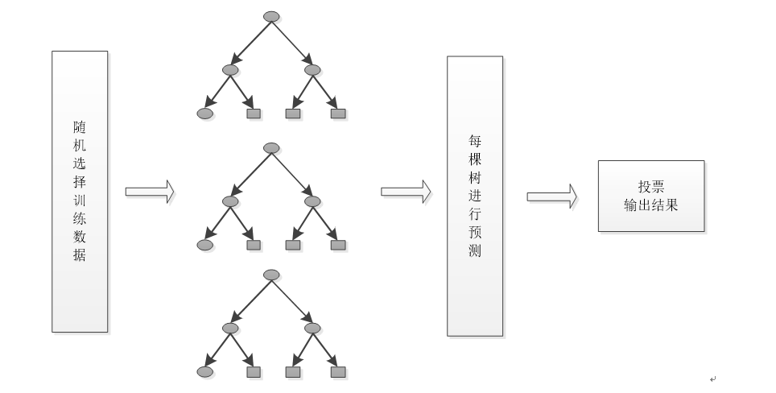
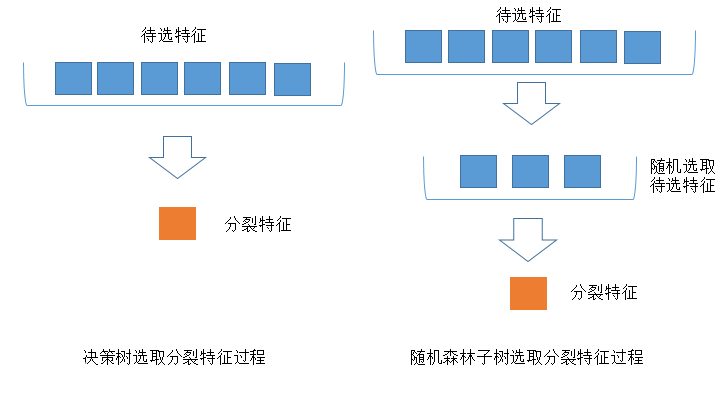

# 随机森林

## 随机森林简介

​	随机森林顾名思义，是用随机的方式建立一个森林，森林里面有很多的决策树组成，随机森林的每一棵决策树之间是没有关联的。在得到森林之后，当有一个新的输入样本进入的时候，就让森林中的每一棵决策树分别进行一下判断，看看这个样本应该属于哪一类（对于分类算法），然后看看哪一类被选择最多，就预测这个样本为那一类。 随机森林其实就是通过集成学习的思想将多棵树集成的一种算法，它的基本单元是决策树，随机采样(bootstrap)就是从我们的训练集里面采集固定个数的样本，但是每采集一个样本后，都将样本放回。也就是说，之前采集到的样本在放回后有可能继续被采集到。对于我们的Bagging算法，一般会随机采集和训练集样本数m一样个数的样本。这样得到的采样集和训练集样本的个数相同，但是样本内容不同。如果我们对有m个样本训练集做T次的随机采样，由于随机性，T个采样集各不相同。 

　　其实从直观角度来解释，每棵决策树都是一个分类器（假设现在针对的是分类问题），那么对于一个输入样本，N棵树会有N个分类结果。而随机森林集成了所有的分类投票结果，将投票次数最多的类别指定为最终的输出，如果是回归问题就用回归均值的方法，这就是一种最简单的 Bagging 思想。

## 随机森林的构建

根据下列算法而建造每棵树：

1. 用*N*来表示训练用例（样本）的个数，*M*表示特征数目。

2. 输入特征数目*m*，用于确定决策树上一个节点的决策结果；其中*m*应远小于*M*。

3. 从*N*个训练用例（样本）中以有放回抽样的方式，取样*N*次，形成一个训练集（即bootstrap取样），并用未抽到的用例（样本）作预测，评估其误差。

4. 对于每一个节点，随机选择*m*个特征，决策树上每个节点的决定都是基于这些特征确定的。根据这m个特征，计算其最佳的分裂方式。

5. 每棵树都会完整成长而不会剪枝，这有可能在建完一棵正常树状分类器后会被采用。

在构建上有有两个重要方面：数据的随机性选取，以及待选特征的随机选取。

1. 数据的随机选取：

​        首先，从原始的数据集中采取有放回的抽样，构造子数据集，子数据集的数据量是和原始数据集相同的。不同子数据集的元素可以重复，同一个子数据集中的元素也可以重复。第二，利用子数据集来构建子决策树，将这个数据放到每个子决策树中，每个子决策树输出一个结果。最后，如果有了新的数据需要通过随机森林得到分类结果，就可以通过对子决策树的判断结果的投票，得到随机森林的输出结果了。如下图，假设随机森林中有3棵子决策树，2棵子树的分类结果是A类，1棵子树的分类结果是B类，那么随机森林的分类结果就是A类。

2. 待选特征的随机选取

​        与数据集的随机选取类似，随机森林中的子树的每一个分裂过程并未用到所有的待选特征，而是从所有的待选特征中随机选取一定的特征，之后再在随机选取的特征中选取最优的特征。这样能够使得随机森林中的决策树都能够彼此不同，提升系统的多样性，从而提升分类性能。下图中，蓝色的方块代表所有可以被选择的特征，也就是目前的待选特征。黄色的方块是分裂特征。左边是一棵决策树的特征选取过程，通过在待选特征中选取最优的分裂特征，完成分裂。右边是一个随机森林中的子树的特征选取过程。

## 随机森林的袋外错误率

​	构建随机森林的一个关键问题就是如何选择最优的特征个数m，要解决这个问题主要依据计算袋外错误率oob error（out-of-bag error）。

　　 随机森林有一个重要的优点就是，没有必要对它进行交叉验证或者用一个独立的测试集来获得误差的一个无偏估计。它可以在内部进行评估，也就是说在生成的过程中就可以对误差建立一个无偏估计。

　　 我们知道，在构建每棵树时，我们对训练集使用了不同的bootstrap sample（随机且有放回地抽取）。所以对于每棵树而言（假设对于第k棵树），大约有1/3的训练实例没有参与第k棵树的生成，它们称为第k棵树的oob样本。

　　而这样的采样特点就允许我们进行oob估计，它的计算方式如下（以样本为单位）：

　　1）对每个样本，计算它作为oob样本的树对它的分类情况（约1/3的树）；

　　2）然后以简单多数投票作为该样本的分类结果；

　　3）最后用误分个数占样本总数的比率作为随机森林的oob误分率。

## 随机森林的优缺点

随机森林的主要优点有：

1） 训练可以高度并行化，对于大数据时代的大样本训练速度有优势。个人觉得这是的最主要的优点。

2） 由于可以随机选择决策树节点划分特征，这样在样本特征维度很高的时候，仍然能高效的训练模型。

3） 在训练后，可以给出各个特征对于输出的重要性

4） 由于采用了随机采样，训练出的模型的方差小，泛化能力强。

5） 相对于Boosting系列的Adaboost和GBDT， 随机森林实现比较简单。

6） 对部分特征缺失不敏感。

随机森林的主要缺点有：

1）在某些噪音比较大的样本集上，随机森林模型容易陷入过拟合。

2 )  取值划分比较多的特征容易对RF的决策产生更大的影响，从而影响拟合的模型的效果。