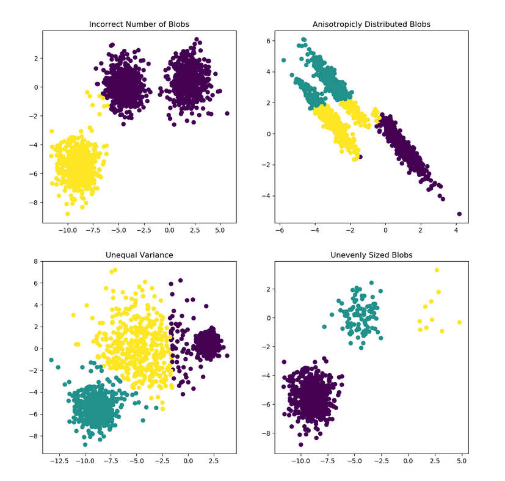
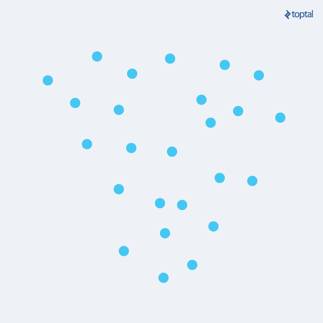
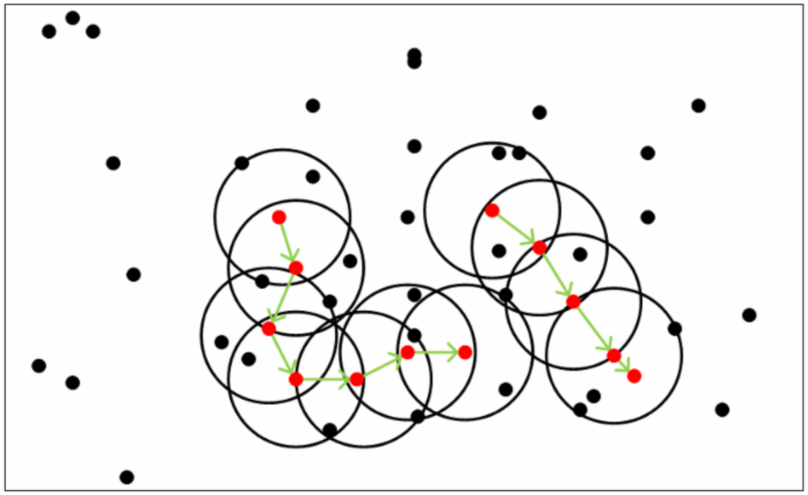

# 聚类
## 1 概述
ＦＩＸＭＥ

聚类就是对大量未标注的数据集，按照数据内部存在的数据结构特征将数据集划分为若干类，使类内的数据比较相似，类间的数据比较相异，属于无监督学习方法。
聚类算法的重点是计算数据之间的相似度，即数据间的距离。

## 2 距离度量
ＦＩＸＭＥ

对函数$dist(\cdot,\cdot)$，若它是一个“距离度量”(distance measure)，则需满足一些基本性质:

非负性: $dist(x_i,x_j) \geq 0$;
同一性: $dist(x_i,x_j) = 0$当且仅当$x_i=x_j$;
对称性: $dist(x_i,x_j) = dist(x_j,x_i)$;
直递性: $dist(x_i,x_j) \leq dist(x_i,x_k) + dist(x_k,x_j)$

给定样本$x_i = (x_{i1};x_{i2};...;x_{in})$与$x_j=(x_{j1};x_{j2};...;x_{jn})$，最常用的距离度量是闵可夫斯基距离(Minkowski distance)
$$
dist_{mk}(x_i,x_j)=(\sum \limits_{u=1}^n |x_{iu}-x_{ju}|^p)^{\frac{1}{p}}
$$

对$p \geq 1$，闵可夫斯基距离显然满足距离度量的基本性质。

$p=2$时，闵可夫斯基距离就是欧式距离(Euclidean distance)
$$
dist_{ed}(x_i,x_j)=\|x_i-x_j\|_2=\sqrt{\sum \limits_{u=1}^n |x_{iu}-x_{ju}|^2}
$$
$p=1$时，闵可夫斯基距离就是曼哈顿距离(Manhattan distance)
$$
dist_{man}(x_i,x_j)=\|x_i-x_j\|_1=\sum \limits_{u=1}^n |x_{iu}-x_{ju}|
$$

除了闵可夫斯基距离外，还有:

1. 切比雪夫距离:
$$
dist(x_i,x_j) = max(|x_i-x_j|,|y_i-y_j|)
$$
标准化欧式距离: 由于数据各维度分量的分布不同，那就先将各个分量都"标准化"到均值和方差都相等，然后再使用欧式距离

2. 马氏距离:

假设两个样本向量分别为$\vec{x}$和$\vec{y}$，样本分布的均值分别为$\mu(\vec{x})$和$\mu(\vec{y})$，协方差为$S(\vec{x},\vec{y})$，那么马氏距离为
$$
dist(\vec{x},\vec{y})=\sqrt{(\vec{x}-\vec{y})^TS(\vec{x},\vec{y})^{-1}(\vec{x}-\vec{y})}
$$

如果样本集合的协方差矩阵是单位矩阵，马氏距离就等于欧式距离。

3. 夹角余弦:
$$
dist(x_i,x_j)=\frac{x_i \cdot x_j}{|x_i||x_j|}
$$

## 3 常见聚类算法

ＦＩＸＭＥ

### 3.1 原型聚类

原型聚类就是“基于原型的聚类”(Prototype-based Clustering)，"原型"的定义是指样本空间中具有代表性的点，如质心点(即同一类别样本点向量的均值)，基于质心点的聚类算法最经典的就是k-means算法。原型聚类假设聚类结构能通过一组原型刻画，通常算法先对原型进行初始化，然后对原型进行迭代更新求解。采用不同的原型表示、不同的求解方式，将产生不同的算法。下面介绍几种著名的原型聚类算法。

#### 3.1.1 k-means算法
k-means算法是一种使用广泛的最基础的聚类算法，其思想非常简单， 对于给定的样本集，按照样本之间的距离大小，将样本集划分为k个簇，让簇内的点尽量紧密地连在一起，而让簇间的距离尽量大。
我们将k-means算法的思想转化为数学模型，假设簇类划分为$(C_1,C_2,...,C_k)$，则k-means算法的目标是最小化平方误差:
$$
E=\sum \limits_{i=1}^{k} \sum \limits_{x \in C_i} \|x-\mu_i\|_2^2
$$
其中，$\mu_i=\dfrac{1}{|C_i|}\sum \limits_{x \in C_i}x$，是簇$C_i$的均值向量，有时也称为质心; $\|x-\mu_i\|^2$代表每个样本点到均值点的欧氏距离。

假设输入样本集$D=\{x_1,x_2,..,x_m\}$，则k-means算法步骤为:
1. 从样本集$D$中随机选择$k$个样本作为初始类别中心$\{\mu_1,\mu_2,...,\mu_k\}$;
2. 对任一样本$x_i$，将其标记为距离最近的类别中心$\mu_j$所属的类j;
3. 更新每个类别中心点$\mu_j$为隶属于该类别的所有样本的均值
4. 循环以上操作，直到达到某个中止条件

中止条件:
- 达到预设的迭代次数
-  最小平均误差MSE小于预设值
- 簇中心点变化率小于预设值

k-means算法的缺点:
- 只针对服从正太分布的簇类样本效果较好，对长条型或者环状型的簇类样本无法适用;
- 参数k需要人为设定
- 初始类别中心的选择对算法迭代次数和结果的影响都非常大

### 3.１.2 吸引力传播算法(Affinity Propagation)

吸引力传播算法是基于数据点间的“信息传递”的一种聚类算法。与k-means算法不同，吸引力传播算法不需要在运行算法之前确定聚类的类别个数。吸引力传播算法寻找的聚类中心点是数据集合中实际存在的点，作为每类的代表。

算法描述：
假设${x_1,x_2,...,x_n}$是数据样本集，数据间没有任何内在结构的假设。令$S$是一个刻画点之间相似度的矩阵，使得$s(i,j) > s(i,k)$当且仅当$x_i$与$x_j$的相似性程度要大于其与$x_k$的相似性。

吸引力传播算法进行交替两个消息传递的步骤，以更新两个矩阵：

- 吸引信息矩阵$R$：$r(i,k)$描述了数据对象$k$适合作为数据对象$i$的聚类中心的程度，表示的是从$i$到$k$的消息；
- 归属信息矩阵$A$：$a(i,k)$描述了数据对象$i$选择数据对象$k$作为其聚类中心的合适程度，表示从$k$到$i$的消息。

两个矩阵$R$和$A$中的全部初始化为０，吸引力传播算法通过以下步骤迭代进行：
1. 吸引信息$r_{t+1}(i,k)$按照
$$
r_{t+1}(i,k)=s(i,k)-\max \limits_{k' \neq k} \{a_t(i,k') + s(i,k')\}
$$
迭代。其中，$t$是迭代次数。

2. 归属信息$a_{t+1}(i,k)$按照

$$
a_{t+1}(i,k) = \min[0,r_t(k,k) + \sum \limits_{i' \notin \{i,k\}} \max \{0,r_t(i',k)\}], i \neq k
$$
和
$$
a_{t+1}(k,k)=\sum \limits_{i' \neq k} \max\{0,r_t(i',k)\}
$$
迭代。
3. 对以上步骤进行迭代，直至满足中止条件，算法结束。

为了避免振荡，吸引力传播算法更新信息时引入了衰减系数$\lambda$。每条信息被设置为它前次迭代更新值的$\lambda$倍加上本次信息更新值的$1-\lambda$倍。其中，衰减系数$\lambda$是介于0到1之间的实数。那么第t+1次$r(i,k)$，$a(i,k)$的迭代值：

$$
r_{t+1}(i,k) = \lambda r_t(i,k) + (1-\lambda)r_{t+1}(i,k)
$$

$$
a_{t+1}(i,k) = \lambda a_t(i,k) + (1-\lambda)a_{t+1}(i,k)
$$

吸引力传播算法的优点：

- 不需要提供聚类的类别数$k$

缺点：
- 复杂度太高，计算量太大

### 3.2 密度聚类

#### 3.2.1 DBSCAN

DBSCAN(Density-Based Spatial Clustering of Applications with  Noise，具有噪声的基于密度的聚类方法)是一种很典型的密度聚类算法，和K-Means，BIRCH这些一般只适用于凸样本集的聚类相比，DBSCAN既可以适用于凸样本集，也可以适用于非凸样本集。下面我们就对DBSCAN算法的原理做一个总结。

DBSCAN是一种基于密度的聚类算法，这类密度聚类算法一般假定类别可以通过样本分布的紧密程度决定。同一类别的样本，他们之间的紧密相连的，也就是说，在该类别任意样本周围不远处一定有同类别的样本存在。

通过将紧密相连的样本划为一类，这样就得到了一个聚类类别。通过将所有各组紧密相连的样本划为各个不同的类别，则我们就得到了最终的所有聚类类别结果。

在介绍算法之前先介绍一些概念:

- $\varepsilon$邻域: 对于样本点$x_i$，和它的距离在$\varepsilon$之内的属于样本集$D$中的点的集合，即$N_{\varepsilon}(x_j)=\{s_i \in D\|dist(x_i,x_j)\leq\varepsilon\}$
- 核心对象: 若$x_j$的$\varepsilon$邻域至少包含$MinPts$个样本，即$\|N_{varepsilon}(x_j)\| \geq MinPts$，那么$x_j$是一个核心对象。其实也就是在核心对象周围的点相对邻域参数来说是致密的。
- 密度直达与可达: 直达的意思是点$x_j$位于点$x_i$的$\varepsilon$邻域中，且$x_i$是核心对象。可达的意思是存在这么一个样本序列$p_1,p_2,...,p_n$，$x_j$到$p_1$是直达的，$p_1$到$p_2$是直达的，就这样不断地借着这些样本作为“跳板”，$x_j$可以间接地“跳到”$x_i$。
- 密度相连: 对于样本点$x_j$和$x_i$若存在点$x_k$使得$x_j$和$x_i$均可由$x_k$密度可达，则称$x_j$和$x_i$密度相连。

从上图可以很容易理解上述定义，图中MinPts=5，红色的点都是核心对象，因为其$\varepsilon$邻域至少有5个样本。黑色的样本是非核心对象。所有核心对象密度直达的样本在以红色核心对象为中心的超球体内，如果不在超球体内，则不能密度直达。图中用绿色箭头连起来的核心对象组成了密度可达的样本序列。在这些密度可达的样本序列的$\varepsilon$邻域内所有的样本相互都是密度相连的。

基于以上概念，DBSCAN所定义的簇类的概念为：由密度可达关系导出的最大的密度相连样本集合。具体来说，给定邻域参数$(\varepsilon,MinPts)$，簇$C \subseteq D$是满足以下性质的非空样本子集:

连接性(connectivity): $x_i \in C$，$x_j \in C \Rightarrow x_i$与$x_j$密度相连

最大性(maximality): $x_i \in C$，$x_j$由$x_i$密度可达$\Rightarrow x_j \in C$

那么，如何从数据集$D$中找出满足以上性质的聚类簇呢? DBSCAN使用的方法很简单，它任意选择一个没有类别的核心对象作为种子，然后找到所有这个核心对象能够密度可达的样本集合，即为一个聚类簇。接着继续选择另一个没有类别的核心对象去寻找密度可达的样本集合，这样就得到另一个聚类簇。一直运行到所有核心对象都有类别为止。

于是，DBSCAN算法先任选数据集中的一个核心对象为"种子"(seed)，再由此出发确定相应的聚类簇，

基本上这就是DBSCAN算法的主要内容了，是不是很简单？但是我们还是有三个问题没有考虑。

第一个是一些异常样本点或者说少量游离于簇外的样本点，这些点不在任何一个核心对象的周围，在DBSCAN中，我们一般将这些样本点标记为噪音点。

第二个是距离的度量问题，即如何计算某样本和核心对象样本的距离。在DBSCAN中，一般采用最近邻思想，采用某一种距离度量来衡量样本距离，比如欧式距离。这和KNN分类算法的最近邻思想完全相同。对应少量的样本，寻找最近邻可以直接去计算所有样本的距离，如果样本量较大，则一般采用KD树或者球树来快速的搜索最近邻。

第三种问题比较特殊，某些样本可能到两个核心对象的距离都小于$\varepsilon$，但是这两个核心对象由于不是密度直达，又不属于同一个聚类簇，那么如果界定这个样本的类别呢？一般来说，此时DBSCAN采用先来后到，先进行聚类的类别簇会标记这个样本为它的类别。也就是说BDSCAN的算法不是完全稳定的算法。

下面我们对DBSCAN聚类算法的流程做一个总结:

输入: 样本集$D=\{x_1,x_2,...,x_m\}$，邻域参数$(\varepsilon, MinPts)$，样本距离度量方式

输出: 簇划分$C$

1. 初始化核心对象集合$\Omega = \varnothing$，初始化聚类簇数$k=0$，初始化未访问样本集合$\Gamma = D$，簇划分$C=\varnothing$

2. 对于$j = 1,2,...,m$，按下面的步骤找出所有的核心对象：

   (a) 通过距离度量方式，找到样本$x_j$的$\varepsilon-$邻域子样本集$N_\varepsilon(x_j)$

   (b) 如果子样本集中样本个数满足$|N_\varepsilon| \geq MinPts$，将样本$x_j$加入核心对象样本集合: $\Omega = \Omega \bigcup \{x_j\}$

3. 如果核心对象集合$\Omega = \varnothing$，则算法结束，否则转入步骤4

4. 在核心对象集合$\Omega$中，随机选择一个核心对象$o$，初始化当前簇核心对象队列$\Omega_{cur}={0}$，初始化类别序号$k=k+1$，初始化当前簇样本集合$C_k = {o}$，更新未访问样本集合$\Gamma = \Gamma - {o}$

5. 如果当前簇核心对象队列$\Omega_{cur} = \varnothing$，则当前聚类簇$C_k$生成完毕, 更新簇划分$C={C_1,C_2,...,C_k}$，更新核心对象集合$\Omega = \Omega - C_k$，转入步骤3

6. 在当前簇核心对象队列$\Omega_{cur}$中取出一个核心对象$o'$，通过邻域距离阈值$\varepsilon$找出所有的$\varepsilon-$邻域子样本集$N_\varepsilon(o')$，令$\bigtriangleup = N_\varepsilon(o') \bigcap \Gamma$，更新当前簇样本集合$C_k = C_k \bigcup \bigtriangleup$，更新未访问样本集合$\Gamma = \Gamma - \bigtriangleup$，更新$\Omega_{cur} = \Omega_{cur} \bigcup (N_\varepsilon(o') \bigcap \Omega)$，转入步骤5

输出结果为: 簇划分$C = {C_1,C_2,...,C_k}$

和传统的K-Means算法相比，DBSCAN最大的不同就是不需要输入类别数$k$，当然它最大的优势是可以发现任意形状的聚类簇，而不是像k-means，仅适用于凸样本集聚类。另外，它在聚类的同时还可以找出异常点，这点和BIRCH算法类似。

那么我们什么时候需要用DBSCAN来聚类呢？一般来说，如果数据集是稠密的，并且数据集不是凸的，那么用DBSCAN会比K-Means聚类效果好很多。如果数据集不是稠密的，则不推荐用DBSCAN来聚类。

下面对DBSCAN算法的优缺点做一个总结。

DBSCAN的优点:
- 可以对分布特殊(非凸，互相包络，长条形等)的稠密数据集进行聚类
- 可以在聚类的同时发现异常点或噪声，从而对异常点或噪声不敏感 
- 不需要事先指定簇类的个数 

缺点:
- 当样本集的密度分布不均匀时，聚类质量较差
- 如果样本集较大时，聚类收敛时间较长，此时在搜索最近邻时需要建立KD树或者球树来进行算法加速。
- 需要对距离阈值$\varepsilon$和邻域样本数阈值$MinPts$联合调参，不同的参数组合对最后的聚类效果有较大的影响。
- 对于高维数据距离的计算会比较麻烦，容易造成“维数灾难”

### 3.3 层次聚类

层次聚类(bierarchical clustering)试图在不同层次对数据集进行划分，从而形成树形的聚类结构。数据集的划分可采用"自底向上"的聚合策略，也可采用"自顶层向下"的分拆策略。

AGNES是一种采用自底向上聚合策略的层次聚类算法，它先将数据集中的每个样本看作一个初始聚类簇，然后在算法运行的每一步中找出距离最近的两个聚类簇进行合并，该过程不断重复，直至达到预设的聚类簇个数。这里的关键是如何计算聚类簇之间的距离。实际上，每个簇是一个样本集合，因此，只需采用关于集合的某种距离即可。例如，给定聚类簇$C_i$与$C_j$，可通过下面的式子来计算距离:

- 最小距离: $d_{min}(C_i,C_j) = min_{x \in C_i,z\ in C_j}dist(x,z)$
- 最大距离: $d_{max}(C_i,C_j) = max_{x \in C_i,z \in C_j}dist(x,z)$
- 平均距离: $d_{avg}(C_i,C_j) = \dfrac{1}{|C_i||C_j|}\sum \limits_{x \in C_i} \sum \limits_{z \in C_j} dist(x,z)$

显然，最小距离由两个簇的最近样本决定，最大距离由两个簇的最远样本决定，而平均距离则由两个簇的所有样本共同决定，当聚类簇距离由$d_{min}$ 、$d_{max}$或$d_{avg}$计算时，AGNES算法被相应地称为"单链接"(single-linkage) 、"全链接"(complete-linkage)或"均链接"(average-linkage)算法。

层次聚类算法如下:

输入: 样本集$D=\{x_1,x_2,...,x_m\}$; 聚类簇距离度量函数$d$; 聚类簇数$k$

过程:
1:     for $j=1,2,...,m$ do
2:        $C_j={x_j}$
3:     end for
4:     for $i=1,2,...,m$ do
5:        for $j=1,2,...,m$ do
6:           $M(i,j)=d(C_i,C_j)$;
7:           $M(j,i)=M(i,j)
8:         end for
9:    end for
10:  设置当前聚类簇个数: $q=m$
11:   while $q>k$ do
12:       找出距离最近的两个聚类簇$C_{i^*}$和$C_{j^*}$;
13:   合并$C_{i^*}$和$C_{j^*}$: $C_{i^*}=C_{i^*} \bigcup C_{j^*}$;
14:   for $j=j^*+1,j^*+2,...,q$ do
15:       将聚类簇$C_j$重新编号为$C_{j-1}$
16:   end for
17:   删除距离矩阵$M$的第$j^*$行与第$j^*$列;
18:   for $j=j^*+1,j^*+2,...,q-1$ do
19:       $M(i^*,j)=d(C_{i^*},C_j)$;
20:       $M(j,i^*)=M(i^*,j)
21:   end for
22:   $q=q-1$
23:   end while
输出: 簇划分$C={C_1,C_2,...,C_k}$

层次聚类算法的优点:
- 可以通过聚类树了解整个聚类过程
- 想要分多少个簇类都可以直接根据树结构来得到，改变簇类数目不需要再次计算数据点的归属

缺点:
- 计算量较大，每次都要计算多个簇类内所有数据点的两两距离。

## 4 聚类性能评估

聚类算法作为非监督学习的一员，由于不存在数据标注，因此其性能的评价不像评估监督学习算法那样简单直接，需要许多指标来进行评估。

### 4.1 调整兰德指数(Adjusted Rand Index)
想要理解调整兰德指数，就必须先说一下兰德指数。

假定样本集合为$S=\{o_1,o_2,...,o_n\}$，给出聚类类别结果表示为$X=\{X_1,X_2,...,X_R\}$，参考类别结果为$Y=\{Y_1,Y_2,...,Y_K\}$，下面给出一些概念: 

-  集合$S_a = \{ (x_i, x_j) | x_i, x_j \in X_r； x_i, x_j \in Y_k \}$，表示无论是聚类类别结果和参考类别结果，集合中的样本配对$x_i,x_j$都被分到了同一类别。a代表集合$S_a$中样本配对的数量。
-  集合$S_b = \{ (x_i, x_j) | x_i \in X_{r1}, x_j \in X_{r2}； x_i \in Y_{k1}, x_j \in Y_{k2} \}$，表示无论是聚类类别结果和参考类别结果，集合中的样本配对$x_i,x_j$都没有被分到了同一类别。b代表集合$S_b$中样本配对的数量。
-  集合$S_c = \{ (x_i, x_j) | x_i, x_j \in X_r； x_i \in Y_{k1}, x_j \in Y_{k2} \}$，表示在聚类类别结果中，集合$c$中的样本配对$x_i,x_j$属于同一类别； 在参考类别结果中，集合中的样本配对$x_i,x_j$不属于同一类别。c代表集合$S_c$中样本配对的数量。
-  集合$S_d = \{ (x_i, x_j) | x_i \in X_{r1}, x_j \in X_{r2}； x_i, x_j \in Y_k \}$，表示在聚类类别结果中，集合中的样本配对$x_i,x_j$不属于同一类别； 在参考类别结果中，集合中的样本配对$x_i,x_j$属于同一类别。d代表集合$S_d$中样本配对的数量。

那么兰德指数可以定义为
$$
RI = \dfrac{a+b}{a+b+c+d} = \dfrac{a+b}{\left(\begin{matrix} n \\ 2 \end{matrix}\right)}
$$
$a+b$是聚类类别结果和参考类别结果一致的样本配对数量，相应的，$c+d$是不一致的样本配对数量，两者之和就是所有样本配对的总和，即从$n$个样本中随意抽取2个的组合数，也就是$\left(\begin{matrix} n \\ 2 \end{matrix}\right) = \dfrac{n(n-1)}{2}$。

观察兰德指数的数学定义，不难发现兰德指数是个在0~1之间的数，等于0表示聚类结果和参考结果两者完全不一致，等于1表示聚类结果和参考结果两者完全一致。

在聚类结果随机产生的情况下，兰德指数不能保证为零，于是调整兰德系数(Adjusted Rand Index)被提出，它具有更高的区分度，它的数学表达式为: 
$$
ARI = \dfrac{RI-E(RI)}{max(RI)-E(RI)}
$$
ARI的取值范围为$[-1,1]$，值越大意味着聚类结果与真实情况越吻合。从广义的角度来讲，ARI衡量的是两个数据分布的吻合程度。

优点:

- 对任意数量的聚类中心和样本数，随机聚类的ARI都非常接近于0；

- 取值在$[-1,1]$之间，负数代表结果不好，越接近于1越好；

- 对聚类结构没有先验假设要求。

缺点:

- 需要真实的数据标签。

### 4.2 基于互信息的评分
互信息(Mutual Information)用来衡量两个数据分布的吻合程度。假设$U$与$V$是对$N$个样本标签的分配情况，则两种分布的熵(熵表示的是不确定程度)分别为：
$$
H(U)=\sum \limits_{i=1}^{|U|}P(i)log(P(i))
H(Ｖ)=\sum \limits_{ｊ=1}^{|Ｖ|}P'(j)log(P'(j))
$$
其中，$P(i)=\frac{U_i}{N}$，$P'(j)=\frac{V_j}{N}$。

U与V之间的互信息(MI)定义为：
$$
MI(U,V)=\sum \limits_{i=1}^{|U|} \sum \limits_{j=1}^{|V|}P(i,j)log(\frac{P(i,j)}{P(i)P'(j)})
$$
其中：$P(i,j)=\frac{|U_i \bigcap V_j|}{N}$

标准化后的互信息为：
$$
NMI(U,V)=\frac{MI(U,V)}{\sqrt{H(U)H(V)}}
$$
不管标签分配之间的“互信息”的实际数量如何，互信息或者标准化后的值不会因此而调整，而会随着标签（簇）数量的增加而增加。

与ARI类似，调整互信息(Adjusted Mutual Information)定义为：
$$
AMI=\frac{MI-E[MI]}{max(H(U),H(V))-E[MI]}
$$
利用基于互信息的方法来衡量聚类效果需要实际类别信息，MI与NMI取值范围为[0,1]，AMI取值范围为[-1,1]，它们都是值越大意味着聚类结果与真实情况越吻合。

优点:
- 对任意数量的聚类中心和样本数，随机聚类的AＭI都非常接近于0；

- 取值在$[-1,1]$之间，负数代表结果不好，越接近于1越好；

缺点:

- 对数据结构有先验假设要求。

### 4.3 同质性，完整性和V-度量

如果给定样本标签的信息，有可能使用条件熵分析来定义一些直观的度量 。
- 同质性(homogeneity): 每个类只包含一个类的成员
- 完整性(completeness): 给定类别的所有成员最后都分配到该类

V-度量实际上等同于之前的归一化互信息(NMI)。

优点:

- 分数是有界的，0代表效果差，1代表效果好
- 具有V-度量数值很差，可以通过同质性和完整性方面来进行定性分析
- 对聚类结构无任何先验假设要求

缺点:
- 随机标记不会接近零，特别是当样本数量大时
- 当样本总数大于1000而样本类别不足10个时，以上指标效果不好

同质性(homogeneity)和完整性(completeness)的数学表达式可以由下面公式给出:
$$
h=1-\dfrac{H(C|K)}{H(C)}
$$

$$
c=1-\dfrac{H(K|C)}{H(K)}
$$
其中$H(C|K)$是给定样本标签的类的条件熵，由下式给出:
$$
H(C|K)=-\sum \limits_{c=1}^{|C|} \sum \limits_{k=1}^{|K|} \dfrac{n_{c,k}}{n} \log(\dfrac{n_{c,k}}{n})
$$
并且$H(C)$是类别的熵，由下式给出:
$$
H(C)=-\sum \limits_{c=1}^{|C|} \dfrac{n_c}{n} log(\dfrac{n_c}{n})
$$
其中$n$是样本总数，$n_c$和$n_k$分别属于$c$类和$k$类的样本数量，最后$n_{c,k}$是本该属于$c$类却被配给$k$类的样本的数量。

$H(K|C)$和$H(C)$的定义与上面同理。

进一步可以由同质性和完整性定义V-measure，其表达式为:
$$
v=2 \dfrac{h \cdot c}{h+c}
$$
### 4.4 Fowlkes-Mallows分数

样本的真实标签已知才可以使用 Fowlkes-Mallows指数。Fowlkes-Mallows指数FMI被定义为:
$$
FMI = \dfrac{TP}{\sqrt{(TP+FP)(TP+FN)}}
$$
其中的TP是True Positive(真正例)的数量，FP是False Positive(假正例)，FN是False Negative(假负例)的数量。

指数范围是[0,1]。越接近于1表示两个簇类之间越相似。

优点:

- 对任意数量的聚类数目和样本数目，随机聚类的FMI都非常接近于0；

- 取值在$[0,1]$之间，零代表聚类结果完全不正确，越接近于1就表示聚类越合理；

- 对聚类结构没有先验假设要求。

缺点:

- 需要真实的数据标签。

### 4.5 Silhouette系数

如果样本的真实标签未知，那只能从模型本身来进行度量，Silhouette系数就是这样的一个评估例子。Silhouette系数的数学表达式由两项组成:

- a: 样本与同一类别中所有其他点的平均距离。

- b: 样本与下一个距离最近的类别中所有其他点的平均距离。

然后给出单个样本的Silhouette系数:
$$
s = \dfrac{b-a}{max(a,b)}
$$
对整个数据集的Silhouette系数是单个数据的Silhouette系数的平均值。

优点:

- Silhouette系数的范围为[-1,1]，-1代表该数据没有被正确地聚类，+1代表该数据被正确地聚类，零点附近表示该数据点是两个类别之间有所重叠的数据点。
- 当类内数据点比较稠密而类间分隔比较开时，Silhouette系数得分较高。

缺点:

- 凸簇类集的Calinski-Harabaz指数通常高于其他类型的簇类，也就是Calinski-Harabaz指数比较受限于凸簇类集。

## 4.6 Calinski-Harabaz指数

对于$k$个类，Calinski-Harabaz指数的数学计算公式为：
$$
s(k) = \dfrac{Tr(B_k)}{Tr(W_k)} \dfrac{N-k}{k-1}
$$
其中，$B_k$是类间距离矩阵，$Ｗ_k$是类内距离矩阵。它们的定义为：
$$
W_k=\sum \limits_{q=1}{k} \sum \limits_{x \in C_q}(x-c_q)(x-c_q)^T
$$

$$
B_k=\sum_{q}n_q(c_q-c)(c_q-c)^T
$$
$N$为数据总量，$C_q$是第$q$类的集合，$c_q$是第$q$类集合的中心点，$c$是所有数据点的中心，$n_q$是类别$q$所包含的数据数量。
类别内部数据的协方差越小越好，类别之间的协方差越大越好，这样的Calinski-Harabasz指数会更大。

优点:
- 当类内数据点比较稠密而类间分隔比较开时，Calinski-Harabasz指数得分较高。
- Calinski-Harabasz指数的计算速度快。

缺点:
- 凸簇类集的Calinski-Harabaz指数通常高于其他类型的簇类，也就是Calinski-Harabaz指数比较受限于凸簇类集。