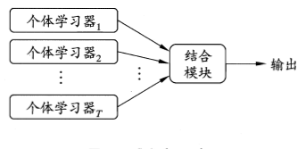
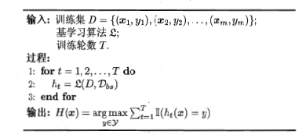

# 集成学习

## 集成学习定义

​	集成学习，顾名思义，通过将多个单个学习器集成/组合在一起，使它们共同完成学习任务，这里的学习器就是指机器学习算法训练得到的假设。而我们之所以有直觉要把多个学习器组合在一起，是因为单个学习器往往可能效果不那么好，而多个学习器可以互相帮助，各取所长，就可能一起合作把一个学习任务完成得比较漂亮。

​	个体学习器通常是用一个现有的学习算法从训练数据产生，例如C4.5决策树算法、BP神经网络算法等。此时集成中只包含同种类型的个体学习器，例如“决策树集成”中的个体学习器全是决策树，“神经网络集成”中就全是神经网络，这样的集成是“同质”（homogeneous）的，同质集成中的个体学习器也称为“基学习器”（base learner），相应的学习算法称为“基学习算法”（base learning algorithm）。有同质就有异质，若集成包含不同类型的个体学习器，例如同时包含决策树和神经网络，那么这时个体学习器一般不称为基学习器，而称作“组件学习器”（component leaner）或直接称为个体学习器。

​	如下图，集成学习的一般结构是：先产生一组“个体学习器”（individual le	arner），再用某种策略将它们结合起来。

## 集成学习之Bagging

​	Bagging的个体弱学习器的训练集是通过随机采样得到的。通过T次的随机采样，我们就可以得到T个采样集，对于这T个采样集，我们可以分别独立的训练出T个弱学习器，再对这T个弱学习器通过集合策略来得到最终的强学习器。对于这里的随机采样有必要做进一步的介绍，这里一般采用的是自助采样法（Bootstap sampling）,即对于m个样本的原始训练集，我们每次先随机采集一个样本放入采样集，接着把该样本放回，也就是说下次采样时该样本仍有可能被采集到，这样采集m次，最终可以得到m个样本的采样集，由于是随机采样，这样每次的采样集是和原始训练集不同的，和其他采样集也是不同的，这样得到多个不同的弱学习器。

​	随机森林是Bagging的一个特化进阶版，所谓的特化是因为随机森林的弱学习器都是决策树。所谓的进阶是随机森林在Bagging的样本随机采样基础上，又加上了特征的随机选择，其基本思想没有脱离Bagging的范畴。Bagging伪码如下图所示：

## 集成学习之Boosting

​	Boosting方法是一种用来提高弱分类算法准确度的方法,这种方法通过构造一个预测函数系列,然后以一定的方式将他们组合成一个预测函数。他是一种框架算法,主要是通过对样本集的操作获得样本子集,然后用弱分类算法在样本子集上训练生成一系列的基分类器。他可以用来提高其他弱分类算法的识别率,也就是将其他的弱分类算法作为基分类算法放于Boosting 框架中,通过Boosting框架对训练样本集的操作,得到不同的训练样本子集,用该样本子集去训练生成基分类器;每得到一个样本集就用该基分类算法在该样本集上产生一个基分类器,这样在给定训练轮数 n 后,就可产生 n 个基分类器,然后Boosting框架算法将这 n个基分类器进行加权融合,产生一个最后的结果分类器,在这 n个基分类器中,每个单个的分类器的识别率不一定很高,但他们联合后的结果有很高的识别率,这样便提高了该弱分类算法的识别率。在产生单个的基分类器时可用相同的分类算法,也可用不同的分类算法,这些算法一般是不稳定的弱分类算法,如神经网络(BP) ,决策树等。Boosting原理图如下所示：

​	Boosting算法要涉及到两个部分，加法模型和前向分步算法。加法模型就是说强分类器由一系列弱分类器线性相加而成。一般组合形式如下：
$$
F_M(x;P)=\sum_{m=1}^nβ_mh(x;a_m)
$$
​	其中，$h(x;a_m)$就是一个个的弱分类器，$a_m$是弱分类器学习到的最优参数，$β_m$就是弱学习在强分类器中所占比重，$P$是所有$a_m$和$β_m$的组合。这些弱分类器线性相加组成强分类器。前向分步就是说在训练过程中，下一轮迭代产生的分类器是在上一轮的基础上训练得来的。也就是可以写成这样的形式：
$$
F_m (x)=F_{m-1}(x)+ β_mh_m (x;a_m)
$$
​	由于采用的损失函数不同，Boosting算法也因此有了不同的类型，AdaBoost就是损失函数为指数损失的Boosting算法。