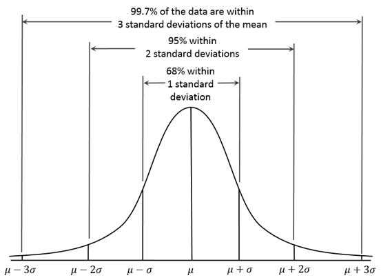

# 异常检测

## 异常检测定义及应用领域

​	所谓异常检测就是发现与大部分对象不同的对象，其实就是发现离群点。异常检测有时也称偏差检测，是检测不符合期望的数据、行为， 在选择异常检测方法时既要考虑解决的问题，也要考虑数据状态，如数据类型、数据分布、数据标记、数据量等。 下面来举一些常见的异常检测的应用：

- 欺诈检测：主要通过检测异常行为来检测是否为盗刷他人信用卡；
- 入侵检测：检测入侵计算机系统的行为；
- 医疗领域：检测人的健康是否异常。

## 正态分布

​	若连续型随机变量$X$的概率密度为：
$$
P(x)= \frac{1}{\sqrt{2 \pi} \sigma}e^{-\frac{(x-\mu)^{2}}{2\sigma^{2}}},-\infty<x<+\infty
$$
​	则称$X$服从参数为$μ$，$σ^2$的正态分布，记为$X∼N(μ,σ^2) $ ，概率分布图如下所示：

​	所谓的参数估计是指，给定分布数据，求分布的参数。对高斯分布来说，就是求$μ$和$σ$。我们可以利用已有的数据来预测总体中的$ μ $和 $σ^2$ ，计算方法如下：
$$
\mu=\frac{1}{m}\sum_{i=1}^mx^{(i)}\\\sigma^{2}=\frac{1}{m}\sum_{i=1}^m(x^{(i)}−\mu^2)
$$

## 异常检测算法

​	通过概率密度量化“不一致”。具体做法是：选择符合高斯分布或能转换为高斯分布的特征，利用收集到的数据对高斯分布做参数估计，把概率密度函数值小于某个阈值的点判定为异常。

​	对于给定的训练集：${x^1,x^2...x^m}$，每个样本都是一个n维向量，那么可以进行参数估计：
$$
\mu_j=\frac{1}{m}\sum_{i=1}^mx_j^{(i)}\\\sigma^{2}_j=\frac{1}{m}\sum_{i=1}^m(x_j^{(i)}−\mu_j^2)
$$
​	一旦我们获得了平均值和方差的估计值，给定新的一个训练实例，根据模型计算$p（x） $：
$$
p(x)=p(x_1,\mu_1,\sigma_1^2)p(x_2,\mu_2,\sigma_2^2)...p(x_2,\mu_2,\sigma_2^2)=\prod_{j=1}^np(x_n,\mu_n,\sigma_n^2)
$$
​	当 $p(x)<ε$ 时，为异常。$ε$这个是个经验值，方法是选择在验证集上使评估指标（如F-measure）值最大的$ε$。
