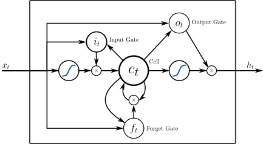

# 深度学习历史发展

## 视觉领域

人工神经网络受到了1959年由诺贝尔奖得主大卫·休伯尔（David H. Hubel）和托斯坦·威泽尔（Torsten Wiesel）提出的理论启发。休伯尔和威泽尔发现，在大脑的初级视觉皮层中存在两种细胞：简单细胞和复杂细胞，这两种细胞承担不同层次的视觉感知功能。简单细胞负责捕捉简单的纹理信息，复杂细胞则复杂组合简单细胞获取的信息来获取更高层次的视觉信号。

到20世纪80年代，日本科学间福岛邦彦提出的新认知机引入了使用无监督学习训练的卷积神经网络。

1989年，扬·勒丘恩（Yann LeCun）等人开始将1974年提出的标准反向传播算法应用于深度神经网络，这一网络被用于手写邮政编码识别。

事实上，从反向传播算法自20世纪70年代提出以来，不少研究者都曾试图将其应用于训练有监督的深度神经网络，但最初的尝试大都失败。赛普·霍克赖特（英语：Sepp Hochreiter）在其博士论文中将失败的原因归结为梯度消失，这一现象同时在深度前馈神经网络和递归神经网络中出现，后者的训练过程类似深度网络。由于深层网络的特性，用于修正每一层网络的误差（梯度），在传播的过程中以指数形式减小或者增加的，导致梯度消失或爆炸。

同时，由于深度神经网络随网络深度增加引入庞大的运算量，受限于当时的运算资源，更深的网络迟迟没有出现。同期SVM等手工设计特征的方式获得巨大的成功，神经网络为多方诟病，深度学习遭遇寒冰期。

2012出现了深度学习的转折。AlexNet真正展现了深度学习强大的能力，其84.6%的top5准确率以碾压性的优势战胜了其他模型（第二名top5为 73.8%）。夺得当年ImageNet图像识别大赛的冠军。

alexnet使用dropout的方式训练网络，并加入数据增强，可以在相同的数据上获得更多的训练样本。同时，也是最重要的，alexnet使用GPU来进行数据运算。拥有大量计算核心和能够直接与运算单元交换数据的显存，GPU的设计本身就非常适合执行大量的并行计算。

其后随着GPU的发展和大数据计数的成熟，深度学习进入高速发展期，VGG，resnet，inception等结构的发展，在图像识别领域，深度神经网络获得巨大成功。2015年，何凯明团队首次在imagenet图像识别大赛上取得超越人类准确率成绩。2017年，著名的imagetnet图像识别比赛宣布关闭，无论的图像分类、物体检测、物体识别，计算机的正确率都已经远远超越人类。可以说，计算机视觉在感知方面的问题已经得到了很好的解决。

## 语音，文本等领域

其他领域，如语音识别领域，也面临图像领域出现的难题，梯度消失，运算量过大，模型难以有效训练。

1982年出现的Hopfield网络，被认为是比较早期的RNN模型的典型。

其对应的时序反向传播算法BPTT（back-propagation through time），由于涉及时间上的运算递归，也面临梯度消失和爆炸的问题。

1997年出现的LSTM（Long-Short time memory）通过组合四个门来处理长期记忆和短期记忆的重组，有效实现了时序序列数据的处理。通过叠加多层LSTM实现的深度网络，在文本和语音领域获得了巨大的成功。

在 2015 年，谷歌通过基于CTC 训练的 LSTM 程序大幅提升了安卓手机和其他设备中语音识别的能力，其中就使用了Jürgen Schmidhuber的实验室在 2006 年发表的方法。百度也使用了 CTC；苹果的 iPhone 在 QuickType 和 Siri 中使用了 LSTM；微软不仅将 LSTM 用于语音识别，还将这一技术用于虚拟对话形象生成和编写程序代码等等。亚马逊 Alexa 通过双向 LSTM 在家中与你交流，而谷歌使用 LSTM 的范围更加广泛，它可以生成图像字幕，自动回复电子邮件，它包含在新的智能助手 Allo 中，也显著地提高了谷歌翻译的质量（从 2016 年开始）。目前，谷歌数据中心的很大一部分计算资源现在都在执行 LSTM 任务。

## 未来

随着业界对深度学习的研究和使用，涌现出了大量深度学习的成功案例。而TensorFlow，pyTorch，MXNet，以及完全国产的PaddlePaddle这类基础计算框架的出现，极大的降低了深度学习的门槛。特别是近年，Nvidia发布的一系列GPU以及CUDA,cuDnn等深度学习基础加速框架，也不断在提高深度运算的效率，极大加速深度学习的发展。