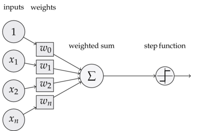

# 感知器与优化规则

## 感知器简介

感知器，也可翻译为感知机，是 Frank Rosenblatt在1957年就职于Cornell航空实验室(Cornell Aeronautical Laboratory)时所发明的一种人工神经网络。它可以被视为一种最简单形式的前馈式人工神经网络，是一种二元线性分类器。

感知器的发明，受到了生物大脑中神经原结构的启发，一个典型的神经元结构如下


而感知器的结构如下



生物神经元通过树突和轴突相互连接，组成复杂的网络结构，所以神经元是生物智能的基本单元。同样，感知器也可以通过复杂的连接组成网络结构，最终形成复杂的深度人工神经网络。


## 感知器工作原理

通过感知器的结构，可以了解到，感知器的本质就是一个线性模型，其通过参数$\boldsymbol W, b$对输入数据$x$进行拟合。

感知器的工作可以用下述公式表示：

$$
y=\phi(\boldsymbol {Wx} + b)
$$

或者使用展开的形式
$$
y =\phi(w_1x_1+w_2x_2+\cdots+w_nx_n + b)
$$

公式中，最外面的激活函数最早使用的是阶越函数（step function）
$$
g(x)=
  \begin{cases}
    1       & x>0\\
    0      &x\le 0
  \end{cases}
$$
其图像如下


而近代，则多使用Sigmoid函数（一般简写为$\sigma$），也就是所谓的S形函数，其图像如下：


可以看到，Sigmoid函数是一种对阶越函数的近似，而且Sigmoid函数在0点处可导，这为优化计算提供了很多便利。

使用Sigmoid的另一个好处是Sigmoid函数输出在$(0, 1)$区间，因此可以表示输出结果的概率作为结果可信度的度量。很多时候这比阶越函数只输出$ \{0, 1\} $要方便的多。

感知器是一种错误驱动（error-driven）的学习算法。感知器学习算法首先需要将权重设置为0或很小的随机数，然后预测训练样本的类型。如果感知器是正确的，算法就继续处理下一个样本。如果感知器是错误的，算法就更新权重，重新预测。权重的更新规则如下:
$$
w_i=w_i+\alpha(d_j-y_j)x_{j,i} \qquad 0\le i \le n
$$
对每个训练样本来说，每个特征对应的权重增加$\alpha(d_j-y_j)x_{j,i}$，$d_j$是样本 j 的真实类型，$y_j$是样本 j 的预测类型，$x_{j,i}$是第 j 个样本 的第i个特征，$\alpha$是控制学习速率的超参数。如果预测是正确的，$d_j-y_j$等于0，$\alpha(d_j-y_j)x_{j,i}$也是0，此时，权重不更新。如预测是错误的，权重会按照学习速率乘以$d_j-y_j$再与对应特征的乘积增加。

对于$b$，可以认为是$w_i$的一种特殊情况，其对应的特征始终为1,更新规则如下：
$$
b=b+\alpha(d_j-y_j)
$$
这里的更新规则与梯度下降法中的权重更新规则类似，都是朝着使样本得到正确分类更新，且更新的幅度是由学习速率控制的。每遍历一次全部训练样本称为完成了一个epoch。如果学习完一个epoch，所有的样本都分类正确，那么算法就会收敛（converge）。

## 感知器应用

感知器可以用来解决比较简单的逻辑问题，如逻辑门的设计。

### 与问题

考虑如下数据表：

|编号| $x_1$ | $x_2$ | $d$ |
|:-:| :-----: | :-----: | :---: |
|1|    0    |    0    |   0   |
|2|    1    |    0    |   0   |
|3|    0    |    1    |   0   |
|4|    1    |    1    |   1   |

可以看出，这里的运算关系是这样的：
$$
y = x_1 \land  x_2
$$
那么应该如何找到一组参数使得下面的方程满足表中的数据呢？

$$
y = g(w_1x_1+w_2x_2+b)
$$

初始化权重为$w_1=1,w_2=2,b=0$，选择 $\alpha=1$权重更新步骤参考下表

| 编号          | $w_1$ | $w_2$ | $b$ | $y$ | $\alpha(d-y)x_{1}$ | $\alpha(d-y)x_{2}$ | $\alpha(d-y)$ |
| :-------------: | :-------: | :-------: | :-----: | :-----: | :--------------------: | :--------------------: | :---------------: |
| epoch 0 样本 0    |  1  |  2  |  0  |  0  |  0  |  0  |  0|
| epoch 0 样本 1    |  1  |  2  |  0  |  1  |  -1  |  0  |  -1|
| epoch 0 样本 2    |  0  |  2  |  -1  |  1  |  0  |  -1  |  -1|
| epoch 0 样本 3    |  0  |  1  |  -2  |  0  |  1  |  1  |  1|
| epoch 1 样本 0    |  1  |  2  |  -1  |  0  |  0  |  0  |  0|
| epoch 1 样本 1    |  1  |  2  |  -1  |  0  |  0  |  0  |  0|
| epoch 1 样本 2    |  1  |  2  |  -1  |  1  |  0  |  -1  |  -1|
| epoch 1 样本 3    |  1  |  1  |  -2  |  0  |  1  |  1  |  1|
| epoch 2 样本 0    |  2  |  2  |  -1  |  0  |  0  |  0  |  0|
| epoch 2 样本 1    |  2  |  2  |  -1  |  1  |  -1  |  0  |  -1|
| epoch 2 样本 2    |  1  |  2  |  -2  |  0  |  0  |  0  |  0|
| epoch 2 样本 3    |  1  |  2  |  -2  |  1  |  0  |  0  |  0|
| epoch 3 样本 0    |  1  |  2  |  -2  |  0  |  0  |  0  |  0|
| epoch 3 样本 1    |  1  |  2  |  -2  |  0  |  0  |  0  |  0|
| epoch 3 样本 2    |  1  |  2  |  -2  |  0  |  0  |  0  |  0|
| epoch 3 样本 3    |  1  |  2  |  -2  |  1  |  0  |  0  |  0|

可以看到，最终在epoch2的样本2,3上，参数就已经停止更新了，接下来的epoch3中，参数完全没有更新。

最终得到的参数为$w_1=1,w_2=2,b=-2$

### 或问题

考虑如下数据表：

| 编号 | $x_1$ | $x_2$ | $d$ |
| :--: | :-----: | :-----: | :---: |
|  1   |    0    |    0    |   0   |
|  2   |    1    |    0    |   1   |
|  3   |    0    |    1    |   1   |
|  4   |    1    |    1    |   1   |

可以看出，这里的运算关系是这样的：
$$
y = x_1 \lor  x_2
$$
以与问题同样的参数初始化和训练步骤，可以得到

$w_1=1,w_2=2,b=0$

事实上，这里比较巧合，我们初始化使用的参数，正好满足这里的数据。

### 非问题

考虑如下数据表：

| 编号 | $x_1$ | $d$ |
| :--: | :-----: | :---: |
|  1   |    0    |   1   |
|  2   |    1   |   0   |

$w_1=-1,b=1$可以满足上述数据


用于求解与和或问题的代码如下:

```python
#!/usr/bin/env python3
import numpy as np

samples_and = [
    [0, 0, 0],
    [1, 0, 0],
    [0, 1, 0],
    [1, 1, 1],
]


samples_or = [
    [0, 0, 0],
    [1, 0, 1],
    [0, 1, 1],
    [1, 1, 1],
]


def perceptron(samples):
    w = np.array([1, 2])
    b = 0
    a = 1

    for i in range(10):
        for j in range(4):
            x = np.array(samples[j][:2])
            y = 1 if np.dot(w, x) + b > 0 else 0
            d = np.array(samples[j][2])

            delta_b = a*(d-y)
            delta_w = a*(d-y)*x

            print('epoch {} sample {}  [{} {} {} {} {} {} {}]'.format(
                i, j, w[0], w[1], b, y, delta_w[0], delta_w[1], delta_b
            ))
            w = w + delta_w
            b = b + delta_b


if __name__ == '__main__':
    print('logical and')
    perceptron(samples_and)
    print('logical or')
    perceptron(samples_or)

```
