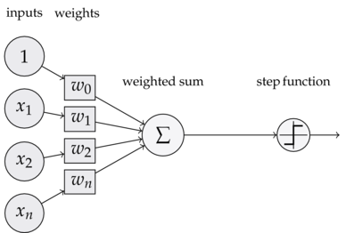

# 全联接网络

感知器可以看成是最简单的神经网络，但是通过前面的实例可以看到，单个感知器还是存在一些局限性的。

回顾前面看过的感知器结构

一个感知器可以有多个输入但是同时只有一个输出。如果将多个感知器的进行并联，对于一组输入，可以有很多不同的感知器对其进行处理。多个感知器组成的结构叫做全联接网络。

如下所示，是一个有四个神经元组成的全联接神经网络：

我们使用圆圈来表示神经网络的输入，标上$\textstyle +1$的圆圈被称为偏置节点，也就是截距项。神经网络最左边的一层叫做输入层，最右的一层叫做输出层（本例中，输出层只有一个节点）。中间所有节点组成的一层叫做隐藏层，因为我们不能在训练样本集中观测到它们的值。同时可以看到，以上神经网络的例子中有3个输入单元（偏置单元不计在内），3个隐藏单元及一个输出单元。

通过堆叠上述简单的网络结构，将神经元之间的输入输出相连接，最终形成复杂的深度全联接人工神经网络。

> 事实上，上述神经网络只有四层，三个隐层，一个输出层，仍然是一个比较浅的神经网络。

