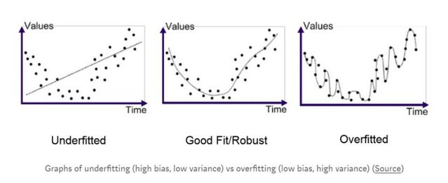
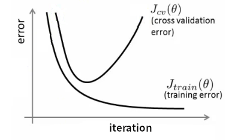

# 过拟合与欠拟合

## 基本概念

深度学习中，对数据建立模型进行训练的时候，基于这样一个基本假设：用于训练模型的数据以及模型实际应用的数据满足独立同分布。换句话说，我们拿历史数据训练出来的模型可以对未来的数据进行预测，或者我们拿获取到的有明确label的数据训练出来的模型可以对没有label的数据进行预测。

但是，这种假设很多时候并不成立，也就是，训练数据与验证数据有不同的分布。例如随着业务的增长，历史数据对业务前景的估计偏低。或者我们拿到的训练数据样本量太少，无法准确反映被验证数据的统计特征。

过欠合问题与过拟合问题如下图所示

## 过拟合

所谓过拟合（Over fitting），字面意思理解，是模型对于数据学习（fitting）的太好（Over），但是碰到训练中没见到过的数据的时候表现就不好。

就像上学的时候，模拟考总能得高分，但是实际考试就总是拿到只在中游的成绩。

这种时候，模型在训练数据上面，损失函数$J$的值会比较小，也就是学习的比较好，但是在测试数据上$J$比较大。损失函数也常用方差（Variance）来表示，因此过拟合的问题，也常被称为方差过大（High Variance）问题。

如本文开头图中右边所示。

过拟合产生的原因，一种情况是由于模型的规模过大，参数过多，导致模型在训练数据上过多的关注了数据中的噪声，因此产生出非常复杂的拟合规则，连噪声也一起拟合了。另一种情况，对于要处理的问题，模型大小可能是合适的，但是给出的训练数据太少，这种时候，模型无法学习到有效的特征，也会导致过拟合。

## 欠拟合

仍然从字面意思理解，欠拟合（Under fitting）是模型对数据的学习（fitting）不够（Under），训练数据都无法有效的学习其规则。这种时候，一般是模型过小，无法有效的学习训练数据导致的。

就像上学的时候，上课没有认真听讲，连模拟考的成绩都很糟糕，更不用说真实的考试了。

这种时候，模型在训练数据上面，损失函数$J$的值也比较大。

欠拟合的时候，直观表示，模型无法很好的拟合数据，也被成为高偏见（High Bias）问题。

## 过拟合与欠拟合的判断

模型刚开始训练的时候，训练与验证集的损失$J$的值都比较大，这时候，模型处于欠拟合的状态。如果模型一直处于欠拟合的状态，需要考虑选择一个比较大的模型。

随着模型训练的继续（iteration增加），如果出现上图中右边所示的曲线，训练集上$J$仍然在变小，但是验证集上$J$却在增大的情况，这里代表模型已经出现了过拟合的情况，需要考虑一下如何防止过拟合。

## 欠拟合的处理

欠拟合的处理需要具体问题具体分析，没有太一般的处理规则。出现欠拟合的情况，一般认为是模型的规模太小，无法有效学习特征。这种时候需要用更大规模，更复杂的模型去拟合数据。

例如，数据中的特征，跟训练目标是二阶函数的关系，那么使用线性模型就无法很好的拟合数据。

另一种比较可能的情况，数据预处理没有很好的发挥作用，导致模型无法学习到很有效的特征。这种时候，需要考虑针对数据预处理做一些改进，如PCA等。

## 过拟合的处理

过拟合的时候，针对训练数据太少导致的过拟合，需要加入更多的训练数据。最直观的增加训练数据的方式就是搜集更多的训练数据。但是对于很多领域来说，更多的训练数据往往是很昂贵甚至是不可能的。因此在已有的数据上进行数据的增广就成了一种非常必要的手段。

### 数据增广

以深度神经网络在图像分类上的应用为例，数据增广的方式有对原始图片进行上下\左右翻转，随机饱和度，随机亮度，随机裁剪处理等等。

### 模型复杂度角度考虑

当加入更多的训练数据仍然无法有效解决过拟合的问题的时候，就需要从模型的角度考虑如何改善过拟合的问题。

上面提到，过拟合问题是由于模型过于复杂，参数过多导致的，所以解决模型过拟合的方式主要从限制模型复杂度入手。方式有dropout，正则化等。