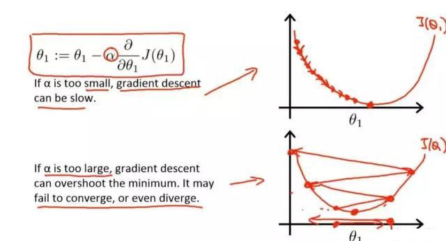
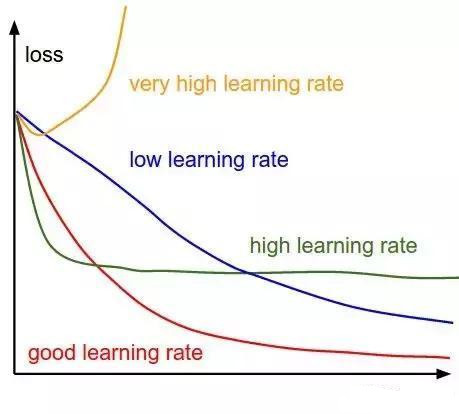
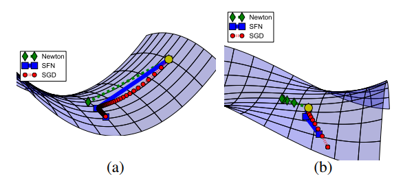
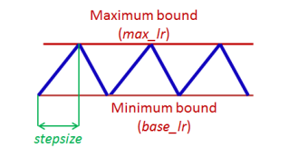
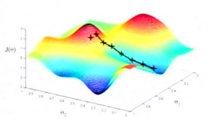

# 学习率

梯度下降算法和反向传播算法中的$\alpha$即学习率，是一个重要的超参数，它控制着我们基于损失梯度调整神经网络权值的速度，大多数优化算法（如SGD、RMSprop、Adam）对它都有涉及。学习率越小，我们沿着损失梯度下降的速度越慢。从长远来看，这种谨慎慢行的选择可能还不错，因为可以避免错过任何局部最优解，但它也意味着我们要花更多时间来收敛，尤其是如果我们处于曲线的至高点。学习率过大，则参数更新的幅度过大，模型有可能会出现震荡，导致错过最优解。如下图所示

学习率可以根据需要调整，不同的学习率对不同的训练任务有不同的影像。例如模型finetune的情况，学习率最好设置的比较小，从而使模型能够更好的学习到新数据的表示。而从头开始训练的模型就可以以较大的学习率开始，以加快训练的收敛速度。下图展示了不同的学习率下出现的各类情况：

## 学习率衰减

通常情况下，使用一个一成不变的学习率并不是一个好主意，一般的做法是，在初始的固定epoch之后，周期性的衰减学习率。衰减的方式有：

- 1/10衰减，也就是每隔固定的epoch，衰减学习率为上次的1/10,
- 1/3衰减，意义同上
- 0.94/0.87/0.74/0.575衰减，隔固定的epoch，将原始学习率乘以对应的权重。

需要注意的是，上述学习率衰减的策略，由于都是指数衰减，因此需要非常小心的设定衰减的epoch间隔，因为epoch间隔过小，则学习率衰减过快，可能导致模型学习的时候没有足够的梯度来更新权重，因而非常容易落入鞍点（arxiv：1406.2572）。

针对这种情况出现了一些有针对性的学习率衰减方案，如arxiv:1506.01186中提出的循环学习率（Cyclical Learning Rates），使用循环的学习率变化方式，尝试越过鞍点：

另一种比较常见的情况是局部极小值：

如图，深度学习面临的解空间往往是这样，有很多的局部极大值和最小值，这里只是二维空间的情况，多维空间的情况更加复杂。模型很容易被困在局部极小值无法达到全局最小值。

> 事实上，对于高维空间，局部极小值在很多情况下也是可以接受的解。但是更优的局部极小值往往意味着更好的模型性能。

下一节将要介绍的动量及各种优化算法，则从另一个角度尝试解决鞍点以及局部最优解的问题。