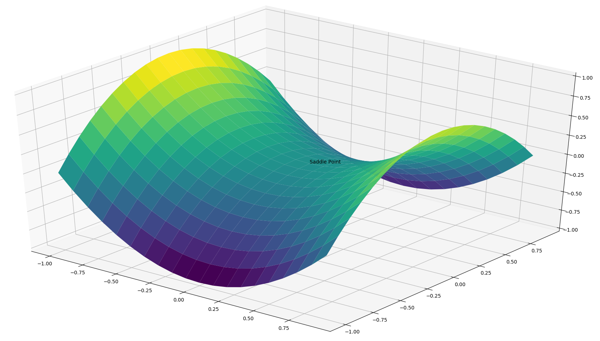
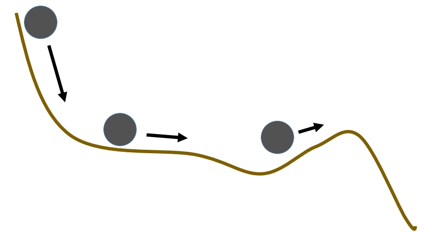

# 优化算法：动量

回忆前面提到的优化算法中的梯度下降（Gradient Descent），根据对样本的计算和参数更新的方式不同分为了 批量梯度下降法(Batch Gradient Descent)，随机梯度下降法(Stochastic Gradient Descent)和小批量梯度下降法(Mini-batch Gradient Descent)。这三种优化算法可以认为是梯度下降的三个变种。

这三种算法都无法应对局部极小值带来的非最优解的问题。对于鞍点问题，详细分析如下。

## 鞍点的解释

梯度下降算法的公式如下

$$
w =w - \alpha \cdot \nabla_w J(w)
$$

其中$\nabla_\theta J( \theta)$为损失函数的梯度，考虑如下图像中的损失函数平面：

靠近鞍点的位置，虽然不是局部极小值，但是由于鞍点位置的导数为0，其附近的梯度，越靠近鞍点，越趋向于0。因此，梯度下降无法得到足够的梯度来更新参数。

## 动量Momentum

解决鞍点问题的一个最初的考虑就是动量，关于动量的解释参考下图：

物体从高处落向低处的时候，由于势能的释放，物体会有一种向更低处运动的趋势，这种趋势即使物体在往高处运动的时候仍然保持。

加入动量之后，梯度下降的公式更新为
$$
\begin{align}
\begin{split}
m_t &= \gamma m_{t-1} + \alpha \nabla_w J( w) \\  
w &= w - m_t
\end{split}
\end{align}
$$
$m$在迭代初始的时候，取0，也就是刚开始的时候是没有动量的。可以看到，这里的动量，在数学意义上，就是随着迭代的进行（t增加），梯度更新的历史的加权叠加。$\gamma$取0.9或近似的值。

在鞍点位置，即使梯度已经为0，但是动量也就是历史梯度更新的趋势可以仍不为0，所以权重可以越过鞍点，继续更新。

动量法是大部分改进优化算法的基础起点，可见其影响比较的深远。

## Nesterov accelerated gradient

又被称为Nesterov动量法，是一种能够提前预判梯度更新的方向并掠过预判与当前状况的中间过程而直接朝着预判的方向进行参数更新的一种方法。

考虑上面提到的Momentum计算梯度并更新权重的方式，通过使用上次以前积累的动量$m_{t-1}$来更新当前梯度的方式，如果直接在计算梯度的时候，就使用动量，就能提前预估参数更新的方向。参数更新公式为：
$$
\begin{align}
\begin{split}
m_t &= \gamma m_{t-1} + \alpha \nabla_w J( w - \gamma m_{t-1} ) \\  
w &= w - m_t
\end{split}
\end{align}
$$

考虑上述图片，其中蓝色箭头表示动量法中，先计算梯度，然后叠加动量进行权重更新的方式。而在Nesterov动量法中，首先计算权重沿动量更新的方向，也就是棕色箭头，然后叠加梯度，也就是红色箭头。最终更新的方向是绿色箭头。Nesterov动量法将动量和梯度的更新进行了结合，可以避免动量法中引入动量带来的更新过快的问题，同时提高了参数更新方向的准确度，因此可以显著的提高一些模型的性能（RNN等）。

## Adagrad

与之前提到过的优化算法对所有的参数使用相同的学习率不通过，Adagrad通过针对不同的参数设置不同的学习率，进行有针对性的权重更新。

简便起见，我们使用$g_t$来表示$t$时刻的梯度，则$g_{t,i}$表示在t时刻，损失函数的梯度在$w_i$上的分量。梯度如下表示：
$$
g_{t, i} = \nabla_w J( w_{t, i} )
$$
则原始梯度更新公式针对每个参数可记为：
$$
w_{t+1, i} =w_{t, i} - \alpha \cdot g_{t, i}
$$
Adagrad的更新公式如下：
$$
w_{t+1, i} = w_{t, i} - \dfrac{\alpha}{\sqrt{G_{t, ii} + \epsilon}} \cdot g_{t, i}
$$
其中$G_{t} \in \mathbb{R}^{d \times d}$为对角矩阵，其对角线元素$G_{t, ii}$为t时刻以前权重$w_i$的所有梯度的平方和。$\epsilon$为一个稳定系数一般取$1e^{-8}$这种比较小的值，避免0被除导致的问题。写成矩阵运算的方式，则Adagrad可写为
$$
w_{t+1} = w_{t} - \dfrac{\alpha}{\sqrt{G_{t} + \epsilon}} \odot g_{t}
$$
根据定义可以看到，学习率是自动根据历史梯度进行调整的，所以Adagrad的学习率不需要人工干预，但是问题也出在这里。历史梯度的平方和是一直增大的，所以梯度更新的幅度会越来越小。

## Adadelta

为了克服Adagrad的问题，Adadelta针对历史梯度，使用了类似动量法的更新策略，对于历史梯度平方和及当前梯度进行加权。公式如下：
$$
E[g^2]_t = \gamma E[g^2]_{t-1} + (1 - \gamma) g^2_t
$$
其中$\gamma$使用与动量法类似的值，如0.9。

原始的梯度下降公式可改写为：
$$
\Delta w_t = - \dfrac{\alpha}{\sqrt{E[g^2]_t + \epsilon}} g_{t}
$$

原作者提到，在这里以及上述提到过的优化算法中，等式两边的值其单位是不统一的，左边为权重，右边因为梯度和梯度平方和的根进行运算，其单位被约掉了，因此作者引入了另外一个加权和：
$$
E[\Delta w^2]_t = \gamma E[\Delta w^2]_{t-1} + (1 - \gamma) \Delta w^2_t
$$
使用这个加权和的平方根来替换学习率$\alpha$得到最终的Adadelta权重更新公式，由于当前t时刻的权重是计算目标，因此使用前一时刻$t-1$的权重来近似：
$$
\begin{align}
\begin{split}
\Delta w_t &= - \dfrac{\sqrt {E[\Delta w^2]_{t-1}+\epsilon} }{\sqrt{E[g^2]_t + \epsilon}} g_{t} \\
w_{t+1} &=w_t + \Delta w_t 
\end{split}
\end{align}
$$

## RMSprop

RMSprop优化算法是Geoff Hinton在其课程上的一个PPT里面提到的一种优化算法，事实上，与Adadelta优化算法中没有加入权重的公式是一样的。
$$
\begin{align}
\begin{split}
E[g^2]_t &= \gamma E[g^2]_{t-1} + (1 - \gamma) g^2_t \\  
w_{t+1} &= w_{t} - \dfrac{\alpha}{\sqrt{E[g^2]_t + \epsilon}} g_{t}
\end{split}
\end{align}
$$

这里Hinton建议$\gamma$设置为0.9，学习率$\alpha$设置为0.001

> RMSprop与Adadelta被认为是在同一时期被分别推演出来用于解决Adagrad优化算法的缺陷。

## Adam

Adaptive Moment Estimation (Adam) 综合了前述几种算法的优点，同时使用了动量momentum和梯度的平方和加权：
$$
\begin{align}
\begin{split}
m_t &= \beta_1 m_{t-1} + (1 - \beta_1) g_t \\  
v_t &= \beta_2 v_{t-1} + (1 - \beta_2) g_t^2  
\end{split}
\end{align}
$$
Adam的作者注意到，因为$m_t,v_t$被初始化为0向量，所以这两个参数在运算的时候都偏小，特别是在模型优化开始的时候以及$\beta_1,\beta_2$接近1的时候。针对这种状况，作者提出了改进方案：
$$
\begin{align}
\begin{split}
\hat{m}_t &= \dfrac{m_t}{1 - \beta^t_1} \\
\hat{v}_t &= \dfrac{v_t}{1 - \beta^t_2} \end{split}
\end{align}
$$
最终的更新公式为
$$
w_{t+1} =w_{t} - \dfrac{\eta}{\sqrt{\hat{v}_t} + \epsilon} \hat{m}_t
$$
作者推荐$\beta_1,\beta_2$取值设置为0.999。

## AdaMax

Adam算法中使用梯度的平方和，这在数学上称为$l_2$范数，可以将梯度平方和的定义扩展到$l_p$范数，由此可产生泛化定义：
$$
v_t = \beta_2^p v_{t-1} + (1 - \beta_2^p) |g_t|^p
$$
事实上，过高的p会导致数值产生不稳定的情况，因此$l_1,l_2$范数比较常用。

但是当p取$\infty$的时候，$\ell_\infty$反而出现一些比较稳定的特征，因此作者（Kingma and Ba, 2015）推出了AdaMax优化算法，使用$\ell_\infty$范数来处理历史梯度：
$$
\begin{align}
\begin{split}
u_t &= \beta_2^\infty v_{t-1} + (1 - \beta_2^\infty) |g_t|^\infty\\  
              & = \max(\beta_2 \cdot v_{t-1}, |g_t|)
\end{split}
\end{align}
$$
这里使用$u$来代替$v$以避免与Adam算法混淆。最终，AdaMax算法的公式可写为：
$$
w_{t+1} =w_{t} - \dfrac{\eta}{u_t} \hat{m}_t
$$
可以看到最终形式与Adam是一样的。作者推荐$\eta=0.002, \beta_1=0.9, \beta_2=0.999$。

## 几种优化算法的比较

参考下面的图片

可以看到，动量法如预想的一样，虽然下降速度很快，但是由于动量积累带来的大幅更新使权重直接越过了鞍点向着另一边前进了很长的距离。

可以看到，上诉优化算法，后者都针对前者的问题进行了响应的改进。一些使用经验指出，相较于其他算法，Adam收敛速度较快，而且稳定性较好，所以在不知道使用什么优化算法的时候，Adam是一个不错的选择。同样需要注意的是，某些研究指出，Adam等加速优化算法训练出来的模型，比精调SGD算法训练的模型，最终准确度经常会低2～3个百分点，且有见到使用除SGD以外的加速优化算法，模型完全无法收敛的案例。