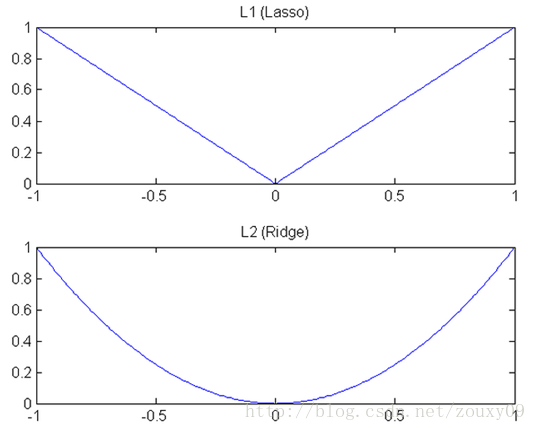

# 正则化

## 奥卡姆剃刀(Occam's razor)原理

正式介绍正则化的内容之前，先花一些时间介绍一下奥卡姆剃刀(Occam's razor)原理。

> 奥卡姆剃刀（英语：Occam's Razor, Ockham's Razor），又称“奥坎的剃刀”，拉丁文为lex parsimoniae，意思是简约之法则，是由14世纪逻辑学家、圣方济各会修士奥卡姆的威廉（William of Occam，约1287年至1347年，奥卡姆（Ockham）位于英格兰的萨里郡）提出的一个解决问题的法则，他在《箴言书注》2卷15题说“切勿浪费较多东西，去做‘用较少的东西，同样可以做好的事情’。”换一种说法，如果关于同一个问题有许多种理论，每一种都能作出同样准确的预言，那么应该挑选其中使用假定最少的。尽管越复杂的方法通常能做出越好的预言，但是在不考虑预言能力（即结果大致相同）的情况下，假设越少越好。
>
> --wiki百科

对应于深度学习中的情况，就是在能够达到最终要求的准确率的情况下，以最简单的模型去实现功能。事实上作为深度学习的模型，大部分情况下，简单的模型已经有足够的表达能力。而复杂的模型无非是简单的模型无法处理一些复杂情况的时候，针对特殊的复杂情况添加的额外处理。任何复杂的模型都可以分解为简单模型加上一系列特例的处理。

但是针对特例的处理，会导致模型过于复杂，在模型中添加太多应对特例的规则。当特例本身并不具备普遍适用性的时候（噪声），这些多余的规则就会在模型泛化的时候引起问题，表现就是模型在训练集上表现良好，在验证集上表现很糟糕。所以需要限制模型对特例的注意，也就是以最少的规则去适配尽可能多的训练数据并抛弃一些特例。

## 正则化的定义

引入额外的信息以解决病态问题或者防止过拟合的过程被称为正则化。

一些研究指出，模型的泛化能力来自于模型的复杂度与训练数据中携带的信息的平衡。如果模型复杂度无法匹配数据中携带的信息，则会出现欠拟合的现象。当模型过于复杂而训练数据中携带信息过少的时候，则会出现过拟合的现象。

模型复杂度由模型的自由度来定义，自由度来自模型参数的多少，也就是模型中权重的多少。所以简便起见，模型复杂度一般由模型参数的多少来衡量。

为了降低模型的复杂度，一些方法推荐使用剪枝等方式来去掉多余的参数。但是这些方法都过于复杂而且实际操作起来难度比较大。

事实上，通过使用一些比较简单的方式，就能限制模型增长的速度，减少模型中起作用的参数的个数，从而达到限制模型复杂度的作用。

深度学习和机器学习中常见的正则形式如下：
$$
w=\text{arg min}_w \sum{J(y_i, f(x_i, w))} +\lambda \Omega(w)
$$
其中第一项用于衡量模型预测与真是值（ground truth）之间的误差，是模型性能的衡量，也是模型优化的重要手段。第二项就是正则项，通常以这个参数来约束模型参数，使参与模型预测的参数个数尽可能的少。

## $l_1$正则与$l_2$正则

$l_1$正则与$l_2$正则是两种比较常用的正则化方式。在很多框架的资料和深度学习的文献中正则化也被称为weight decay。其公式分别如下：
$$
\begin{align}
w&=\text{arg min}_w \sum{J(y_i, f(x_i, w))} +\lambda |w| \\
w&=\text{arg min}_w \sum{J(y_i, f(x_i, w))} +\lambda (w)^2
\end{align}
$$

可以看到，$l_1$正则就是将权重的绝对值作为惩罚项加入损失函数中，而$l_2$正则则是将权重的值的平方加入损失函数。

> 针对单层的线性回归网络，加入$l_1$正则的模型又被称为lasso，加入$l_2$正则的模型被称为ridge。

由于计算的方式不同，两种正则在实际使用的时候产生的效果也会有比较大的不同。

$l_1$正则的特性：

- 稀疏性：加入$l_1$正则的模型，对于最终结果没有影像的特征其对应权重在训练的时候会很快的趋向并等于0，也就是最终模型中，只有一部分权重是非0元素。
- 特征选择：特征选择的能力来自于模型的稀疏性，也就是说，只有非0元素对应的特征在最终的预测结果中起作用，因此不起作用的特征可以被剔除。
- 结果可解释：对应特征的权重中为0，则表示对应的特征对最终的结果没有影像，特别的对于线性模型的情况，还可以通过权重的大小来反映对应的特征对最终结果影像的程度。

$l_2$正则的特性：

在深度学习的模型中，$l_2$正则最大的应用场景就是防止模型过拟合。因为$l_2$正则可以让权重趋向于0，而较小的参数代表模型复杂度的降低。

$l_1$正则可以在训练的过程中，让权重很快的变成0，而$l_2$参数则只能让参数趋向0。这是由深度模型权重更新的优化算法和两种正则的数学表达方式决定的。

参考梯度下降的权重更新公式，分别加入两种正则可以得到：

$$
\begin{align}
w &=
  \begin{cases}
    w - \alpha \cdot  \frac{\partial J( w)}{\partial w}-\lambda       & x>0\\
    w - \alpha \cdot  \frac{\partial J( w)}{\partial w}+\lambda      &x< 0
  \end{cases} \\
w &= w - \alpha \cdot  \frac{\partial J( w)}{\partial w}-\lambda w
\end{align}
$$

需要注意的是，这里在$l_1$在0点处连续但不可导，因此导数没有定义，所在优化求解的时候，需要用次梯度等方式进行优化求解。

可以看到，$l_1$正则中，权重以一个正常数$\lambda$持续降低，因此可以以更快的速度趋于0。而$l_2$由于使用了权重参数自身作为正则化因子，因此，在权重趋于0的时候，其变化幅度会越来越小。从图像上看如下：

事实上，还有一种$l_0$正则化：
$$
w=\text{arg min}_w \sum{J(y_i, f(x_i, w))} +\lambda |w|^0
$$
其数学意义为，取权重中，不为0的元素的个数作为正则化项加入损失函数中。其对模型正则化的作用更强，而且效果更好。但是由于不好求导优化，所以使用的比较少，一般以$l_1$正则近似替代。

