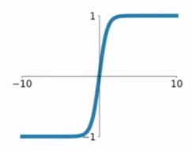

# 进一步讨论激活函数

我们知道，如果不加激活函数，则多层的神经网络与单层的神经网络除了运算量之外，本身没有很大的区别。激活函数的非线性特征为神经网络的拟合能力提供了可能。因此，神经网络中，激活函数的选择是非常重要的一个环节。下面介绍几种常用的激活函数，包括曾经提到的sigmoid函数和tanh函数。

## 阶越函数

介绍感知器的时候，曾经提到过一种早期使用的函数-阶越函数（step function）
$$
g(x)=
  \begin{cases}
    1       & x>0\\
    0      &x\le 0
  \end{cases}
$$
其图像如下

可以看到，在0的位置，这个函数本身是不连续而且不可导的，因此使用这个函数给网络优化带来了一定的挑战。同时，固定输出能代表的含义比较固定，因此网络的表达能力受限制。

## sigmoid函数

神经网络比较早期使用的函数之一，公式如下：
$$
\sigma(x) = \frac{1}{1+e^{-x}}
$$
其图像如下：

在sigmod函数中我们可以看到，其输出是在(0,1)这个开区间内，这点很有意思，可以联想到概率，但是严格意义上讲，不要当成概率。sigmod函数曾经是比较流行的，它可以想象成一个神经元的放电率，在中间斜率比较大的地方是神经元的敏感区，在两边斜率很平缓的地方是神经元的抑制区。

当然，流行也是曾经流行，这说明函数本身是有一定的缺陷的。

1) 当输入稍微远离了坐标原点，函数的梯度就变得很小了，几乎为零。在神经网络反向传播的过程中，我们都是通过微分的链式法则来计算各个权重w的微分的。当反向传播经过了sigmod函数，这个链条上的微分就很小很小了，况且还可能经过很多个sigmod函数，最后会导致权重w对损失函数几乎没影响，这样不利于权重的优化，这个问题叫做梯度饱和，也可以叫梯度弥散。

2) 函数输出不是以0为中心的，这样会使权重更新效率降低。对于这个缺陷，在斯坦福的课程里面有详细的解释。

3) sigmod函数要进行指数运算，这个对于计算机来说是比较慢的。

## tanh函数

双曲正切函数。公式如下：
$$
tanh(x)=\frac{sinh(x)}{cosh(x)} = \frac {e^x-e^{-x}}{e^x+e^{-x}}
$$

tanh函数和sigmod函数的曲线是比较相近的。首先相同的是，这两个函数在输入很大或是很小的时候，输出都几乎平滑，梯度很小，不利于权重更新；不同的是输出区间，tanh的输出区间是在(-1,1)之间，而且整个函数是以0为中心的，这个特点比sigmod的好。

一般二分类问题中，隐藏层用tanh函数，输出层用sigmod函数。不过这些也都不是一成不变的，具体使用什么激活函数，还是要根据具体的问题来具体分析，还是要靠调试的。

## ReLU函数

ReLU函数公式和曲线如下
$$
f(x) =max(0,x)
$$

ReLU(Rectified Linear Unit)函数是目前比较火的一个激活函数，相比于sigmod函数和tanh函数，它有以下几个优点：

1) 在输入为正数的时候，不存在梯度饱和问题。

2) 计算速度要快很多。ReLU函数只有线性关系，不管是前向传播还是反向传播，都比sigmod和tanh要快很多。（sigmod和tanh要计算指数，计算速度会比较慢）

当然，缺点也是有的：

1) 当输入是负数的时候，ReLU是完全不被激活的，这就表明一旦输入到了负数，ReLU就会死掉。这样在前向传播过程中，还不算什么问题，有的区域是敏感的，有的是不敏感的。但是到了反向传播过程中，输入负数，梯度就会完全到0，这个和sigmod函数、tanh函数有一样的问题。

2) 我们发现ReLU函数的输出要么是0，要么是正数，这也就是说，ReLU函数也不是以0为中心的函数。

## ELU函

ELU函数公式和曲线如下图
$$
f(x)=
  \begin{cases}
    x       & x>0\\
    \alpha(e^x-1)      &x\le 0
  \end{cases}
$$

ELU函数是针对ReLU函数的一个改进型，相比于ReLU函数，在输入为负数的情况下，是有一定的输出的，而且这部分输出还具有一定的抗干扰能力。这样可以消除ReLU死掉的问题，不过还是有梯度饱和和指数运算的问题。

## PReLU函数

PReLU函数公式和曲线如下图
$$
f(x) = max(\alpha x, x)
$$

PReLU也是针对ReLU的一个改进型，在负数区域内，PReLU有一个很小的斜率，这样也可以避免ReLU死掉的问题。相比于ELU，PReLU在负数区域内是线性运算，斜率虽然小，但是不会趋于0。

PReLU的公式，里面的参数α一般是取0~1之间的数，而且一般还是比较小的，如零点零几。特别的，当α=0.01时，我们叫PReLU为Leaky ReLU。

### ## CReLU

因为ReLU会丢掉负向的所有输出，所以，为了保留这些信息，又出现了一种改进的方式，公式如下：
$$
CReLU(x) = [ReLU(x),ReLU(-x)]
$$
这种改进方式，与其说是一种激活函数，更像是一种工程上的trick，其实现是直接翻转输出，经过与原输出连接之后，直接经过ReLU激活，如下图：

## SELU

$$
selu(x) = \lambda
  \begin{cases}
    x       & x>0\\
    \alpha e^x-\alpha      &x\le 0
  \end{cases}
$$

经过该激活函数后使得样本分布自动归一化到0均值和单位方差(自归一化，保证训练过程中梯度不会爆炸或消失，效果比Batch Normalization 要好) 
虽然看上去就是ELU乘了个$\lambda$，但是关键在于这里的$\lambda, \alpha$是有严格证明的确定值的，而且都大于1：
$$
\begin{align}
        \lambda = 1.0507009873554804934193349852946 \\
        \alpha = 1.6732632423543772848170429916717
\end{align}
$$

以前relu，prelu，elu这些激活函数，都是在负半轴坡度平缓，这样在activation的方差过大的时候可以让它减小，防止了梯度爆炸，但是正半轴坡度简单的设成了1。而selu的正半轴大于1，在方差过小的的时候可以让它增大，同时防止了梯度消失。这样激活函数就有一个不动点，网络深了以后每一层的输出都是均值为0方差为1。

## swish

google的automl项目，通过堆砌算力来搜索最优化网络结构的尝试，产生了一些非常有代表性的结果如nasnet等。同时，在激活函数领域，google的automl也带来了新的一种，拥有强大表现能力的激活函数：
$$
swish(x) =\frac{x}{1+e^{-x}}
$$
可以看出，这个函数其实就是$x\cdot sigmoid(x)$。

# 如何使用

介绍了那么多激活函数，如何使用呢？目前没有非常确定的规则，哪些情况使用哪些激活函数。工程上，比较一般性的实践经验是，先拿ReLU来用，毕竟这是最简单的而且对运算量要求最小的一个激活函数。在ReLU好用，而且成本允许的情况下，再考虑其他几种激活函数的使用。