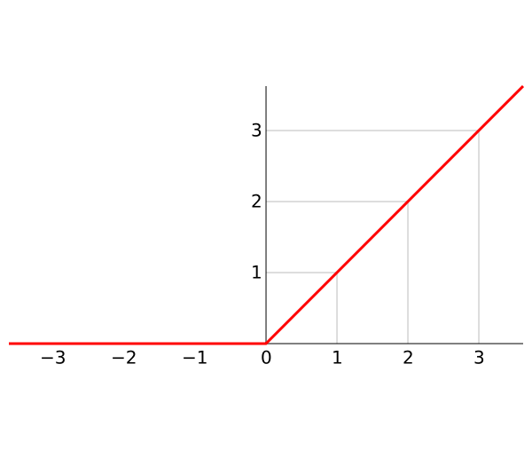

# Batch Normalization

深度学习领域基于一个基本的假设：独立同分布假设。也就是假设训练数据和测试数据是满足相同分布的，这是通过训练数据获得的模型能够在测试集获得好的效果的一个基本保障。

深度神经网络的训练中，随着深度的加大，网络变得越来越难以训练，收敛的速度越来越慢。同时，有观测指出，对于数据进行预处理的手段，如白化操作，可以有效的加快网络训练的速度。而白化的本质就是将输入数据变为均值0单位方差的正太分布。

作为多层深度神经网络，可以看成是简单的单层神经网络的堆叠组合，其每一层的输出都可以看成是下一层的输入。每层网络输出的内容都受到当层网络的权重W和偏置b以及最后的非线性激活函数的影像，因此几乎不会出现正好是均值0，单位方差的情况。事实上，随着训练的进行，网络的权重W和偏置b一直在变化，因而输出的分布也是呈一直变化的状态，这种情况被称作Internal Covariate Shift。对于后面的网络，除了要学习上层网络经过处理过后的数据特征，还要学习上层网络输出的数据分布，因而学习效率低下。

Batch Normalization则通过对每层神经网络的输出进行变换，强制输出数据为均值0，单位方差。也就是保证每层网络输出的数据分布统一，因此下层网络只需要学习数据中的特征，所以大大加快了学习效率，加快了收敛的速度。

## Internal Covariate Shift出现的原因

以现代神经网络常用的ReLU（Rectified Linear Unit）函数为例，ReLU函数的图像如下：



可以预见的是，如果输入的数据，原本是均值0，那么经过ReLU之后，其均值会往正向变动，而且由于负数全部被丢掉，其方差也会变小。最终的结果，原本为正态分布的数据，会向着正向越来越偏离原来的分布。

##  Batch Normalization

为了解决上面提到的问题，BN首先引入了归一化处理：
$$
\hat x^{(k)}=\frac{x^{(k)}-E[x^{(k)}]}{\sqrt{Var[x^{(k)}]}}
$$

对输入网络的数据进行了一个归一化处理。但是如果是仅仅使用上面的归一化公式，对网络某一层A的输出数据做归一化，然后送入网络下一层B，这样是会影响到本层网络A所学习到的特征的，因为数据的统计特征已经被丢掉了。而要想从数据中学习到有效的预测规则，则需要想办法把刚刚丢掉的统计特征留下来。因此BN中引入了变幻重构的概念。通过对每个神经元引入两个参数$\gamma, \beta$，来对归一化后的数据再次进行一步变换：
$$
y^{(k)}=\gamma^{(k)} \hat x^{(k)} + \beta^{(k)}
$$
最后，Batch Normalization的前向传播公式为：
$$
\begin{align}
\mu_\beta &\gets \frac{1}{m} \sum ^m_{i=1}x_i  \qquad \text{mini-batch mean}\\
\sigma_\beta^2 &\gets \frac{1}{m} \sum ^m_{i=1}(x_i-\mu_\beta)^2  \qquad \text{mini-batch variance}\\
\hat x_i &\gets \frac{x_i-\mu_\beta}{\sigma_\beta^2 + \epsilon}  \qquad \text{normalize}\\
y_i &\gets \gamma \hat x_i + \beta  \qquad \text{scale and shift}\\
\end{align}
$$
事实上，如果 $\gamma=\sqrt{Var[x]},  \beta=E[x]$，上述公式的过程中会出现$y=x$。也就是数据的分布被完全的恢复了。这也是scale and shift的目的。看上去，饶了一圈还是回到了原点，本来是为了解决Internal Covariate Shift的问题的，如果数据不变，那么意义在哪里？

事实上，数据完全恢复只是一种理想的情况。Internal Covariate Shift的问题会导致训练的速度变慢，这里通过归一化操作来降低Internal Covariate Shift对训练的影像，同时为了避免数据的丢失，又引入了$\gamma, \beta$企图还原被归一化破坏的数据，这是一对矛盾的操作。BN试图从这种矛盾中找到一种平衡来解决Internal Covariate Shift带来的问题。

根据实验，使用BN可以使模型收敛速度快十倍以上，也就是原来需要100个以上epoch才能收敛的模型，使用BN之后，可能只需要十几个epoch就能收敛。而且BN的使用，还使得模型对初始化的敏感降低，较大的学习率的情况下也可以保证收敛。

## BN的使用

可以看到，在网络训练的时候，只需要计算每个mini-batch的数据并按照公式计算即可。而对于训练完成后的验证过程，一般输入只有一张图片，无法计算mean和variance。事实上在验证的时候，会使用训练时候记录的训练数据的mean和variance来进行计算。看一个keras中对BN的实现

```python
input_shape = self.input_shape
reduction_axes = list(range(len(input_shape)))
del reduction_axes[self.axis]
broadcast_shape = [1] * len(input_shape)
broadcast_shape[self.axis] = input_shape[self.axis]
if train:
    m = K.mean(X, axis=reduction_axes)
    brodcast_m = K.reshape(m, broadcast_shape)
    std = K.mean(K.square(X - brodcast_m) + self.epsilon, axis=reduction_axes)
    std = K.sqrt(std)
    brodcast_std = K.reshape(std, broadcast_shape)
    mean_update = self.momentum * self.running_mean + (1-self.momentum) * m
    std_update = self.momentum * self.running_std + (1-self.momentum) * std
    self.updates = [(self.running_mean, mean_update),
                    (self.running_std, std_update)]
    X_normed = (X - brodcast_m) / (brodcast_std + self.epsilon)
else:
    brodcast_m = K.reshape(self.running_mean, broadcast_shape)
    brodcast_std = K.reshape(self.running_std, broadcast_shape)
    X_normed = ((X - brodcast_m) /
                (brodcast_std + self.epsilon))
out = K.reshape(self.gamma, broadcast_shape) * X_normed + K.reshape(self.beta, broadcast_shape)
```

可以看到，代码中存储了训练过程的running_mean和running_std并在验证的时候直接进行了使用。