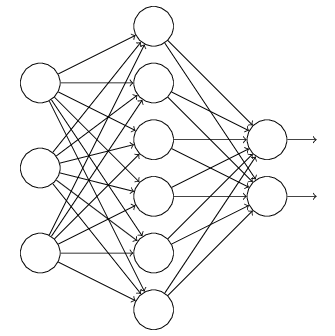
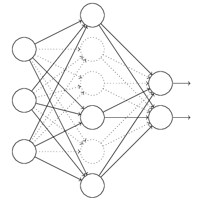
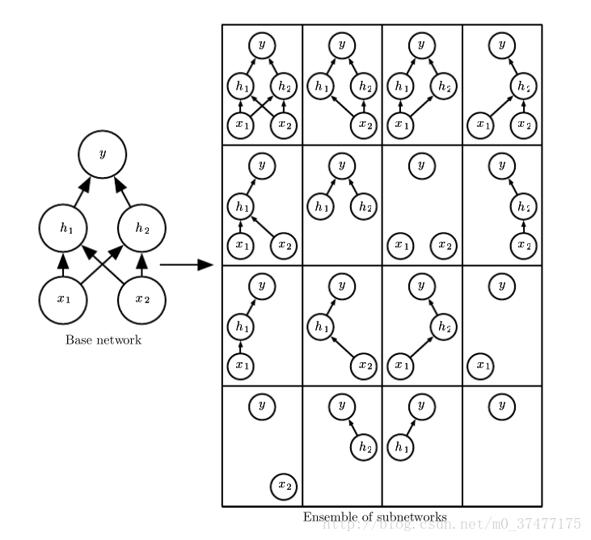

# dropout
正则是通过在代价函数后面加上正则项来防止模型过拟合的。而在神经网络中，另一种方法是通过修改神经网络本身结构来实现的，其名为Dropout。该方法是在对网络进行训练时用一种技巧（trick），对于如下所示的三层人工神经网络：

对于上图所示的网络，在训练开始时，随机得丢弃（dropout）一些（可以设定为一半，也可以为1/3，1/4等）隐藏层神经元的输入，即认为这些神经元不存在，同时保持输入层与输出层神经元的个数不变，这样便得到如下的神经网络：

然后按照BP学习算法对神经网络中的参数进行学习更新（虚线连接的单元不更新，因为认为这些神经元被临时删除了）。这样一次迭代更新便完成了。下一次迭代中，同样随机删除一些神经元，与上次不一样，做随机选择。这样一直进行，直至训练结束。 

在使用的时候，则不需要dropout，也就是保留所有神经元的输出，让所有的神经原参与最后的预测。

训练时候丢弃的方式比较简单，直接将这些被丢弃的神经元的输出置为0，然后照常参与运算即可。但是丢掉一些神经原的输出后，必然会对网络的运算产生影像，其中最重要的就是影响了数据的分布，因此需要做一些特殊的处理。在训练的时候，以一定比例，例如1/3来丢弃神经元的输出，那么保留下来的2/3的神经元其输出的分布的平均值只有原来的2/3,这时候，需要将输出统一除以2/3,以保证神经原输出的分布基本不变。在验证的时候，因为不再使用droput，所以不需要做任何操作。

## dropout的解释

### bagging

要具体解释为什么集成的方式可以提高泛化能力，先来介绍一下一个具体的方案-bagging的思想。

bagging是一种集成方法（ensemble methods）,可以通过集成来减小泛化误差（generalization error）。 
bagging的最基本的思想是通过分别训练几个不同分类器，最后对测试的样本，每个分类器对其进行投票。在机器学习上这种策略叫model averaging。 其之所以有效，是因为并非所有的分类器都会产生相同的误差，只要有不同的分类器产生的误差不同就会对减小泛化误差非常有效。 

可以把dropout类比成将许多大的神经网络进行集成的一种bagging方法。 但是每一个神经网络的训练是非常耗时和占用很多内存的，训练很多的神经网络进行集合分类就显得太不实际了。Hinton等人在《Dropout: A simple way to prevent neural networks from overfitting》中声称，dropout相当于在原来的网络基础上进行修剪得到了一个新的规模较小的网络，较小的网络由于参数较少，因此不容易发生过拟合的状况。而最终不做dropout的网络，则相当于对训练过程中所有的较小网络的一个集成（ensemble）。因此可以获得比原始网络更好的性能。

