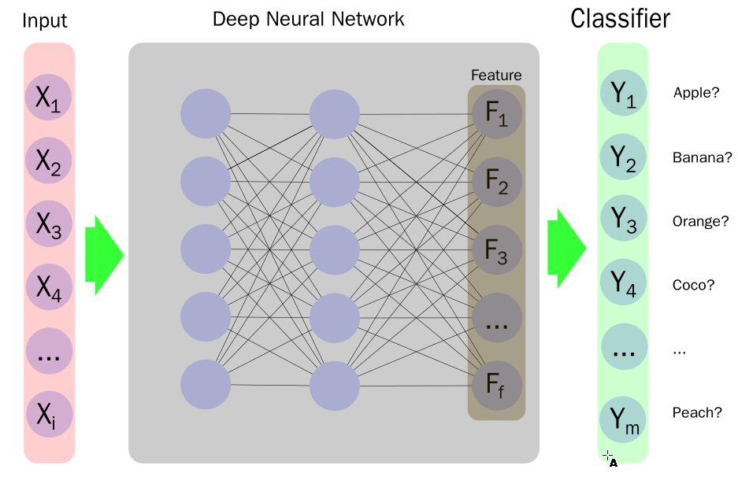
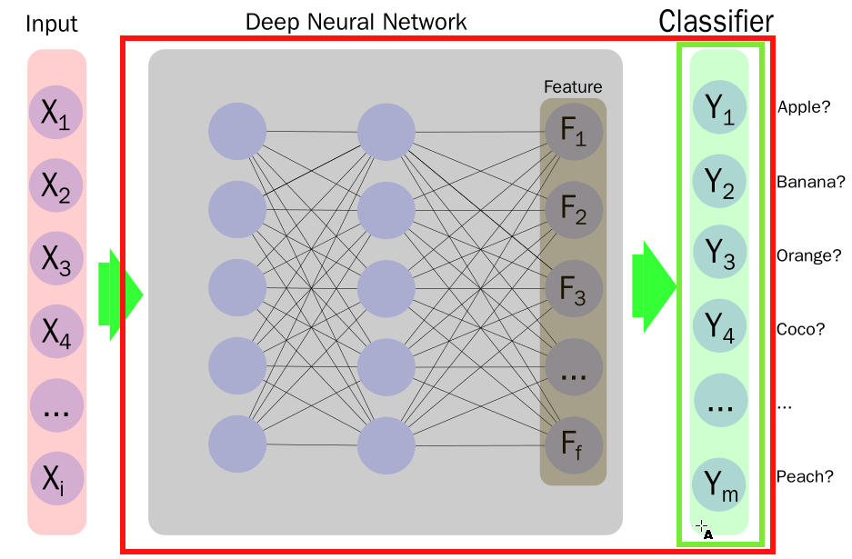
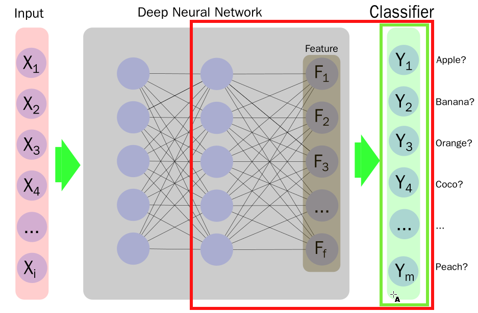
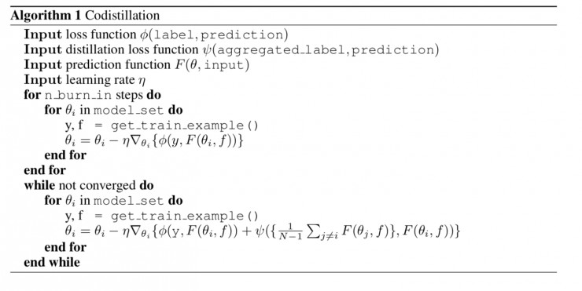

# 蒸馏法/transfer learning

## transfer learning
transfer learning或迁移学习，在机器学习上的广义定义为，研究在一个领域内获得的知识如何应用到另一个不同，但是有联系的领域。一个简单的例子是，识别小型汽车的模型如何应用于识别卡车上面。

深度学习领域，比较常被当作transfer learning典型例子的是模型的finetune。

> 需要注意的是，transfer learning严格的定义是知识的迁移，而模型finetune是建立在模型参数初始化方法上的。只是目前并不加以严格区分。

## 模型finetune

考虑图像分类领域的模型，其一般结构如下：

其中，Deep Neural Network层为特征提取网络，而最终与分类任务具体相关的只有最后的分类器Classifier层。

一般认为，模型的初始化过程中，参数的选择是比较重要的，好的参数初始化可以加速模型收敛的速度，并能有效提高模型最终的准确率等性能指标。一个训练好的模型，其参数要比随机初始化的模型，拥有更好的参数分布，因此以一个训练好的模型作为起点去训练，可以极大的缩短模型训练的过程。另外一种观点认为，训练好的模型，其内部已经拥有足够多的知识，已经可以认识很多东西，所以在这个基础上，再做训练可以利用已有的知识，更快的训练出任务相关的模型。

### model-zoo

因为已经训练好的模型在新模型训练过程中的种种优势，尽量使用预训练模型就成为了人工智能工作中的一个必要环节。为此，各大深度学习框架，为了方便框架的使用者，都会一共一些常见模型的预训练模型供下载。各框架提供模型下载的板块一般被称为model-zoo。

#### tensorflow

tensorflow的slim model-zoo位于 https://github.com/tensorflow/models/tree/master/research/slim。

其中提供的预训练模型有

Model | TF-Slim File | Checkpoint | Top-1 Accuracy| Top-5 Accuracy |
:----:|:------------:|:----------:|:-------:|:--------:|
[Inception V1](http://arxiv.org/abs/1409.4842v1)|[Code](https://github.com/tensorflow/models/blob/master/research/slim/nets/inception_v1.py)|[inception_v1_2016_08_28.tar.gz](http://download.tensorflow.org/models/inception_v1_2016_08_28.tar.gz)|69.8|89.6|
[Inception V2](http://arxiv.org/abs/1502.03167)|[Code](https://github.com/tensorflow/models/blob/master/research/slim/nets/inception_v2.py)|[inception_v2_2016_08_28.tar.gz](http://download.tensorflow.org/models/inception_v2_2016_08_28.tar.gz)|73.9|91.8|
[Inception V3](http://arxiv.org/abs/1512.00567)|[Code](https://github.com/tensorflow/models/blob/master/research/slim/nets/inception_v3.py)|[inception_v3_2016_08_28.tar.gz](http://download.tensorflow.org/models/inception_v3_2016_08_28.tar.gz)|78.0|93.9|
[Inception V4](http://arxiv.org/abs/1602.07261)|[Code](https://github.com/tensorflow/models/blob/master/research/slim/nets/inception_v4.py)|[inception_v4_2016_09_09.tar.gz](http://download.tensorflow.org/models/inception_v4_2016_09_09.tar.gz)|80.2|95.2|
[Inception-ResNet-v2](http://arxiv.org/abs/1602.07261)|[Code](https://github.com/tensorflow/models/blob/master/research/slim/nets/inception_resnet_v2.py)|[inception_resnet_v2_2016_08_30.tar.gz](http://download.tensorflow.org/models/inception_resnet_v2_2016_08_30.tar.gz)|80.4|95.3|
[ResNet V1 50](https://arxiv.org/abs/1512.03385)|[Code](https://github.com/tensorflow/models/blob/master/research/slim/nets/resnet_v1.py)|[resnet_v1_50_2016_08_28.tar.gz](http://download.tensorflow.org/models/resnet_v1_50_2016_08_28.tar.gz)|75.2|92.2|
[ResNet V1 101](https://arxiv.org/abs/1512.03385)|[Code](https://github.com/tensorflow/models/blob/master/research/slim/nets/resnet_v1.py)|[resnet_v1_101_2016_08_28.tar.gz](http://download.tensorflow.org/models/resnet_v1_101_2016_08_28.tar.gz)|76.4|92.9|
[ResNet V1 152](https://arxiv.org/abs/1512.03385)|[Code](https://github.com/tensorflow/models/blob/master/research/slim/nets/resnet_v1.py)|[resnet_v1_152_2016_08_28.tar.gz](http://download.tensorflow.org/models/resnet_v1_152_2016_08_28.tar.gz)|76.8|93.2|
[ResNet V2 50](https://arxiv.org/abs/1603.05027)^|[Code](https://github.com/tensorflow/models/blob/master/research/slim/nets/resnet_v2.py)|[resnet_v2_50_2017_04_14.tar.gz](http://download.tensorflow.org/models/resnet_v2_50_2017_04_14.tar.gz)|75.6|92.8|
[ResNet V2 101](https://arxiv.org/abs/1603.05027)^|[Code](https://github.com/tensorflow/models/blob/master/research/slim/nets/resnet_v2.py)|[resnet_v2_101_2017_04_14.tar.gz](http://download.tensorflow.org/models/resnet_v2_101_2017_04_14.tar.gz)|77.0|93.7|
[ResNet V2 152](https://arxiv.org/abs/1603.05027)^|[Code](https://github.com/tensorflow/models/blob/master/research/slim/nets/resnet_v2.py)|[resnet_v2_152_2017_04_14.tar.gz](http://download.tensorflow.org/models/resnet_v2_152_2017_04_14.tar.gz)|77.8|94.1|
[ResNet V2 200](https://arxiv.org/abs/1603.05027)|[Code](https://github.com/tensorflow/models/blob/master/research/slim/nets/resnet_v2.py)|[TBA]()|79.9\*|95.2\*|
[VGG 16](http://arxiv.org/abs/1409.1556.pdf)|[Code](https://github.com/tensorflow/models/blob/master/research/slim/nets/vgg.py)|[vgg_16_2016_08_28.tar.gz](http://download.tensorflow.org/models/vgg_16_2016_08_28.tar.gz)|71.5|89.8|
[VGG 19](http://arxiv.org/abs/1409.1556.pdf)|[Code](https://github.com/tensorflow/models/blob/master/research/slim/nets/vgg.py)|[vgg_19_2016_08_28.tar.gz](http://download.tensorflow.org/models/vgg_19_2016_08_28.tar.gz)|71.1|89.8|
[MobileNet_v1_1.0_224](https://arxiv.org/pdf/1704.04861.pdf)|[Code](https://github.com/tensorflow/models/blob/master/research/slim/nets/mobilenet_v1.py)|[mobilenet_v1_1.0_224.tgz](http://download.tensorflow.org/models/mobilenet_v1_2018_02_22/mobilenet_v1_1.0_224.tgz)|70.9|89.9|
[MobileNet_v1_0.50_160](https://arxiv.org/pdf/1704.04861.pdf)|[Code](https://github.com/tensorflow/models/blob/master/research/slim/nets/mobilenet_v1.py)|[mobilenet_v1_0.50_160.tgz](http://download.tensorflow.org/models/mobilenet_v1_2018_02_22/mobilenet_v1_0.5_160.tgz)|59.1|81.9|
[MobileNet_v1_0.25_128](https://arxiv.org/pdf/1704.04861.pdf)|[Code](https://github.com/tensorflow/models/blob/master/research/slim/nets/mobilenet_v1.py)|[mobilenet_v1_0.25_128.tgz](http://download.tensorflow.org/models/mobilenet_v1_2018_02_22/mobilenet_v1_0.25_128.tgz)|41.5|66.3|
[MobileNet_v2_1.4_224^*](https://arxiv.org/abs/1801.04381)|[Code](https://github.com/tensorflow/models/blob/master/research/slim/nets/mobilenet/mobilenet_v2.py)| [mobilenet_v2_1.4_224.tgz](https://storage.googleapis.com/mobilenet_v2/checkpoints/mobilenet_v2_1.4_224.tgz) | 74.9 | 92.5|
[MobileNet_v2_1.0_224^*](https://arxiv.org/abs/1801.04381)|[Code](https://github.com/tensorflow/models/blob/master/research/slim/nets/mobilenet/mobilenet_v2.py)| [mobilenet_v2_1.0_224.tgz](https://storage.googleapis.com/mobilenet_v2/checkpoints/mobilenet_v2_1.0_224.tgz) | 71.9 | 91.0
[NASNet-A_Mobile_224](https://arxiv.org/abs/1707.07012)#|[Code](https://github.com/tensorflow/models/blob/master/research/slim/nets/nasnet/nasnet.py)|[nasnet-a_mobile_04_10_2017.tar.gz](https://storage.googleapis.com/download.tensorflow.org/models/nasnet-a_mobile_04_10_2017.tar.gz)|74.0|91.6|
[NASNet-A_Large_331](https://arxiv.org/abs/1707.07012)#|[Code](https://github.com/tensorflow/models/blob/master/research/slim/nets/nasnet/nasnet.py)|[nasnet-a_large_04_10_2017.tar.gz](https://storage.googleapis.com/download.tensorflow.org/models/nasnet-a_large_04_10_2017.tar.gz)|82.7|96.2|
[PNASNet-5_Large_331](https://arxiv.org/abs/1712.00559)|[Code](https://github.com/tensorflow/models/blob/master/research/slim/nets/nasnet/pnasnet.py)|[pnasnet-5_large_2017_12_13.tar.gz](https://storage.googleapis.com/download.tensorflow.org/models/pnasnet-5_large_2017_12_13.tar.gz)|82.9|96.2|

#### pytorch
pytorch的model-zoo文档位于https://pytorch.org/docs/master/torchvision/models.html

其中提供的预训练模型：

|Network | Top-1 error | Top-5 error|
|-|-|
|AlexNet | 43.45 | 20.91|
|VGG-11 | 30.98 | 11.37|
|VGG-13 | 30.07 | 10.75|
|VGG-16 | 28.41 | 9.62|
|VGG-19 | 27.62 | 9.12|
|VGG-11 with batch normalization | 29.62 | 10.19|
|VGG-13 with batch normalization | 28.45 | 9.63|
|VGG-16 with batch normalization | 26.63 | 8.50|
|VGG-19 with batch normalization | 25.76 | 8.15|
|ResNet-18 | 30.24 | 10.92|
|ResNet-34 | 26.70 | 8.58|
|ResNet-50 | 23.85 | 7.13|
|ResNet-101 | 22.63 | 6.44|
|ResNet-152 | 21.69 | 5.94|
|SqueezeNet 1.0 | 41.90 | 19.58|
|SqueezeNet 1.1 | 41.81 | 19.38|
|Densenet-121 | 25.35 | 7.83|
|Densenet-169 | 24.00 | 7.00|
|Densenet-201 | 22.80 | 6.43|
|Densenet-161 | 22.35 | 6.20|
|Inception v3 | 22.55 | 6.44|

#### mxnet

mxnet的model-zoo在这里https://mxnet.incubator.apache.org/api/python/gluon/model_zoo.html

可用的模型如下：

| Alias            | Network                                                      | # Parameters | Top-1 Accuracy | Top-5 Accuracy | Origin                                                       |
| ---------------- | ------------------------------------------------------------ | ------------ | -------------- | -------------- | ------------------------------------------------------------ |
| alexnet          | [AlexNet](https://arxiv.org/abs/1404.5997)                   | 61,100,840   | 0.5492         | 0.7803         | Converted from pytorch vision                                |
| densenet121      | [DenseNet-121](https://arxiv.org/pdf/1608.06993.pdf)         | 8,062,504    | 0.7497         | 0.9225         | Converted from pytorch vision                                |
| densenet161      | [DenseNet-161](https://arxiv.org/pdf/1608.06993.pdf)         | 28,900,936   | 0.7770         | 0.9380         | Converted from pytorch vision                                |
| densenet169      | [DenseNet-169](https://arxiv.org/pdf/1608.06993.pdf)         | 14,307,880   | 0.7617         | 0.9317         | Converted from pytorch vision                                |
| densenet201      | [DenseNet-201](https://arxiv.org/pdf/1608.06993.pdf)         | 20,242,984   | 0.7732         | 0.9362         | Converted from pytorch vision                                |
| inceptionv3      | [Inception V3 299x299](http://arxiv.org/abs/1512.00567)      | 23,869,000   | 0.7755         | 0.9364         | Converted from pytorch vision                                |
| mobilenet0.25    | [MobileNet 0.25](https://arxiv.org/abs/1704.04861)           | 475,544      | 0.5185         | 0.7608         | Trained with [script](https://github.com/apache/incubator-mxnet/blob/master/example/gluon/image_classification.py) |
| mobilenet0.5     | [MobileNet 0.5](https://arxiv.org/abs/1704.04861)            | 1,342,536    | 0.6307         | 0.8475         | Trained with [script](https://github.com/apache/incubator-mxnet/blob/master/example/gluon/image_classification.py) |
| mobilenet0.75    | [MobileNet 0.75](https://arxiv.org/abs/1704.04861)           | 2,601,976    | 0.6738         | 0.8782         | Trained with [script](https://github.com/apache/incubator-mxnet/blob/master/example/gluon/image_classification.py) |
| mobilenet1.0     | [MobileNet 1.0](https://arxiv.org/abs/1704.04861)            | 4,253,864    | 0.7105         | 0.9006         | Trained with [script](https://github.com/apache/incubator-mxnet/blob/master/example/gluon/image_classification.py) |
| mobilenetv2_1.0  | [MobileNetV2 1.0](https://arxiv.org/abs/1801.04381)          | 3,539,136    | 0.7192         | 0.9056         | Trained with [script](https://gluon-cv.mxnet.io/model_zoo/index.html#image-classification) |
| mobilenetv2_0.75 | [MobileNetV2 0.75](https://arxiv.org/abs/1801.04381)         | 2,653,864    | 0.6961         | 0.8895         | Trained with [script](https://gluon-cv.mxnet.io/model_zoo/index.html#image-classification) |
| mobilenetv2_0.5  | [MobileNetV2 0.5](https://arxiv.org/abs/1801.04381)          | 1,983,104    | 0.6449         | 0.8547         | Trained with [script](https://gluon-cv.mxnet.io/model_zoo/index.html#image-classification) |
| mobilenetv2_0.25 | [MobileNetV2 0.25](https://arxiv.org/abs/1801.04381)         | 1,526,856    | 0.5074         | 0.7456         | Trained with [script](https://gluon-cv.mxnet.io/model_zoo/index.html#image-classification) |
| resnet18_v1      | [ResNet-18 V1](http://arxiv.org/abs/1512.03385)              | 11,699,112   | 0.7093         | 0.8992         | Trained with [script](https://gluon-cv.mxnet.io/model_zoo/index.html#image-classification) |
| resnet34_v1      | [ResNet-34 V1](http://arxiv.org/abs/1512.03385)              | 21,814,696   | 0.7437         | 0.9187         | Trained with [script](https://gluon-cv.mxnet.io/model_zoo/index.html#image-classification) |
| resnet50_v1      | [ResNet-50 V1](http://arxiv.org/abs/1512.03385)              | 25,629,032   | 0.7647         | 0.9313         | Trained with [script](https://gluon-cv.mxnet.io/model_zoo/index.html#image-classification) |
| resnet101_v1     | [ResNet-101 V1](http://arxiv.org/abs/1512.03385)             | 44,695,144   | 0.7834         | 0.9401         | Trained with [script](https://gluon-cv.mxnet.io/model_zoo/index.html#image-classification) |
| resnet152_v1     | [ResNet-152 V1](http://arxiv.org/abs/1512.03385)             | 60,404,072   | 0.7900         | 0.9438         | Trained with [script](https://gluon-cv.mxnet.io/model_zoo/index.html#image-classification) |
| resnet18_v2      | [ResNet-18 V2](https://arxiv.org/abs/1603.05027)             | 11,695,796   | 0.7100         | 0.8992         | Trained with [script](https://gluon-cv.mxnet.io/model_zoo/index.html#image-classification) |
| resnet34_v2      | [ResNet-34 V2](https://arxiv.org/abs/1603.05027)             | 21,811,380   | 0.7440         | 0.9208         | Trained with [script](https://gluon-cv.mxnet.io/model_zoo/index.html#image-classification) |
| resnet50_v2      | [ResNet-50 V2](https://arxiv.org/abs/1603.05027)             | 25,595,060   | 0.7711         | 0.9343         | Trained with [script](https://gluon-cv.mxnet.io/model_zoo/index.html#image-classification) |
| resnet101_v2     | [ResNet-101 V2](https://arxiv.org/abs/1603.05027)            | 44,639,412   | 0.7853         | 0.9417         | Trained with [script](https://gluon-cv.mxnet.io/model_zoo/index.html#image-classification) |
| resnet152_v2     | [ResNet-152 V2](https://arxiv.org/abs/1603.05027)            | 60,329,140   | 0.7921         | 0.9431         | Trained with [script](https://gluon-cv.mxnet.io/model_zoo/index.html#image-classification) |
| squeezenet1.0    | [SqueezeNet 1.0](https://arxiv.org/abs/1602.07360)           | 1,248,424    | 0.5611         | 0.7909         | Converted from pytorch vision                                |
| squeezenet1.1    | [SqueezeNet 1.1](https://github.com/DeepScale/SqueezeNet/tree/master/SqueezeNet_v1.1) | 1,235,496    | 0.5496         | 0.7817         | Converted from pytorch vision                                |
| vgg11            | [VGG-11](https://arxiv.org/abs/1409.1556)                    | 132,863,336  | 0.6662         | 0.8734         | Converted from pytorch vision                                |
| vgg13            | [VGG-13](https://arxiv.org/abs/1409.1556)                    | 133,047,848  | 0.6774         | 0.8811         | Converted from pytorch vision                                |
| vgg16            | [VGG-16](https://arxiv.org/abs/1409.1556)                    | 138,357,544  | 0.6986         | 0.8945         | Converted from pytorch vision                                |
| vgg19            | [VGG-19](https://arxiv.org/abs/1409.1556)                    | 143,667,240  | 0.7072         | 0.8988         | Converted from pytorch vision                                |
| vgg11_bn         | [VGG-11 with batch normalization](https://arxiv.org/abs/1409.1556) | 132,874,344  | 0.6859         | 0.8872         | Converted from pytorch vision                                |
| vgg13_bn         | [VGG-13 with batch normalization](https://arxiv.org/abs/1409.1556) | 133,059,624  | 0.6884         | 0.8882         | Converted from pytorch vision                                |
| vgg16_bn         | [VGG-16 with batch normalization](https://arxiv.org/abs/1409.1556) | 138,374,440  | 0.7142         | 0.9043         | Converted from pytorch vision                                |
| vgg19_bn         | [VGG-19 with batch normalization](https://arxiv.org/abs/1409.1556) | 143,689,256  | 0.7241         | 0.9093         | Converted from pytorch vision                                |

### 预训练模型的使用

各框架预训练模型的使用方式依各框架的特点有所不同。不过基本都不外乎以下几种使用模式：

- 使用除最后分类器外的全部预训练模型的权重初始化待训练模型，重新创建最后的Classifier分类器层（绿色框），并将待训练模型全部层一起训练（红色框的部分）
  
- 使用除最后分类器外的全部预训练模型的权重初始化待训练模型，重新创建最后的Classifier分类器层（绿色框），并只训练Classifier分类器层，参考上图
- 使用除最后分类器外的全部预训练模型的权重初始化待训练模型，重新创建最后的Classifier分类器层（绿色框），训练特征提取网络的部分层及最终的Classifier分类器层（红色框）
  
- 使用特征提取层的基础网络结构重新设计业务相关的网络，利用特征提取层部分权重初始化新设计网络对应的层。新网络其他部分直接默认初始化，训练整个网络的权重。典型应用如FCN等，使用的是VGG网络作为基础网络。

# 蒸馏法（distillation）

深度学习作为当今人工智能领域皇冠上最璀璨的明珠，如果要想将其推向工业级的应用，则往往需要可望而不可及的强大算力！而这种算力则是由价格高昂的硬件、庞大而复杂的分布式计算环境、精妙高效的算法作为支撑的。

同时，为了提升神经网络模型的性能，Caruana 等人早在 2006 年（那时深度学习还没有大火）就提出了一种压缩大规模复杂网络的方法。由于集成学习在传统的机器学习领域大获成功，许多深度学习研究人员很自然地想要利用集成学习的思想，将大量的模型聚合到一个神经网络中，通过暴力的训练，为不同的模型赋予不同的权值，对这些模型的输出进行加权平均得到最终的结果，以便充分利用它们各自对于不同的任务所具有的优势。

而这种暴力的训练过程和臃肿的网络结构需要消耗巨大的计算资源、造成额外的能源消耗。另外，由于基础架构的限制（分布式计算节点的通信、同步、任务调度等问题）、对模型进行优化求解的障碍、集成学习环境下各模型的贡献缺乏好的决策，使得盲目的堆砌计算资源也可能触碰到模型性能的天花板（例如：分布式随机梯度下降（distrtibuted SGD））。

另外随着数据量的增大，模型的规模也越来越大，而为了模型能够保持良好的泛化性能，许多情况下，深度学习工作者都使用容量远远超出任务所需参数量的大模型加上强力的正则化来训练模型。最终导致模型训练完成后参数有很大程度的稀疏。也就是模型中的运算量，只有一部分对最终的预测结果有贡献。这也是一种对运算资源的浪费。

为此，「深度学习泰斗」Geoffrey E.Hinton 近年来在知识蒸馏（或者「暗知识提取」）方面做了一系列工作，试图通过这种从高计算能力要求、同时也具有高表现的模型中提取出一些隐含的知识，并且将其作为先验，通过设计新的网络结构和目标函数将这种知识「传授」给规模较小的深度学习网络，实现对网络模型的压缩，以显著缩小的网络规模和计算需求展现出尽量高的模型表现。这种知识压缩和提取的流程被Hinton等人称为模型的**蒸馏**(arxiv:1503.02531)。

Hinton认为，Dark knowledge，暗知识，就是隐藏在深度学习表面上所展现出来的网络结构、节点之间的连接权重、网络的输出这些看得到的数据之下的知识。如果能够找到一种途径，使得我们能够获取这种知识，并且将其包装成一种先验概率，迁移到更小的模型中去，是否能够提升小模型的性能呢？事实上，笔者认为，这也可以看作是在迁移学习的框架下，将大规模网络视作信息充分的 source domain，将小规模网络视作需要大规模网络补充信息的 target domain，而我们提取到的 dark knowledge 则是两个任务之间的 common knowledge。

如何处理这种知识则成为了一个关键的问题。Hinton注意到，现代神经网络中常用的输出层使用SoftMax函数作为标签概率分配函数，而最终的损失函数$J$则使用SoftMax交叉熵作为计算loss的方式。考虑两者的公式。
$$
\begin{align}
q_i &= \frac{exp(z_i)}{\sum_j \exp(z_j)} \\
J &= - \sum_i y_i log (q_i)
\end{align}
$$
然而这种处理方式存在一个负作用：与正确标签相比，模型为所有的误标签都分配了很小的概率。实际使用中，不同的标签其分配的概率可能达到几个数量级的差别。Hinton 举例说：在图片分类问题中，识别一辆宝马汽车的图片时，分类器将该图片识别为清洁车的概率是很小的，然而这种概率比起将其识别为胡萝卜的可能是会大出很多。同时，作为损失函数的交叉熵，其训练使用对应target的one-hot编码，因此只对正确分类的概率进行了损失统计，其他错误的分类，虽然携带有分离间的信息，却没有得到有效的利用，这无疑是浪费了重要的可以用于将大规模网络的知识迁移到小规模网络中去的宝贵先验概率。
$$
\begin{align}
q_i &= \frac{exp(z_i/T)}{\sum_j \exp(z_j/T)} \\
J &= - \sum_i y_i log (q_i)
\end{align}
$$
为此，Hinton简单修改了softmax的公式，加入了Tempature：
$$
q_i^{soft} = \frac{exp(z_i/T)}{\sum_j \exp(z_j/T)}
$$
当式中T=1的时候，就是传统的softmax。通过提高T，类似热力学系统中的概念，系统的能量会增加，而最终给出的概率则携带更多的信息（能量），数值上看，就是最终的概率分布变得不那么尖锐，趋于平缓（soft）。

最终蒸馏过程中，首先使用hard-target依传统方式训练一个比较大的模型，训练过程中，使用dropout，$l_2$等正则化方式限制模型权重增长。然后创建小模型，以大模型的高T值输出作为小模型的soft target，同时依小模型的任务需求，使用对应的hard-target(one-hot编码)。因此，小模型训练的过程中，其损失函数有两部分：
$$
\begin{align}
J &= \alpha J^{soft} + (1-\alpha)J^{hard} \\
J &= - \alpha \sum_i y_i^{soft} log (q_i^{soft})  -(1- \alpha) \sum_i y_i log (q_i)
\end{align}
$$
其中的$y_i^{soft}$就是大模型输出的soft softmax。

最终模型使用则仍旧取T=1,按照常规方式使用即可。

同时针对N个模型的组合（ensemble）可以使用N个模型输出的soft softmax来同时进行训练。

这种方式，也被称为Teacher-Student训练方式。

## 协同蒸馏（co-distillation）

可以看到，上述模型训练的过程，仍然涉及两个步骤，其训练的过程仍然较为复杂，因此其在应用中仍然受到一些限制。为此，Hinton等人又提出了协同蒸馏的概念（arxiv:1804.03235），指出一批同构的模型，其可互为teacher和student，具体算法如下：

因为，这里的teacher可以使用ckpt，不需要用最新的在训练模型，因此有比较大的灵活性，可以避免分布式SGD的参数更新问题。
