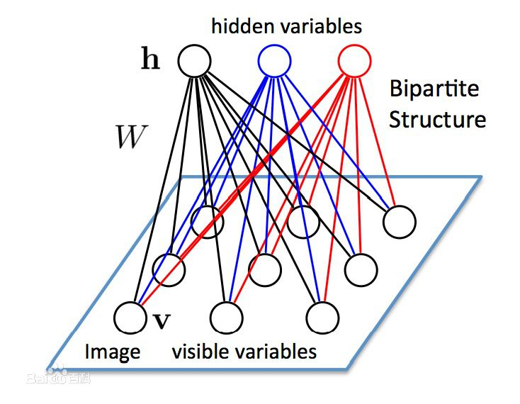
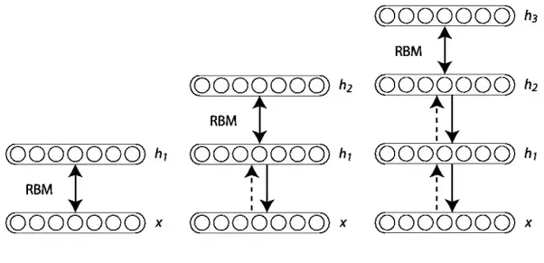

# 深度置信网络

深度置信网络（Deep Belief Networks）本质上是一种具有生成能力的图形表示网络，即它生成当前示例的所有可能值。

深度置信网络是概率统计学与机器学习和神经网络的融合，由多个带有数值的层组成，其中层之间存在关系，而数值之间没有。深层置信网络主要目标是帮助系统将数据分类到不同的类别。

- 深度置信网络由诸如波尔兹曼机无监督网络组成。在这里，每个子网络的不可见层是下一层的可见层。隐藏层或不可见的层并不是相互连接，而是有条件互相独立的。
- 将若干个RBM“串联”起来则构成了一个DBN，其中，上一个RBM的隐层即为下一个RBM的显层，上一个RBM的输出即为下一个RBM的输入。
- 训练过程中，需要充分训练上一层的RBM后才能训练当前层的RBM，直至最后一层。

## 深度信念网络如何演进？

第一代神经网络使用感知器，通过考虑“权重”或预先馈送的目标属性来识别特定的物体或其他物体。然而，感知器只能在更基本的层面上有效，并不能提高识别的技术。

为了解决这些问题，第二代神经网络引入了反向传播的概念，将得到的输出与期望的输出进行比较，最终目标是使误差值减小到零。支持向量机通过引用先前测试用例的输入来创建和理解更多的测试用例。

接下来是针对信念网络的非循环图。这种图能够帮助解决与推理那些和学习问题有关的问题。随后是深度置信网络，它帮助创建存储在叶节点中的无偏值。

## 受限玻尔兹曼机

深度置信网络由诸如波尔兹曼机无监督网络组成。在这里，每个子网络的不可见层是下一层的可见层。隐藏层或不可见的层并不是相互连接，而是有条件互相独立的。

联合配置网络的可见层和隐藏层上的概率，取决于联合配置网络的能量与其他所有联合配置网络的能量。

## 训练深度置信网络

训练网络层属性的第一步是直接从像素获取输入信号。下一步是将此图层的值作为像素，并在第二个隐藏层从先前获取的特征中学习特征。每当另一层的属性或特征被添加到深度置信网络时，训练数据集的对数概率的下限就会有所改善。

DBN和RBM可使用贪婪的层际无监督训练原则是每层的基石，过程如下：
- 将第一层作为RBM训练，将$x=h_{0}$输入作为可见层。
- 将第一层获取的输入表征作为第二层数据。
- 将第二层作为RBM训练，将转化后的数据（样本或平均激活）作为训练样本。
- 重复2和3，选择满意的层数，每次向上传递样本或平均值。
- 细调该深度结构的所有参数，参考DBN指数相似代理，或有监督训练标准（加入额外的学习机器把习得的表征转化为有监督的预测，例如线形分类）。

## 实施

贪婪学习算法被用来训练整个深度置信网络。它一次训练一个波尔兹曼机，直到所有的波尔兹曼机都被训练为止。
