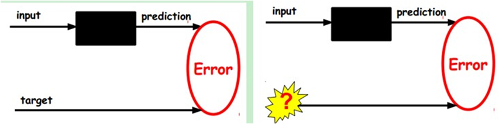
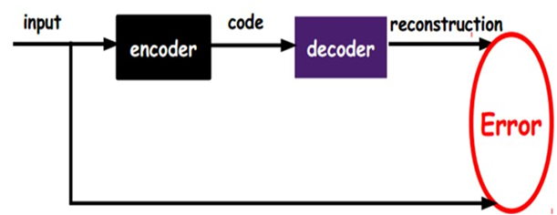
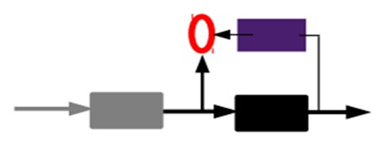
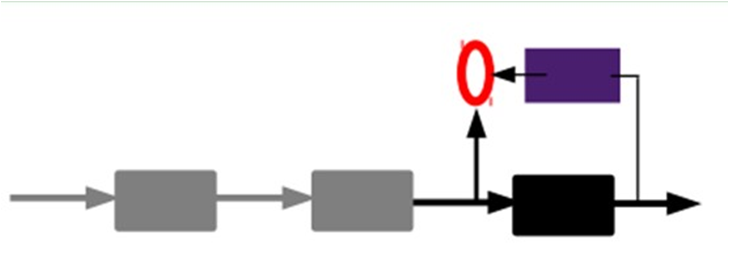
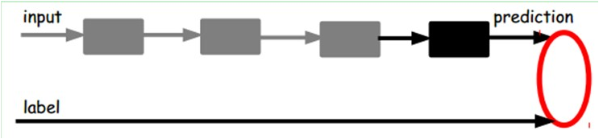
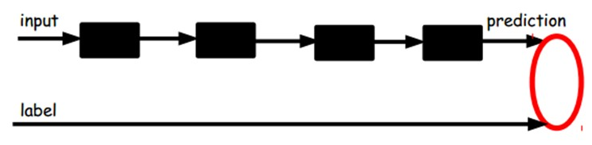

# 自动编码机

自动编码机（Autoencoder）属于非监督学习，不需要对训练样本进行标记。自动编码机（Autoencoder）由三层网络组成，其中输入层神经元数量与输出层神经元数量相等，中间层神经元数量少于输入层和输出层。在网络训练期间，对每个训练样本，经过网络会在输出层产生一个新的信号，网络学习的目的就是使输出信号与输入信号尽量相似。自动编码机（Autoencoder）训练结束之后，其可以由两部分组成，首先是输入层和中间层，我们可以用这个网络来对信号进行压缩；其次是中间层和输出层，我们可以将压缩的信号进行还原。

自动编码机原理，假设我们输入一个n维的信号$x (x \in {[0,1]})$，经过输入层到达中间层，信号变为y，可以用如下公式表示：
$$
y=s(Wx+b)
$$

上式中中 s 是非线性函数，如sigmoid. W是输入层到中间层的链接权值，b为中间层的bias. 信号y经过解码层解码，输出到n个神经元的输出层，信号变为z,如下公式： 

$$
z=s(W′y+b′)
$$
上式中中 s是非线性函数，如sigmoid. W′是中间层到输出层的链接权值，b′为输出层的bias. z 被当作是x的预测。 通常情况下，权重矩阵W′被限制为权重矩阵W的转置：$W' = W^{T}$.

当前的问题就是调整网络参数，使得最终输出的z与原始输入的信号x尽量的接近。根据输入数据的假设分布，有很多误差计算方法。可以使用典型的平方误差（squared error）:$L(xz) = ||x-z||^{2}$. 如果输入的数据为位向量或者是位概率向量，可以使用交叉熵方法：
$$
\begin{aligned}
L_{H}(x,z) = -\sum _{k=1}^{n}[x_{k}log{z_{k}} + (1-x_{k})log(1-z_{k})]
\end{aligned}
$$

我们希望中间层输出的分布式y,它能够捕获数据变化的主要因素的坐标数据。这类似于将数据投影到主成分上，可以获取数据变化的主要因素。如果我们将输入层与中间层之间的函数s变为线性函数，将最终输出层信号z与原始输入信号x的误差变为设为平方误差.则这个问题就变成了一个线性代数中的主成份分析问题了。假设中间层有k个节点，就变成由输入信号x的前k个主成份项，来近似表示原始输入信号.如果中间层的函数s是非线性的，自动编码机功能不同于PCA，具有捕获输入数据多模态方面的能力。当我们考虑堆叠多个编码器构建深度自动编码器时，不考虑PCA变得更加重要。

因为y可以视为x的有损压缩形式，通过我们的优化算法，可以对训练样本产生很好的压缩效果，同时在测试样本集上有很好的表现，但是我们并不能保证网络可以所有样本都有好的压缩效果。
## 特征提取能力

1. 给定无标签数据，用非监督学习学习特征： 

在我们之前的神经网络中，如第一个图，我们输入的样本是有标签的，即（input, target），这样我们根据当前输出和target（label）之间的差去改变前面各层的参数，直到收敛。但现在我们只有无标签数据，也就是右边的图。那么这个误差怎么得到呢？

如图，我们将input输入一个encoder编码器，就会得到一个code，这个code也就是输入的一个表示，那么我们怎么知道这个code表示的就是input呢？我们加一个decoder解码器，这时候decoder就会输出一个信息，那么如果输出的这个信息和一开始的输入信号input是很像的（理想情况下就是一样的），那很明显，我们就有理由相信这个code是靠谱的。所以，我们就通过调整encoder和decoder的参数，使得重构误差最小，这时候我们就得到了输入input信号的第一个表示了，也就是编码code了。因为是无标签数据，所以误差的来源就是直接重构后与原输入相比得到。

2. 通过编码器产生特征，然后训练下一层。这样逐层训练： 

得到第一层的code，我们的重构误差最小让我们相信这个code就是原输入信号的良好表达了，或者牵强点说，它和原信号是一模一样的（表达不一样，反映的是一个东西）。那第二层和第一层的训练方式就没有差别了，我们将第一层输出的code当成第二层的输入信号，同样最小化重构误差，就会得到第二层的参数，并且得到第二层输入的code，也就是原输入信息的第二个表达了。其他层就同样的方法炮制就行了（训练这一层，前面层的参数都是固定的，并且他们的decoder已经没用了，都不需要了）。

3. 有监督微调： 

到这里，这个AutoEncoder还不能用来分类数据，因为它还没有学习如何去连结一个输入和一个类。它只是学会了如何去重构或者复现它的输入而已。那么，为了实现分类，我们就可以在AutoEncoder的最顶的编码层添加一个分类器（例如罗杰斯特回归、SVM等），然后通过标准的多层神经网络的监督训练方法（梯度下降法）去训练。也就是说，这时候，我们需要将最后层的特征code输入到最后的分类器，通过有标签样本，通过监督学习进行微调，这也分两种，一个是只调整分类器（黑色部分）。

另一种：通过有标签样本，微调整个系统：（如果有足够多的数据，这个是最好的。end-to-end learning端对端学习）

一旦监督训练完成，这个网络就可以用来分类了。神经网络的最顶层可以作为一个线性分类器，然后我们可以用一个更好性能的分类器去取代它。在研究中可以发现，如果在原有的特征中加入这些自动学习得到的特征可以大大提高精确度，甚至在分类问题中比目前最好的分类效果还要好。