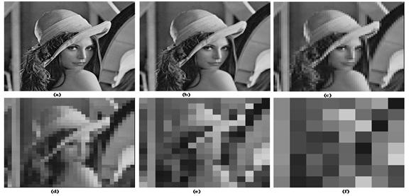
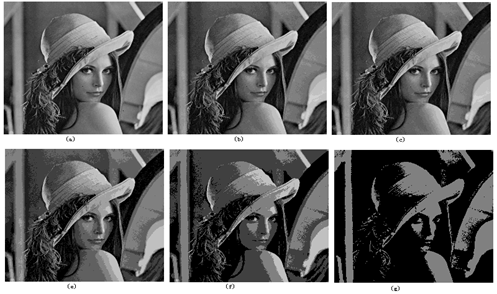

# 图像的采样和量化

获取图像的目标是从感知的数据中产生数字图像，但是传感器的输出是连续的电压波形，因此需要把连续的感知数据转换为数字形式。这一过程由图像的取样与量化来完成。  数字化坐标值称为取样；数字化幅度值称为量化。   

## 图像采样

在取样时，若横向的像素数（列数）为M ，纵向的像素数（行数）为N，则图像总像素数为M*N个像素。一般来说，采样间隔越大，所得图像像素数越少，空间分辨率低，质量差，严重时出现马赛克效应；采样间隔越小，所得图像像素数越多，空间分辨率高，图像质量好，但数据量大。

## 图像的量化

量化等级越多，所得图像层次越丰富，灰度分辨率高，图像质量好，但数据量大；量化等级越少，图像层次欠丰富，灰度分辨率低，会出现假轮廓现象，图像质量变差，但数据量小。

很明显，数字图像的质量在很大程度上取决于取样和量化中所用的样本数和灰度级。一般，当限定数字图像的大小时, 为了得到质量较好的图像可采用如下原则：

1. 对缓变的图像， 应该细量化， 粗采样， 以避免假轮廓。
2. 对细节丰富的图像，应细采样，粗量化， 以避免模糊（混叠）。