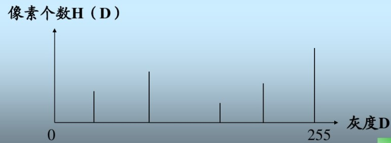

# 灰度/颜色直方图

## 灰度直方图

灰度直方图是关于灰度级分布的函数，是对图像中灰度级分布的统计。灰度直方图是将数字图像中的所有像素，按照灰度值的大小，统计其出现的频率。一幅图像由不同灰度值的像素组成，图像中灰度的分布情况是该图像的一个重要特征。图像的灰度直方图就描述了图像中灰度分布情况，能够很直观的展示出图像中各个灰度级所占的多少。 图像的灰度直方图是灰度级的函数，描述的是图像中具有该灰度级的像素的个数：其中，横坐标是灰度级，纵坐标是该灰度级出现的频率。 

不过通常会将纵坐标归一化到[0,1]区间内，也就是将灰度级出现的频率（像素个数）除以图像中像素的总数。灰度直方图的计算公式如下：
$$
p(r_k) = \frac{n_k}{MN}
$$
其中，$r_k$是像素的灰度级，$n_k$是具有灰度$r_k$的像素的个数，$MN$是图像中总的像素个数。 

## 颜色直方图

颜色直方图是在许多图像检索系统中被广泛采用的颜色特征。它所描述的是不同色彩在整幅图像中所占的比例，而并不关心每种色彩所处的空间位置，即无法描述图像中的对象或物体。颜色直方图特别适于描述那些难以进行自动分割的图像。 直方图中的数值都是统计而来，描述了该图像中关于颜色的数量特征，可以反映颜色直方图。图像颜色的统计分布和基本色调;直方图只包含了该图像中某一颜色值出现的频数，而丢失了某象素所在的空间位置信息;任一幅图像都能唯一的给出一幅与它对应的直方图，但不同的图像可能有相同的颜色分布，从而就具有相同的直方图，因此直方图与图像是一对多的关系;如将图像划分为若干个子区域，所有子区域的直方图之和等于全图直方图;一般情况下，由于图像上的背景和前景物体颜色分布明显不同，从而在直方图上会出现双峰特性，但背景和前景颜色较为接近的图像不具有这个特性。

### 类别

​	全局颜色直方图：反映的是图像中颜色的组成分布，即出现了哪些颜色以及各种颜色出现的概率，Swain 和 Ballard最先提出了使用颜色直方图作为图像颜色特征的表示方法。他们还指出:颜色直方图相对于图像的以观察轴为轴心的旋转以及幅度不大的平移和缩放等几何变换是不敏感的，颜色直方图对于图像质量的变化(如模糊)也不甚敏感。颜色直方图的这种特性使得它比较适合于检索图像的全局颜色相似性的场合，即通过比较颜色直方图的差异来衡量两幅图像在颜色全局分布上的差异。

​	累加颜色直方图：当图像中的特征并不能取遍所有可取值时，统计直方图中会出现一些零值。这些零值的出现会对相似性度量的计算带来影响，从而使得相似性度量并不能正确反映图像之间的颜色差别。为解决这个问题，在全局直方图的基础上，Stricker和Orengo进一步提出了使用“累加颜色直方图”的概念。在累加直方图中，相邻颜色在频数上是相关的。相比一般直方图，虽然累加直方图的存储量和计算量有很小的增加，但是累加直方图消除了一般直方图中常见的零值，也克服了一般直方图量化过细过粗检索效果都会下降的缺陷。一般的颜色直方图由于颜色空间是三维的，具有相同的三通道独立分布，但其联合分布并不为一。这种不考虑联合分布的方法，会导致在结果集中不相似的图像数目增加。因此便产生了1x3D的颜色直方图，设三个通道的量化级数分别是$l、m、n$，则总的量化级数$K=l*m*n$。这种方法虽然克服了一维的缺点，但颜色分辨率较低，而特征维数较高。对于一般的直方图特征维数是$K=l+m+n$，因此1x3D直方图的高维数，给特征处理带来了极大的不便。因此便想到了量化直方图。考虑到不同颜色空间的特性，各通道对人眼的视觉重要程度不同，可以对不同的颜色通道给于不同的量化级数。预先给定量化级数，用联合的方法建立直方图比较简单，但是却存在以下的不足：首先，没有考虑图像本身的特点；其次，没有考虑颜色空间的特点，$l、m、n$的不同取值，不足以反映不同颜色空间的3D分布情况；最后，颜色集合的代表性差。