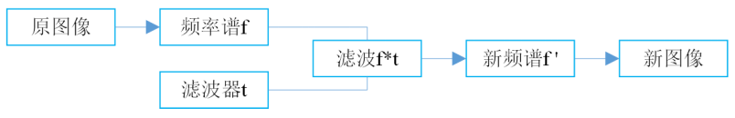
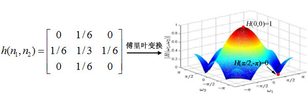
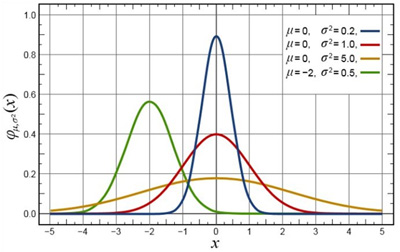
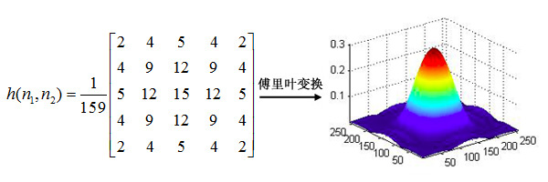
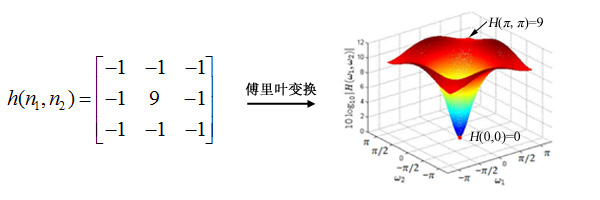

# 图像频域滤波

图像中灰度级的变化的快慢，称为频域（frequency domain）。用$X(w_1，w_2)$表示图像在频率$(w_1，w_2)$处的强度值，因为图像是二维的，因此其频率变化也是二维的。 

 

频域分析把图像分解为从低频到高频的频率成分。图像强度变化慢的区域只包含低频成分；强度值快速变化的区域产生高频成分。通过傅里叶变换或余弦变化可以清楚地显示图像的频率成分。图像是二维的，因此频率分两种，即垂直频率（垂直方向的变化$w_1$）和水平频率（水平方向的变化$w_2$）。

在频域分析的框架下，滤波器是一种放大图像中某些频段，同时滤掉（或减弱）其他频段的算子。低通滤波器（LPF, Low Pass Filter）就是消除高频部分，让低频分量通过；高通滤波器（HPF, High Pass Filter）就是消除低频部分，让高频分量通过。

之所以可以选择性的让某些频段通过，是因为图像滤波使用了逐个像素进行二维离散卷积的形式实现，而我们知道对空域信号的卷积相当于在频域的乘积。因此，滤波核的频率响应$h(w_1，w_2)$乘原始像素的频谱$X(w_1，w_2)$，相当于滤除了滤波核频谱较低位置的频率分量，而只有滤波和频谱较高区域的频率分量得以通过。

## 低通滤波器

低通滤波(Low-pass filter) 是一种过滤方式，规则为低频信号能正常通过，而超过设定临界值的高频信号则被阻隔、减弱。但是阻隔、减弱的幅度则会依据不同的频率以及不同的滤波程序（目的）而改变。它有的时候也被叫做高频去除过滤（high-cut filter）或者最高去除过滤（treble-cut filter)。低通过滤是高通过滤的对立。 

下面的$h(w_1，w_2)$为一个低通滤波器的滤波核，也就是冲激响应：

 

### 高斯低通滤波器

高斯滤波器是一种常见的低通滤波器，用于抑制服从正态分布的噪声非常有效。其滤波核中像素对应的权重（冲激响应*h*）与它到中心像素之间的距离成正比。

参数*σ*决定高斯函数曲线的宽度，即边缘像素所占比例的大小。*σ*越小曲线越窄，边缘像素的权重越低；反之，*σ*越大，曲线越宽，边缘像素所占权重越大。一维高斯分布如下图所示：

 

二维高斯分布： 
$$
x(n_1,n_2)= \frac{1}{{2\pi\sigma^2}}exp[-\frac{n_1^2+n_2^2}{2\sigma^2}]
$$
 

从低通滤波结果可以看出，原始图像中的低频分量（图像的平缓部分）通过了滤波器，而高频分量被抑制，整幅图像被平滑了，丢失了高频细节信息。 

## 高通滤波器

高通滤波(high-pass filter) 是一种过滤方式，规则为高频信号能正常通过，而低于设定临界值的低频信号则被阻隔、减弱。但是阻隔、减弱的幅度则会依据不同的频率以及不同的滤波程序（目的）而改变。它有的时候也被叫做低频去除过滤（low-cut filter）。 

下面的$h(w_1，w_2)$为一个高通滤波器的滤波核 :

 

通过高通滤波，原始图像中的高频分量（图像的边缘）被放大，而低频分量被抑制。 