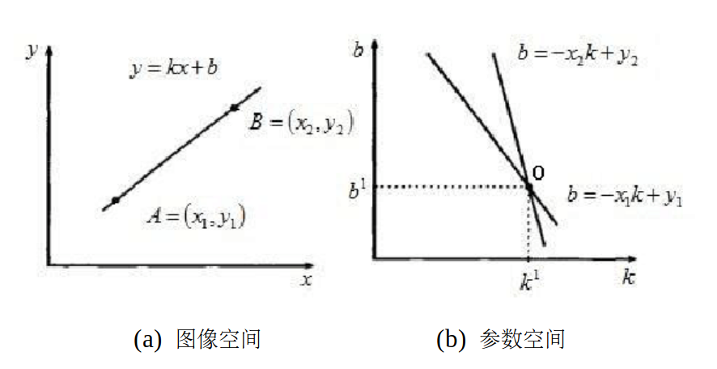
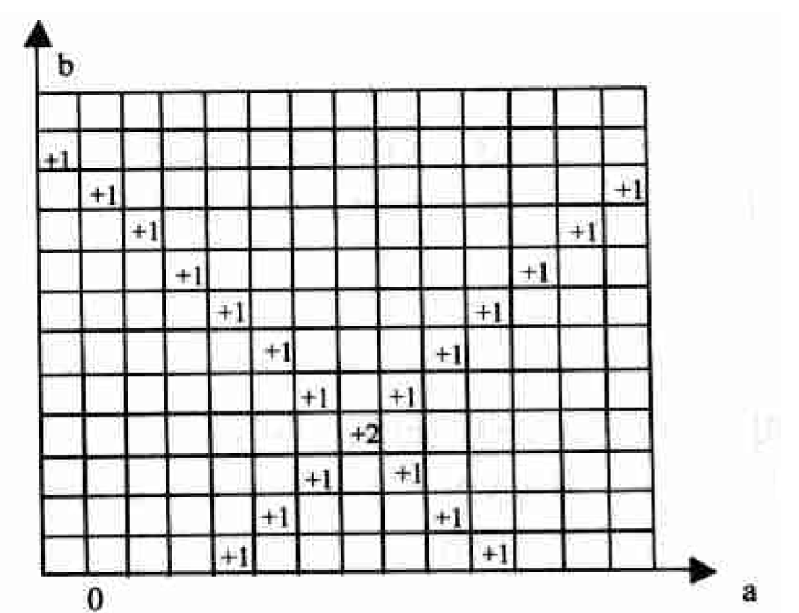
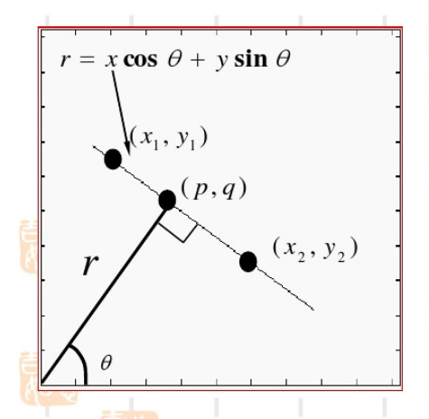
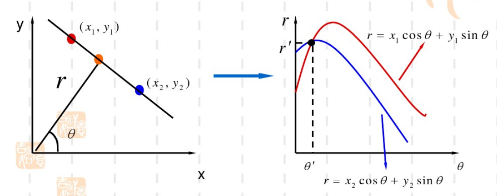
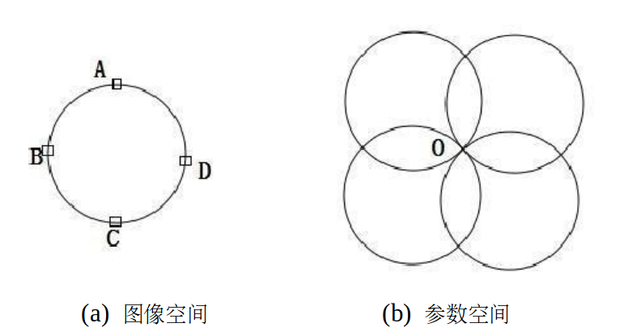
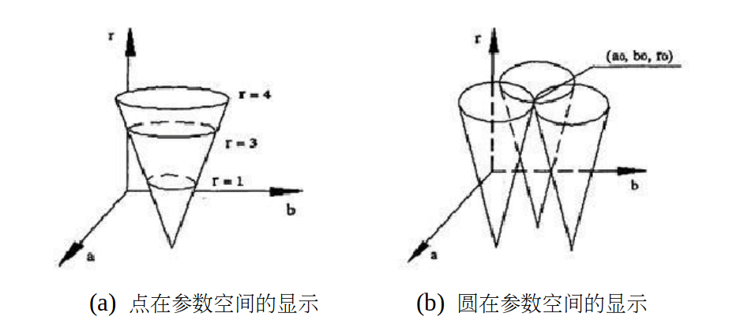

# 哈夫变换

哈夫变换的基本思想是将图像空间中的像素点映射到参数空间相应的轨迹，然后把参数空间中离散坐标点的轨迹经过次数进行累加，最后根据累加值确定最终模型参数。

## 1 在直角坐标系下哈夫变换的直线检测

在直线坐标系下有直线$y=kx+b$，其中$k$为斜率，$b$是截距。如下图，在直线上选取两个点$A(x_1,y_1)$、$B(x_2,y_2)$，过点$A$和$B$的直线表示为
$$
\begin{cases} y_1=kx_1+b \\ y_2=kx_2+b \end{cases}
$$

上式可以调整为
$$
\begin{cases} b=-x_1k+y_1 \\ b=-x_2k+y_2 \end{cases}
$$

这可以看作是在参考空间$(k,b)$下的两条直线，这表明图像空间中的一个点映射到参数空间就变成了一条直线。这两条直线相交于点$O$，这个相交点$O$就是点$A$和$B$所在直线的参数解，因此只要找到参数空间中多条直线经过的相交点，就能检测到图像空间的相应直线。

具体寻找相交点时，可以将参数空间离散化。

首先建立一个二维累加数组$A(k,b)$，表示直线经过参数空间离散点$(k,b)$附近的次数。

开始时$A(k,b)$初始化为0，对于图像空间的每个点$(x_i,y_i)$，转化到参数空间中的直线$b=-x_ik+y_i$，将$k$的所有离散值代入上式，从而计算出对应的$b$值。每计算出一对$(k,b)$，都将对应的数组$A(k,b)$加1。

所有的计算结束之后，在参数计算表决结果中找到$A(k,b)$的最大值，其所对应的$(k_0,b_0)$就是图像空间中共线点数最多的直线方程的参数，例子可以参见下图。

如果需要检测多条直线，后面只要继续寻找相应次峰值即可，它们对应于图像空间中共线点略少的直线。

但是，在直角坐标系下，存在一个很大问题：当所要检测的直线的斜率为无穷大时，在参数空间中的对应相交点的$k$值为无穷大，该相交点无法在实际应用中的参数空间中表示出来。

要解决该问题，可以用其他不包含无穷值的坐标系代替直角坐标系，如极坐标系。

## ２ 直线在极坐标系下的表达形式

如图，坐标原点到直线$l$的垂直距离为$r$，相应的垂足为$(p,q)$，该垂直线与$x$轴的夹角为$\theta$，那么有$(p,q)=(r\cos\theta,r\sin\theta)$。

直线$l$的斜率可以表示为$-\dfrac{1}{\tan\theta}$

假定直线上任一点为$(x,y)$，那么直线$l$的斜率也可以表示为$\dfrac{y-p}{x-q}=\dfrac{y-r\sin\theta}{x-r\cos\theta}$

所以
$$
\begin{align} &\dfrac{y-r\sin\theta}{x-r\cos\theta}=-\dfrac{1}{\tan\theta}\\ \Rightarrow &r = x\cos\theta + y\sin\theta \end{align}
$$

上式即为直线在极坐标下的表达形式，它的参数$r$和$\theta$在实际应用中不会出现无穷值情况。

## 3 在极坐标系下哈夫变换的直线边缘检测

与直角坐标系下同理，图像空间的两点$(x_1,y_1)$和$(x_2,y_2)$映射到参数空间得到
$$
\begin{cases} &r=x_1\cos\theta + y_1\sin\theta \\ &r=x_2\cos\theta + y_2\sin\theta \end{cases}
$$

上面表示两条波动函数，它们的相交点即为图像空间直线的参数解，如下图所示。

## 4 哈夫变换的圆边缘检测

假设在图像空间中，存在一个圆心为$(a_0,b_0)$，半径为$r$的圆：
$$
(x-a_0)^2 + (y-b_0)^2 = r^2
$$
转换到极坐标系表示为
$$
\begin{cases}
&x=a+r\cos\theta \\
&y=b+r\sin\theta
\end{cases}
$$
变为参数空间的表示形式
$$
\begin{cases}
&a=x-r\cos\theta \\
&b=y-r\sin\theta
\end{cases}
$$
如果已知所要检测的圆半径为$r=r_0$，假定图像空间中的一个点为$(x_0,y_0)$，该点映射到参数空间为
$$
\begin{cases}
&a=x_0-r_0\cos\theta \\
&b=y_0-r_0\sin\theta
\end{cases}
$$
由上式可知，图像空间上的点映射到参数空间就是一个圆。

如下图，如果我们在图像空间中取出$Ａ$、$Ｂ$、$Ｃ$、$Ｄ$四个边缘像素点，以$r$为半径映射到参数空间，可以得到参数空间中的四个圆交于点$O$，然后我们需要对参数空间中所有的离散坐标点进行统计，找出参数空间累加值最大的点。

实际应用中，一般无法得知检测圆的半径，那么图像空间中的点$(x,y)$映射到参数空间为$(a,b,r)$，由于$r$可以取任意值，图像空间中的任意一点对应参数空间的一个圆锥面(如下图所示)，这样圆的检测就从二维空间上升到三维空间，计算量明显增大。

