# 附加说明

## 为何需要自行编译

 opencv3.4
由于版权原因，因为在 3.0 之后版本的 OpenCV 对 SIFT、SURF等新算法没有提供直接
编译好的动态库来加载使用，必须自己编译。同样，OpenCV 对设计到版权问题的及比较新的、不太稳定的算法全都放到 opencv_contrib 中。且只在它的 Github 中能够找到，
OpenCV 的官网上是没有的。因此对于想使用 Sift、Sufer、双目立体匹配算法、结构光等新的算法及有专利权算法的同学需要自行编译。

## 常见问题

**如果可能，请尽量在一个刚装好OS得系统上面执行编译安装。有些软件，特别是大型开发IDE，会在系统里面添加一些你根本不了解的默认配置，导致编译过程出现一些奇怪的问题，而这些问题很多时候只在某个特定环境里出现，不拿到实际的机器，根本无法解决这类问题。**

关于目录，windows默认使用\作为目录分割符号，但是\同时是C语言中的转义字符，cmake中使用/作为目录分割符，C代码中可以使用\\作为或者/作为目录的分割符号。

(1) cmake配置过程中会自动从网络下载文件，因此网络不好的有可能出现 ffmpeg 找不到等相
应错误，具体可参考：https://blog.csdn.net/yiyuehuan/article/details/52951574

(2) 注意，如果系统已安装 CUDA9.0, 则会自动选择相应编译项，编译会出错。

改进
方法：

(a) 处理相应问题，改写编译文件，详见
https://blog.csdn.net/u014613745/article/details/78310916

(b) 去掉 CUDA 相应编译选项：如 WITH_CUDA, WITH_CUBLAS 和 WITH_CUFFT 等
由于版权原因，因为在 3.0 之后版本的 OpenCV 对 SIFT、SURF 等新算法没有提供直接
编译好的动态库来加载使用，必须自己编译。同样，OpenCV 对设计到版权问题的及比较
新的、不太稳定的算法全都放到 opencv_contrib 中。且只在它的 Github 中能够找到，
OpenCV 的官网上是没有的。因此对于想使用 Sift、Sufer、双目立体匹配算法、结构光等
新的算法及有专利权算法的同学需要自行编译。

(3) 此处编译未考虑添加 MATLAB, CUDA, QT 等支持，如计算机中已安装对应库，请在
CMake 配置时去掉对应选项。


# 附加资源

## 使用已经配置好的虚拟机镜像

安装确实有困难的学员，可以使用已经编译安装好opencv3.4.1和VisualStudio的虚拟机镜像文件，下载地址如下。

链接: https://pan.baidu.com/s/1q5BBW-zFIbnvUYwoKRVGew 提取码: 7uc5

虚拟机内系统用户名密码：Administrator/abc123!@#

下载完成后，使用VirtualBox软件导入即可使用。

虚拟机推荐至少分配4G以上内存。


## 教程中编译好的opecv3.4.1下载

上述虚拟机文件较大，这里将编译后的opencv打包提供如下。

链接: https://pan.baidu.com/s/1YtXG0hkCIRSCQUkuTryYww 提取码: 9bw9

下面这个也可以

链接：https://pan.baidu.com/s/15gsVfd2sXxMmOhBQq99czA 密码：4y96


## 配套视频教程

https://edu.csdn.net/course/detail/24757

# Visual Studio2019 Community下编译安装OpenCV3.4.1

## 安装前提

安装计算机配置（推荐）:Intel i5 CPU; 8G 内存；磁盘至少剩余 20G 空间；

操作系统：Windows 8.1/Windows 10或更新的windows 64 位版

已安装软件（安装顺序无关）：

(1) Visual Studio 2019 社区版(Community edition)或更高版本；

​	安装选项选择C++桌面开发和Python开发选项，如图所示。


VisualStudio的安装，需要在线下载7～8GB的安装文件，所以一定要找一个比较好的网络。

(2) CMake 软件 3.14 或更高版本
安装包下载地址(windows 64 位版)：

https://cmake.org/files/v3.14/cmake-3.14.3-win64-x64.msi

## 安装步骤

安装需要经过如下步骤：

(1) 下载 OpenCV 3.4.1 相关源码包；

(2) 使用 CMake 配置 OpenCV;

(3) 使用 Visual Studio 2019 最后编译 OpenCV；

### 下载 OpenCV 源码包

**请一定下载这里要求的版本，其他版本的安装有一些不一样的地方，需要单独处理**

下载需要的 Opencv3.4.1 版本源码：


https://github.com/opencv/opencv/releases


下载需要的 opencv_contrib3.4.1 版本源码

https://github.com/opencv/opencv_contrib/releases


**这两个压缩包文件名是一样的，注意不要相互覆盖了。**

然后保存至相关目录，解压。

假设解压后分别为 C:\opencv3.4.1-src\opencv-3.4.1和C:\opencv3.4.1-src\opencv_contrib-3.4.1

### 使用 Cmake 配置 OpenCV

我们选择的是从源代码编译安装opencv，所以首先要对源代码进行相应的配置，如编译器选项，某些组件是否需要编译等等的。曾经这个步骤是使用configure命令来实现的，现在多用cmake来进行相关的配置，cmake有一套自己的语法可以跨平台，能实现自动查找各平台编译器，配置相关组件等工作。

运行 CMake GUI（图形界面），如下图所示。在 Source Code 和 build the binaries
分别填入源代码目录和编译结果存放目录。源代码为刚才解压目录，build 目录使用C:/opencv3.4.1-src/opencv-3.4.1/build，cmake会自动帮我们创建这个目录。


点击 Configure, 选择对应编译器。cmake会自动检测OS内安装的编译器，一般选择默认的即可，这里因为系统里面只安装了VisualStudio，所以只有这个选项可用。

**这里OS是X64的，默认的opencv编译也是X64版本，包括后续的测试代码也都是编译X64版本的，请注意。**

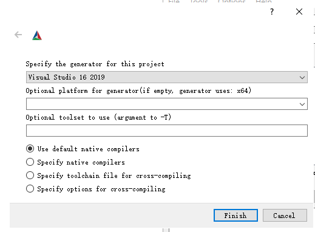

然后点击 Finish 按钮，开始配置过程。如图所示：

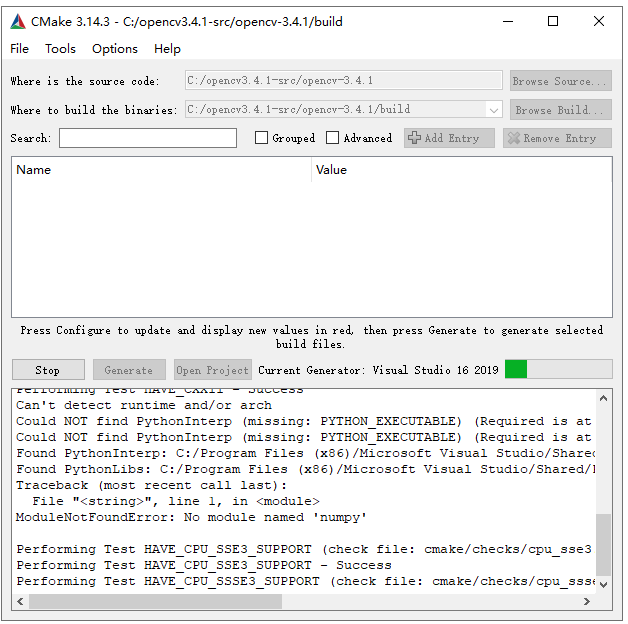

首次配置完成后会出现大量错误（红色条目），可以不用去管。接着在配置选项里面找到OPENCV_EXTRA_MODULES_PATH 项，填入Contrib目录，可以在Search框里面进行搜索这个选项。

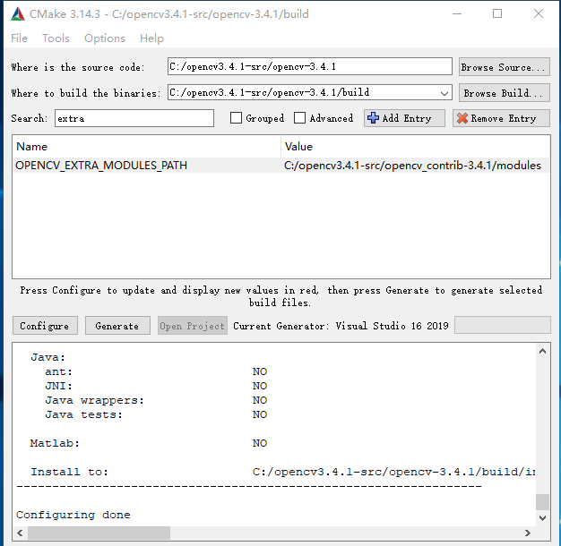

同时还要找到opencv_world的选项并进行勾选，这个选项默认是不勾选的，后续测试会用到这个模块。

>如果使用的是更新的opencv版本，可能还需编译NONFREE，这个需要注意。

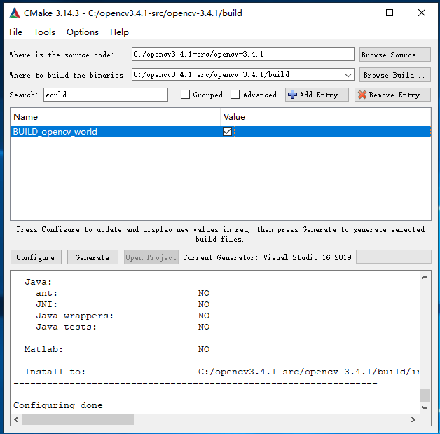

然后，再次点击 Configure 按钮，代码配置正常完成，如下图所示：

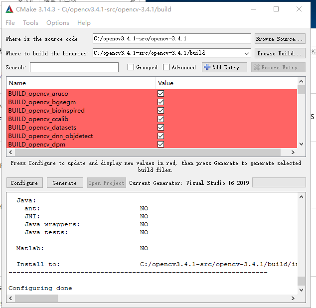

点击 Generate 按钮，cmake会生成用于VisualStudio编译的项目及sln文件，生成过程很快完成，如图所示：

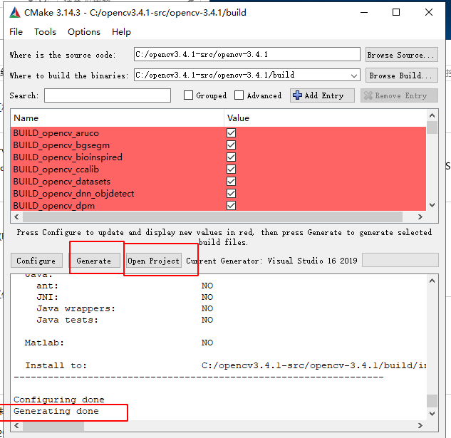

然后点击 Open Project 按钮(Generate 右侧)，在 Visual Studio 中打开项目，如图：

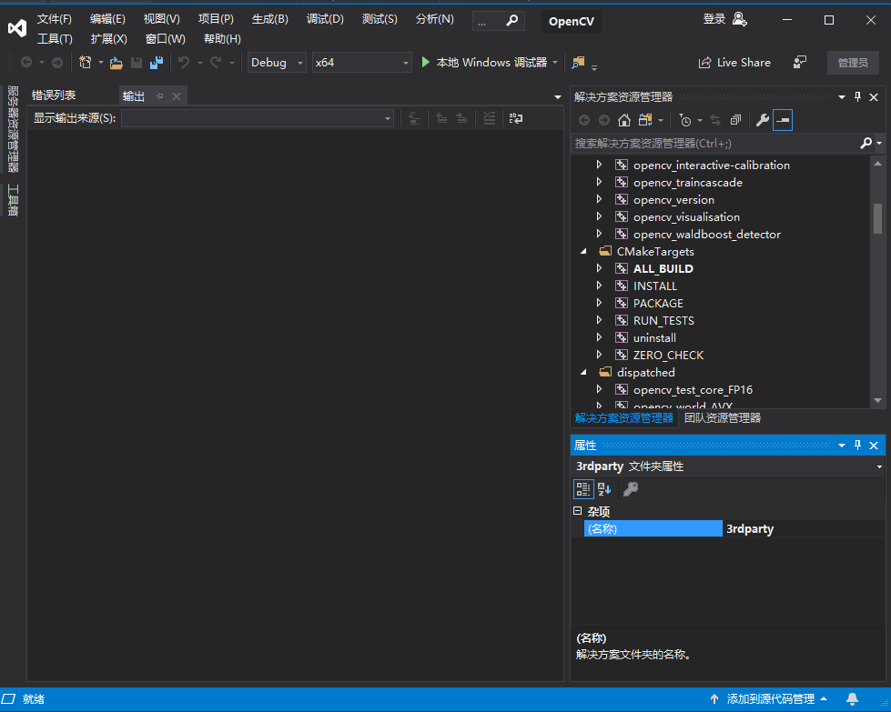

###  使用 Visual Studio 最后编译 OpenCV

右击VisualStudio解决方案资源管理器里面的CMakeTargets下面的INSTALL项目，选择“生成”，Visual Studio 会开始编译，整个过程耗时较长，30分钟到1小时或更久，视机器性能而定。

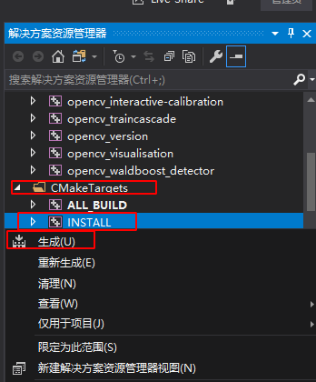

过一段时间后，系统提示编译完成，进入C:\opencv3.4.1-src\opencv-3.4.1\build\install目录，可以找到已经编译好的dll/lib等文件和include头文件目录。

至此，编译过程全部完成。

build目录在编译过程中，达到了17G的大小，所以开始编译前一定注意磁盘空间是否充足。

## OpenCV 开发配置与测试


把 C:\opencv3.4.1-src\opencv-3.4.1\build\install 文件夹下的内容全部复制到 C:\opencv3.4.1 文件夹中作为最终的编译文件使用.

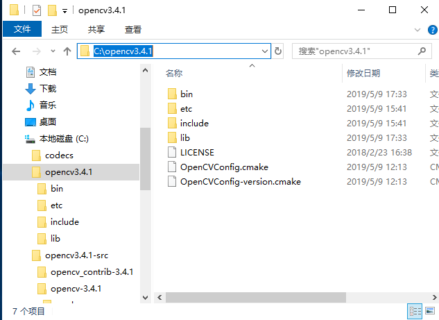

测试全部完成之后可以把C:\opencv3.4.1-src\opencv-3.4.1\build\ 内容删除(因为它实在太大了)：

(1) 将 C:\opencv3.4.1\bin和 C:\opencv3.4.1\lib添加到环境变量；这一步做一次就可以，以后每次新建一个项目都不用再做。

右键点击资源管理器中的此电脑->选择属性->选择高级系统设置->选择环境变量设置->选择系统环境变量->双击Path->依次新建两个环境变量，如图：

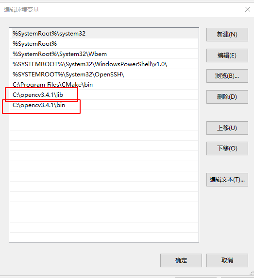

启动VisutllStudio，创建新项目，新建一个C++控制台应应用，项目名称为helloworld，保存在C:\codecs目录下。

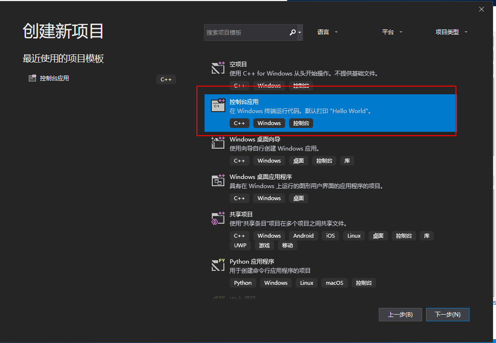

在解决方案资源管理器选择相应项目（这里是helloworld），右键点击，选择属性：

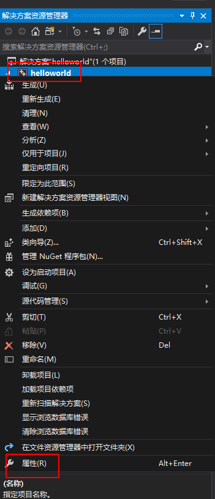


(2) 选择VC++目录，将C:\opencv3.4.1\include\opencv2;C:\opencv3.4.1\include\opencv;C:\opencv3.4.1\include;添加到“包含目录”中； 将C:\opencv3.4.1\lib;添加到 “库目录中”：如图所示：这一步每次新建项目都要做。

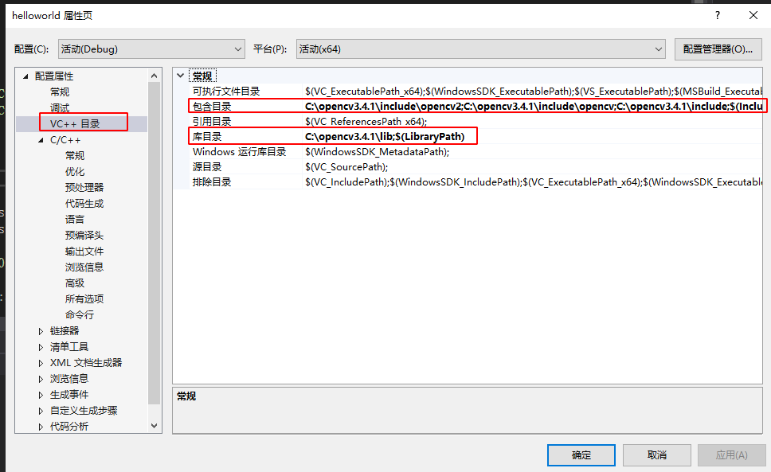

(3)找到链接器->输入->附加依赖项，将 opencv_world341d.lib 添加到“附加依赖库中”，这一步，每次新建项目都要做。

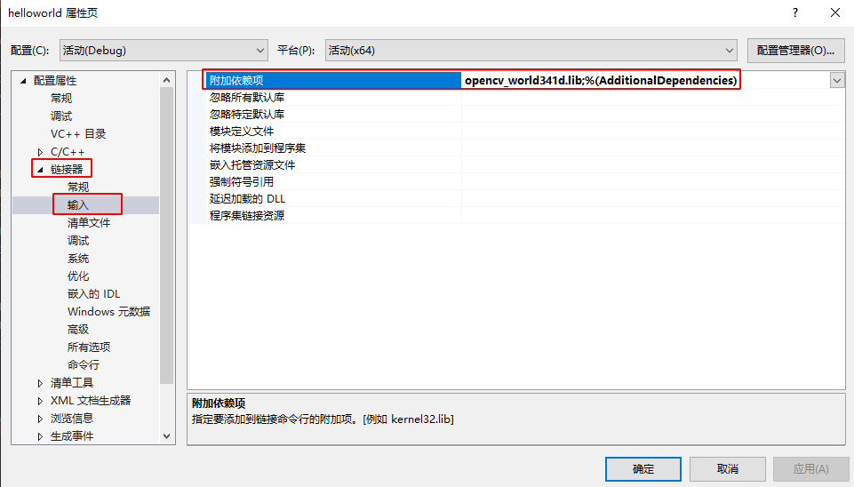


将VisualStudio创建的项目默认代码（这里是helloworld.cpp）替换成下述测试代码，

测试代码如下:

```c
#include <stdio.h>
#include <iostream>
#include "opencv2/opencv.hpp"
#include"opencv2/core/core.hpp"
#include "opencv2/highgui/highgui.hpp"
#include"opencv2/xfeatures2d.hpp"
using namespace cv;
using namespace std;
int main()
{
	Mat img_1 = imread("C:/codecs/small.jpg", CV_LOAD_IMAGE_COLOR);
	Mat img_2 = imread("C:/codecs/large.jpg", CV_LOAD_IMAGE_COLOR);
	Ptr<Feature2D> sift = xfeatures2d::SIFT::create();
	vector<KeyPoint> keypoints_1, keypoints_2;
	Mat descriptors_1, descriptors_2;


	sift->detectAndCompute(img_1, noArray(), keypoints_1, descriptors_1);
	sift->detectAndCompute(img_2, noArray(), keypoints_2, descriptors_2);
	//绘制特征点(关键点)
	drawKeypoints(img_1, keypoints_1, descriptors_1, Scalar(0, 0, 255));
	drawKeypoints(img_2, keypoints_2, descriptors_2, Scalar::all
	(-1), DrawMatchesFlags::DRAW_RICH_KEYPOINTS);
	imshow("img_1", descriptors_1);
	imshow("img_2", descriptors_2);
	waitKey(0);
	return 0;
}
```

点击VisualStudio菜单中的调试->开始执行，VisualStudio会自动编译并执行这里的项目，结果如图：

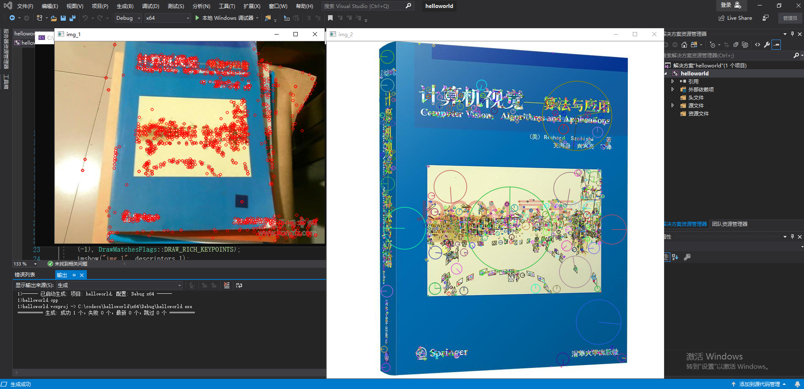

测试用的图片可以自行去图片搜索引擎搜索《计算机视觉-算法与应用》。
