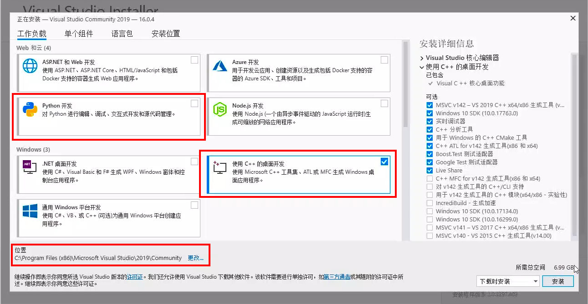

# 不同操作系统下的OpenCV安装教程

## 说明

OpenCV安装教程针对计算机视觉部分的课程，对于熟悉不同操作系统和编程语言的学员请按下表选择相应的编辑器，并按照目录参考对应的教程。

| 操作系统 | 编程语言 |       编辑器       |
| :------: | :------: | :----------------: |
| Windows  |   C++    | Visual Studio 2019 |
| Windows  |  Python  |      Anaconda      |
|  Linux   |  Python  |      Anaconda      |
|   Mac    |   C++    |       Xcode        |
|   Mac    |  Python  |      Anaconda      |

**目录**

[TOC]

## Windows

### 安装前提

安装计算机配置（推荐）：

- Intel i5 CPU，8G内存，磁盘至少剩余20G空间

操作系统：

- Windows 8.1/Windows 10或更新的windows 64位版

  > 有学员问Windows 7行不行？
  >
  > 也不是说不行，主要是遇到环境问题，网上的相关资料可能没那么多，会花费更多的时间折腾。

### Visual Studio 2019+OpenCV安装

#### Visual Studio安装

Visual Studio 2019社区版(Community edition)或更高版本

VS 2019安装包可以到官网去下载。

Visual Studio官网：https://visualstudio.microsoft.com/zh-hans/


下载完后，双击安装，然后点继续，等个一分钟左右会弹出如下图的面板，勾选里面的C++桌面开发和Python开发选项，安装地址这里采用默认路径，想安装在其它位置的学员请自行修改。



点击安装，Visual Studio会在线下载7～8GB的安装文件，请尽量在网络良好的情况下安装。

#### OpenCV安装步骤

##### 下载教程中编译好的OpenCV 3.4.1

> 这里直接提供视频里面编译好的OpenCV 3.4.1，因为源码安装编译opencv太过繁琐，而且极易出现莫名奇妙的环境问题，就不让学员趟这浑水了。

编译好的OpenCV 3.4.1下载地址：

链接：https://pan.baidu.com/s/12atLqhYBD8zRZPz1qlq9vQ    提取码：33un

##### OpenCV环境配置

1. 解压上一步下载的压缩包到本地（挑个合适的目录，后面要用上）

2. 配置环境变量

   这步是要将`opencv3.4.1\bin`和`opencv3.4.1\lib`添加到环境变量。

   右键点击 “我的电脑” -> 选择属性

   

    -> 选择高级系统设置

   

   -> 选择环境变量

   

   -> 双击系统变量中的Path

   在编辑环境变量中，点击新建，然后点击浏览，添加本地存放的`opencv3.4.1\bin`，最后点击确定。

   

   

3. 启动Visual Studio，创建新项目，新建一个C++控制台应用，项目名称为cvtest，存放位置保持默认。

   

   

4. 在解决方案资源管理器中，右键点击cvtest项目，在弹出的选项框中点击属性：

   

   进入属性页，选择VC++目录，先`opencv3.4.1\include`添加到 “包含目录” ，方法如下：

5. “包含目录”右侧点击下拉框，选择编辑。

   

6. 如下图，点击文件夹的图标，接着点击`...`，找到`opencv3.4.1\include`即可。

   

   

   `opencv3.4.1\lib`添加到“库目录”的方式同理，最后的结果如下所示：

   **注意：这一步每次新建项目都要做。**

   

7. 找到链接器 -> 输入 -> 附加依赖项，将`opencv_world341d.lib`添加到 “附加依赖项” ，方法与上一步基本一致，只是最后一步直接把`opencv_world341d.lib`输进去就行。

   **这一步也是每次新建项目都要做。**

   

   

#### 测试用例

1. 将第一步解压出来的codecs中的照片`large.jpg`和`small.jpg`，放到cvtest项目地址。

   > 不知道项目地址，可以右键点击cvtest项目，在弹出的选项框中选择 “在文件资源管理器中打开文件夹” 。

   最后，将cvtest.cpp的内容替换为下面的测试代码：

   ```C++
   #include <iostream>
   #include <opencv2/opencv.hpp>  
   #include <opencv2/xfeatures2d.hpp>
   
   using namespace cv;
   using namespace std;
   
   void main()
   {
   	Ptr<Feature2D> f2d = xfeatures2d::SIFT::create();
   
   	//记得把jpg图片的路径修改成本地的
   	Mat img_1 = imread("C:\\Users\\Administrator\\Desktop\\left.jpg");
   	Mat img_2 = imread("C:\\Users\\Administrator\\Desktop\\right.jpg");
   	//Detect the keypoints
   	vector<KeyPoint> keypoints_1, keypoints_2;
   	f2d->detect(img_1, keypoints_1);
   	f2d->detect(img_2, keypoints_2);
   	//Calculate descriptors (feature vectors)
   	Mat descriptors_1, descriptors_2;
   	f2d->compute(img_1, keypoints_1, descriptors_1);
   	f2d->compute(img_2, keypoints_2, descriptors_2);
   	//Matching descriptor vector using BFMatcher
   	BFMatcher matcher;
   	vector<DMatch> matches;
   	matcher.match(descriptors_1, descriptors_2, matches);
   	//绘制匹配出的关键点
   	Mat img_matches;
   	drawMatches(img_1, keypoints_1, img_2, keypoints_2, matches, img_matches);
   	imshow("【match图】", img_matches);
   	//等待任意按键按下
   	waitKey(0);
   }
   ```

2. 点击Visual Studio菜单的 “本地Windows调试器” ，自动编译并执行这里的代码，结果如下图：

   

   如果能正常出现上面的图片，说明OpenCV已经正确配置。如果提示opencv_world341d.lib没有加载，尝试重启软件。

#### 附加资源

##### 关于源码编译

本教程提供的OpenCV 3.4.1是已经编译好的，如果学员想要体验源码编译的 “酸爽” ，可以参考这个教程：

声明：源码编译不是课程所需，所以不作要求。

##### 使用已经配置好的虚拟机镜像

如果学员想用虚拟机又不想折腾上面的安装设置，可以使用已经编译安装好opencv3.4.1和Visual Studio的虚拟机镜像文件，下载地址如下：

链接: https://pan.baidu.com/s/1q5BBW-zFIbnvUYwoKRVGew    提取码: 7uc5

这个镜像有9.2GB，请确保网络顺畅。

虚拟机内系统用户名密码：Administrator/abc123!@#

下载完成后，使用VirtualBox软件导入即可使用。

虚拟机推荐至少分配4G以上内存。

### Anaconda+OpenCV安装

#### Anaconda下载

由于Anaconda官网的下载源在国外，没有翻墙的话，下载速度可能会很慢，建议移步清华大学的开源软件镜像网站下载。

清华源下载地址：https://mirrors.tuna.tsinghua.edu.cn/anaconda/archive/

从中寻找到对应系统的最新版本Anaconda即可，我们的系统是64位的Windows，所以下载`Anaconda3-5.3.1-Windows-x86_64.exe`。


如果你可以翻墙，可以到官网下载最新的版本https://www.anaconda.com/distribution/。


#### Anaconda安装

1. 下载完成后，双击exe文件，出来以下的设置界面，直接点Next。

2. 点击`I Agree`。

3. 选择用户`Just Me`，点击`Next`。

4. 选择合适的安装路径，新建一个空的文件夹。

5. 如果之前安装过python，不想打乱之前的环境变量就不要勾选第一个，不勾选的话就不能够在windows的命令行里使用conda、jupyter等命令，不过可以在Anaconda安装完成后使用Anaconda Prompt运行上述命令。如果是没下载过python的萌新，可以把第一个勾上。

   第二个是设置Anaconda所带的Python 3.7为系统默认的python版本，这个可以勾上。

   点击Install就完成了安装设置。

   

#### opencv安装

点击打开`Anaconda-Navigator`，选择左侧`Environments`，然后选择`All`，在搜索栏搜索`opencv`，勾选三个选项，分别是`libopencv`、`opencv`、`py-opencv`，最后点击`apply`。

稍等片刻就安装完成了。

#### pip安装opencv-contrib

点击开始，然后打开Anaconda Prompt命令行。


在命令行中输入

```python
pip install opencv-contrib-python==3.4.2.16
```


安装成功！

#### 测试用例

点击打开`Anaconda-Navigator`，点击Jupyter Notebook下的launch。


在本地浏览器会自动打开一个网页端的python环境，然后点击`新建`下的`python3`，创建一个notebook代码编辑环境。


把以下代码复杂粘贴到编写框，把`lena.jpg`放到当前目录，点击`Run`或直接Ctrl+Enter运行代码。

```python
import cv2
img = cv2.imread("./lena.jpg")
cv2.imshow("lena", img)
cv2.waitKey(0)
cv2.destroyAllWindows()
```

> lena.jpg图片可以到下面链接中的`opencv安装教程`目录下的压缩包`opencv图和视频.zip`里找到。
>
> 链接：https://pan.baidu.com/s/1I9a46MuS3ona2CfhdoKD-Q   密码:clgs


如果能正常输出图片，说明opencv安装没有问题。

接着输入以下代码

```python
sift = cv2.xfeatures2d.SIFT_create()
```

运行后，如果跟下图一样没有报错提示，说明opencv-contrib也安装成功。


## Linux

### 安装前提

安装计算机配置（推荐）：

- Intel i5 CPU，8G内存

操作系统（推荐）：

- Ubuntu 18.04 LTS 64位

### Anaconda+OpenCV安装

#### Anaconda下载

由于Anaconda官网的下载源在国外，没有翻墙的话，下载速度可能会很慢，建议移步清华大学的开源软件镜像网站下载。

清华源下载地址：https://mirrors.tuna.tsinghua.edu.cn/anaconda/archive/

从中寻找到对应系统的最新版本Anaconda即可，我们的系统是64位的Linux，所以下载`Anaconda3-5.3.1-Linux-x86_64.sh`。


如果你可以翻墙，可以到官网下载最新的版本https://www.anaconda.com/distribution/。


#### Anaconda安装

1. 在anaconda安装包所在目录右键打开命令行终端，输入`./Anaconda3-5.3.1-Linux-x86_64.sh`。

   

2. 输入回车键，会显示license agreement，这个协议很长，直接输入q跳过就好。

   

3. 输入yes，接受license terms，后续会弹出提示，让你确定anaconda的安装位置，如果你想修改直接输入一个路径就好，不想改就点回车，开始安装anaconda。

   

4. 安装完成后会提示是否初始化环境变量，输入yes。

   接着会提示是否安装Microsoft VSCode，输入no即可。

   

5. 重启终端，输入`anaconda-navigator`，即可运行anaconda。

   

6. 安装完成后，还需要检查pyhton是不是anaconda自带的版本，在命令行输入`which python`，如果出来的路径是anaconda的就没有问题。

   

   如果不是，那就要在.bashrc文件中加入一条代码。具体操作如下：

   在终端输入

   ```bash
   whereis python
   ```

   

   找到你的anaconda自带python的路径。再在终端输入

   ```bash
   sudo gedit ~/.bashrc
   ```

   打开.bashrc文件后，在文件最后加上下面这条语句

   ```bash
   export PATH="/home/XXXX/anaconda3/bin:$PATH"
   ```

   `/home/XXXX/anaconda3/bin`改成本地anaconda自带的python路径就好。

#### opencv-python和opencv-contrib-python安装

 打开终端输入下列命令行升级pip

```bash
pip install --upgrade pip
```

输入下列命令行安装opencv-python

```sh
pip install opencv-python==3.4.2.17
```


安装完成后，接着输入下列命令行安装opencv-contrib-python

```sh
pip install opencv-contrib-python==3.4.2.17
```


#### 测试用例

下面进行代码测试，先找一个合适的目录，右击打开命令行终端，敲入`jupyter-notebook`，点回车。


浏览器一般会自动打开，出现下面的界面。如果没有，在浏览器中输入`http://localhost:8888/tree`，记得把端口号`8888`改成自己的，这个在上一步中可以看到（看上图红框）。


接着点击右手边的`New`，再点击`Python3`，创建jupyter notebook的编辑环境。


把以下代码复杂粘贴到编写框，把`lena.jpg`放到当前目录，点击`Run`或直接Ctrl+Enter运行代码。

```python
import cv2
img = cv2.imread("./lena.jpg")
cv2.imshow("lena", img)
cv2.waitKey(0)
cv2.destroyAllWindows()
```

> lena.jpg图片可以到下面链接中的`opencv安装教程`目录下的压缩包`opencv图和视频.zip`里找到。
>
> 链接：https://pan.baidu.com/s/1I9a46MuS3ona2CfhdoKD-Q   密码:clgs


如果能正常输出图片，说明opencv-python安装没有问题。

接着输入以下代码

```python
sift = cv2.xfeatures2d.SIFT_create()
```

运行后，如果跟下图一样没有报错提示，说明opencv-contrib也安装成功。


## Mac

进入下面链接的网盘，下载cvtest.txt, left.jpg, right.jpg和“mac下opencv”文件夹。

链接：https://pan.baidu.com/s/1I9a46MuS3ona2CfhdoKD-Q   密码:clgs

> 说明：
>
> cvtest是后续测试的代码，left.jpg, right.jpg是测试用图。
>
> “mac下opencv”文件夹包含opencv和opencv_contrib的源码以及cmake的dmg格式安装包，

### Xcode+OpenCV安装

#### 安装Xcode

进入网址<https://developer.apple.com/download/more/> ，登录app store账号安装Homebrew。


之后下载Xcode10。


下载完成后，解压缩会直接生成**Xcode.app**，然后把它移动到应用程序中，至此，启动台里面就添加上Xcode了。


#### 安装Cmake Gui

Cmake已经从开头的百度网盘下好了，你也可以去官网https://cmake.org/download/下载。直接点击dmg包就可以安装Cmake。

安装Cmake后，打开Cmake开始编译opencv以及opencv_contrib的源码。

> opencv以及opencv_contrib的源码指的是开头百度网盘中的源码opencv3.4.1和源码opencv_contrib3.4.1两个zip压缩包。
>
> zip包最好解压到一个比较合适的目录。


> 步骤说明：
>
> step1：点击browse source，选择opencv的源码路径；
>
> Step2：点击browse build，选择编译生成到哪个路径；
>
> step3：点击configure，开始第一次配置；
>
> Step4：在search中输入extra，点击2处的按钮，选择`opencv_contrib/modules`这个文件；
>
> 
>
> Step5：再次点击configure ，开始第二次配置；
>
> Step6：最后点击generate 生成。

#### 在终端terminal下生成

从启动台中打开terminal终端，然后进入build1这个文件下：`cd xxx`，xxx表示你的build1路径，进入build1目录后执行`make`命令。


等待一会儿之后，显示100%，再执行`sudo make install`。


等待片刻后，opencv就编译完成了。

#### 配置Xcode下的编译环境

新建一个项目，选择macOS下的Command Line Tool。


填写项目名称和组织id，Language选择C++，点击next。


接下来把opencv的头文件和依赖库路径添加到编译设置，按照下图顺序点击，在3处输入`search`，之后在4和5中按如图填写路径。


Building Phases下有个Link Binary With Libraries，点加号，

点`Add others...`，按键盘上的`/`键，会弹出路径输入栏，安装的opencv依赖库位置是`/usr/local/lib`，然后把lib目录下文件全选，然后点击open。


添加之后会出现以下的依赖文件：

#### 测试用例

点击main.cpp，然后在代码栏粘贴如下代码，修改图片路径，这两张图是教程开始在百度网盘上下载的，点击左上的三角按钮运行。


出现如下图则表示opencv_contrib配置成功了。


测试代码：

```C++
#include <iostream>
#include <opencv2/opencv.hpp>  
#include <opencv2/xfeatures2d.hpp>

using namespace cv;
using namespace std;

int main()
{
	Ptr<Feature2D> f2d = xfeatures2d::SIFT::create();

	//记得把jpg图片的路径修改成本地的
	Mat img_1 = imread("/Users/user/Downloads/dataset/left.jpg");
	Mat img_2 = imread("/Users/user/Downloads/dataset/right.jpg");
	//Detect the keypoints
	vector<KeyPoint> keypoints_1, keypoints_2;
	f2d->detect(img_1, keypoints_1);
	f2d->detect(img_2, keypoints_2);
	//Calculate descriptors (feature vectors)
	Mat descriptors_1, descriptors_2;
	f2d->compute(img_1, keypoints_1, descriptors_1);
	f2d->compute(img_2, keypoints_2, descriptors_2);
	//Matching descriptor vector using BFMatcher
	BFMatcher matcher;
	vector<DMatch> matches;
	matcher.match(descriptors_1, descriptors_2, matches);
	//绘制匹配出的关键点
	Mat img_matches;
	drawMatches(img_1, keypoints_1, img_2, keypoints_2, matches, img_matches);
	imshow("匹配", img_matches);
	//等待任意按键按下
	waitKey(0);
}
```

### Anaconda+OpenCV安装

#### Anaconda下载

由于Anaconda官网的下载源在国外，没有翻墙的话，下载速度可能会很慢，建议移步清华大学的开源软件镜像网站下载。

清华源下载地址：https://mirrors.tuna.tsinghua.edu.cn/anaconda/archive/

从中寻找到对应系统的最新版本Anaconda即可，我们的系统是64位的Mac，所以下载`Anaconda3-5.3.1-MacOSX-x86_64.pkg`。


如果你可以翻墙，可以到官网下载最新的版本https://www.anaconda.com/distribution/。


#### Anaconda安装

下载完成之后，直接点击默认安装即可，安装好之后长这个样子：


#### opencv安装

点击打开`Anaconda-Navigator`，选择左侧`Environments`，然后选择`All`，在搜索栏搜索`opencv`，勾选三个选项，分别是`libopencv`、`opencv`、`py-opencv`，最后点击`apply`。

稍等片刻就安装完成了。

#### pip安装opencv-contrib

考虑到有些同学电脑上有多个版本的python，在开始安装前，首先要在命令行执行`python -m pydoc -b`，会在网页上显示你当前python安装的一些包和库。


接下来，在网页上搜索`cv`，如果出cv2，就代表刚才成功安装opencv基本库，这一步主要是为了确认你当前的pip环境能和之后要用到的python版本能够对应上。


至此，我们就可以开始安装opencv-contrib了，在命令行执行命令

```sh
pip install opencv-contrib-python==3.4.2.16
```

注意命令行后面的数字`3.4.2`一定要和我们在anaconda上安装opencv时勾选的opencv的version一致。


等待片刻出现Successfully就代表安装成功。

#### 测试用例

点击打开`Anaconda-Navigator`，点击Jupyter Notebook下的launch。


在本地浏览器会自动打开一个网页端的python环境，然后点击`新建`下的`python3`，创建一个notebook代码编辑环境。


在notebook编辑环境中输入以下代码，Ctrl+Enter运行代码块。

```python
import cv2 as cv
sift = cv.xfeatures2d.SIFT_create()
```


运行之后，如果跟上图一样没有报错提示，说明opencv-contrib安装成功。