# Visual Studio 2019 Community下源码编译OpenCV 3.4.1

**目录**

[TOC]

## 安装前提

安装计算机配置（推荐）：

- Intel i5 CPU，8G 内存，磁盘至少剩余 20G 空间

操作系统：

- Windows 8.1/Windows 10或更新的windows 64 位版

  > 有学员问Windows 7行不行？
  >
  > 也不是说不行，主要是遇到环境问题，网上的相关资料可能没那么多，会花费更多的时间折腾。

已安装软件：

- Visual Studio 2019 社区版(Community edition)或更高版本

  VS2019安装包可以到官网去下载。

  Visual Studio官网：https://visualstudio.microsoft.com/zh-hans/

  

  下载完后，双击安装，然后点继续，等个一分钟左右会弹出如下图的面板，勾选里面的C++桌面开发和Python开发选项，安装地址这里采用默认路径，想安装在其它位置的学员请自行修改。

  

  点击安装，Visual Studio会在线下载7～8GB的安装文件，请尽量在网络良好的情况下安装。

- CMake软件3.14或更高版本

  3.14.3版本安装包下载地址(windows 64 位版)：

  https://cmake.org/files/v3.14/cmake-3.14.3-win64-x64.msi

  下载好CMake后，双击安装包，在弹出页面点击 “Next” -> 点击 “Install” -> 勾选Desktop Icon，点击 “Next” -> 安装保持默认（想要安装在别处的自行修改），点击 “Next” -> 等个十几秒，最后点击 “Finish” 。

  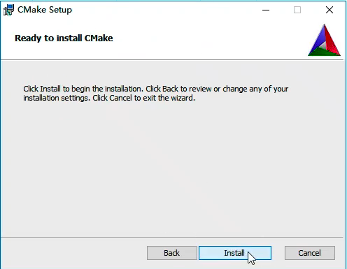

  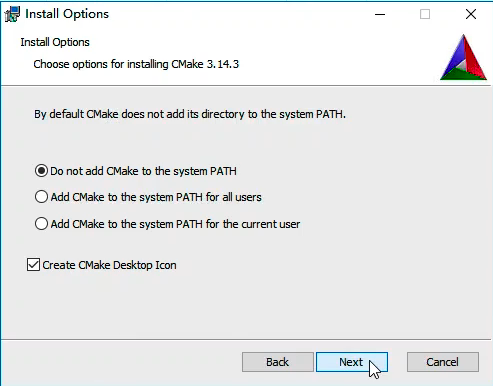

  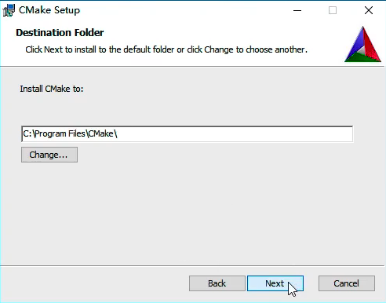

**如果可能，请尽量在一个刚装好OS得系统上面执行编译安装。有些软件，特别是大型开发IDE，会在系统里面添加一些你根本不了解的默认配置，导致编译过程出现一些奇怪的问题，而这些问题很多时候只在某个特定环境里出现，不拿到实际的机器，根本无法解决这类问题。**

## 安装步骤

### 下载OpenCV 3.4.1相关源码包

从以下两个链接下载源码：

Opencv 3.4.1版本源码地址https://github.com/opencv/opencv/releases

opencv_contrib 3.4.1版本源码地址https://github.com/opencv/opencv_contrib/releases

**请一定下载这里要求的版本，其他版本的安装有一些不一样的地方，需要单独处理**

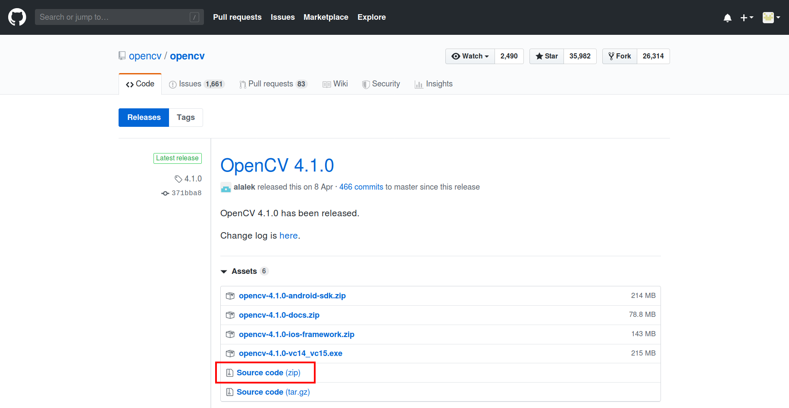

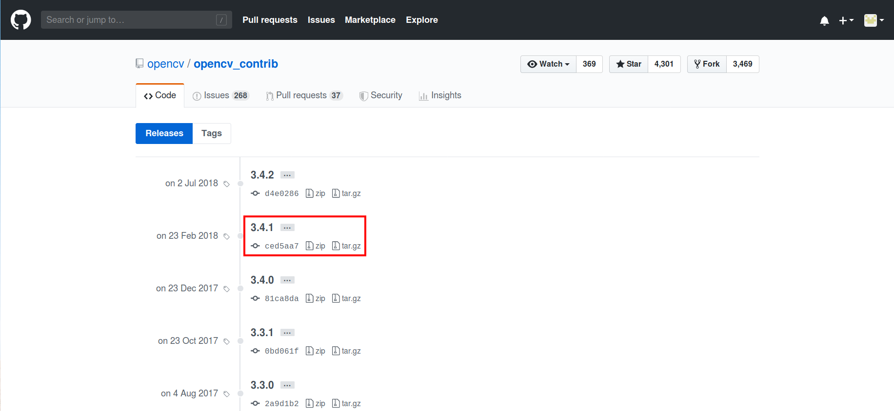

这两个压缩包文件名是一样的，注意不要相互覆盖了。

保存至本地后解压，解压后的文件分别为

`opencv3.4.1-src\opencv-3.4.1`

`opencv3.4.1-src\opencv_contrib-3.4.1`

### 使用Cmake配置OpenCV

首先要对源码进行相应的配置，如编译器选项，某些组件是否需要编译等。曾经这个步骤使用configure命令来实现，现在多用cmake来进行相关的配置，cmake有一套可以跨平台的语法，能自动查找各平台编译器、配置相关组件等工作。

点击运行CMake GUI（图形界面），如下图所示。

`source code`设置源代码目录，填入`opencv3.4.1-src\opencv-3.4.1`的路径。

`build the binaries`设置编译结果存放目录，填入`opencv3.4.1-src/opencv-3.4.1/build`的路径，cmake会自动帮我们创建这个目录。

设置好路径后，点击 ”Configure“ 。

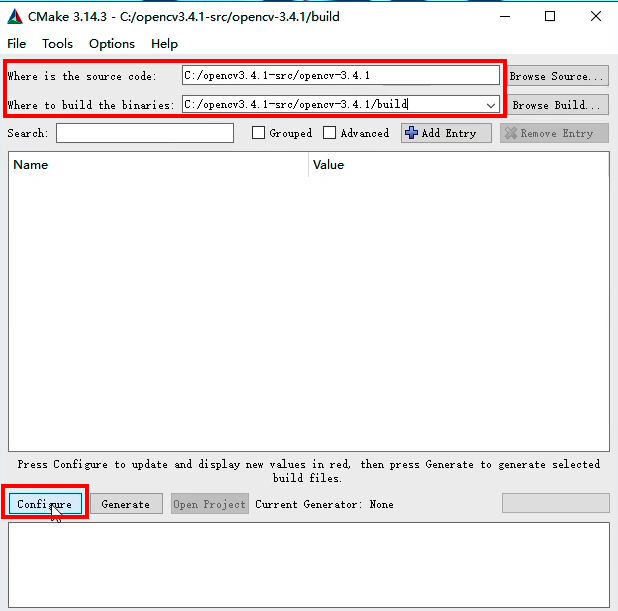

选择对应编译器，cmake会自动检测操作系统内已安装的编译器，这里选择Visual Studio 16 2019，然后点击 ”Finish“ 按钮，开始配置过程。

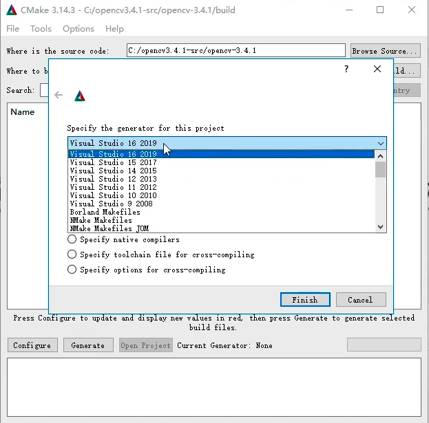

等个将近一分钟就可配置完成，首次配置成功会出现大量红色条目，可以不用去管。

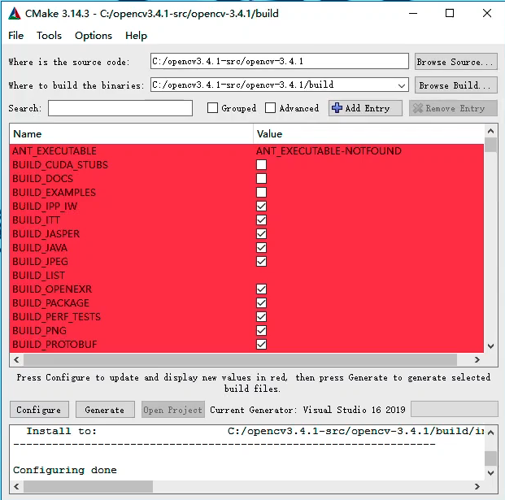

在Search框内搜索 ”extra“，在配置选项里找到`OPENCV_EXTRA_MODULES_PATH`，填入`opencv_contrib-3.4.1/modules`的路径。

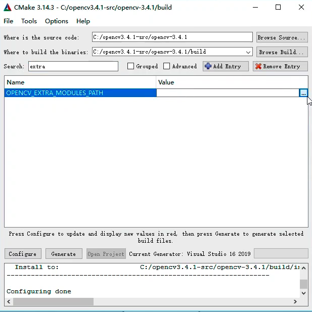

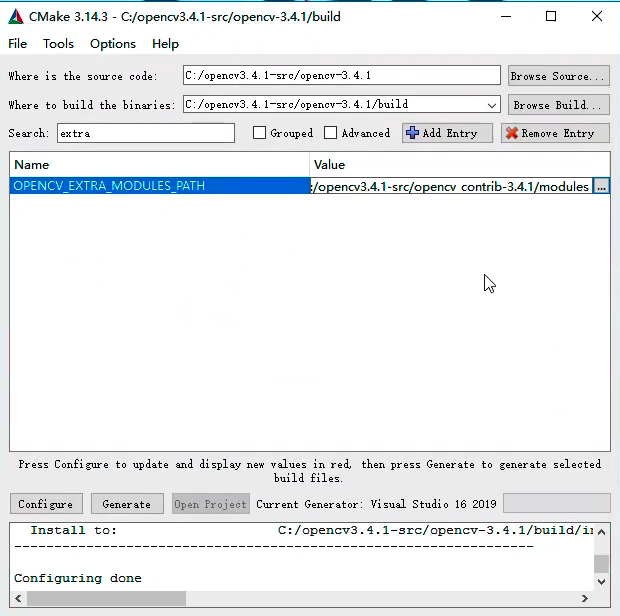

接着，在Search框内输入 ”world“ ，在配置选项里找到`BUILD_opencv_world`并勾选。

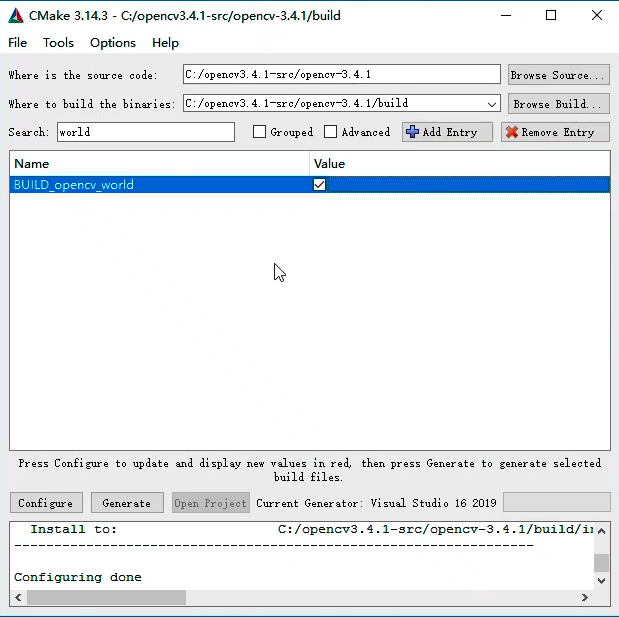

> 如果使用的是更新的opencv版本，在Search框内输入 ”nonfree“ ，勾选所有带NONFREE的选项，这个需要注意。

再次点击Configure按钮，代码配置很快就能完成，然后点击Generate按钮，cmake会生成用于Visual Studio编译的项目及sln文件，生成结果如下图所示：

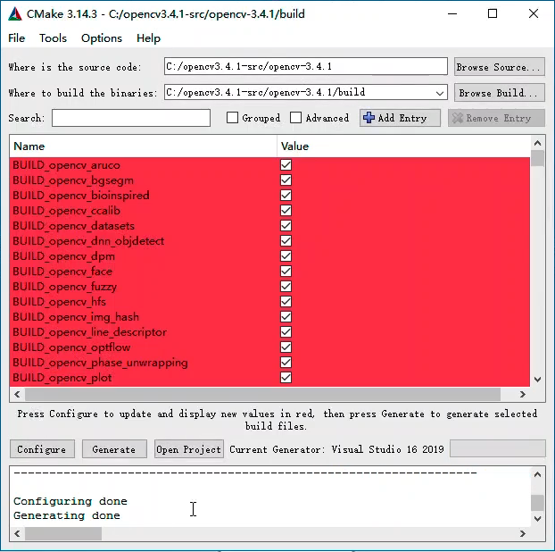

然后点击Open Project按钮（Generate的右侧），会弹出文件打开选项，这里选择Visual Studio打开项目，如下图：

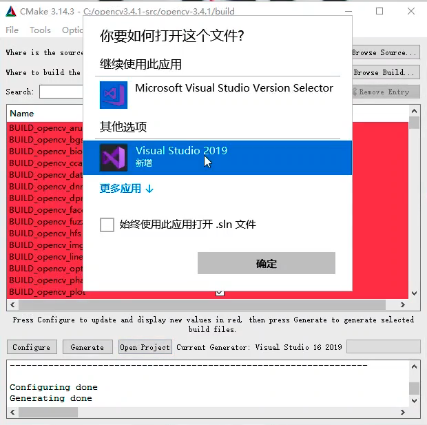

### 使用Visual Studio最后编译OpenCV

在Visual Studio解决方案资源管理器中，找到`CMake Targets`下面的`INSTALL`项目，右击选择 “生成” ，开始编译，整个过程耗时较长，大约在30分钟～1小时，具体时间视机器性能而定。

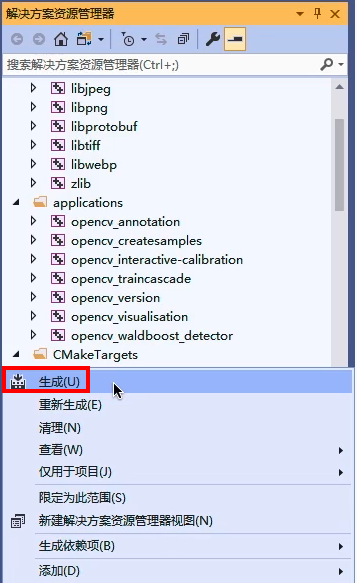

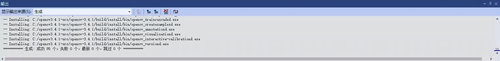

系统提示编译完成后，在`opencv3.4.1-src\opencv-3.4.1\build\install`目录下的就是所有编译好的opencv 3.4.1文件。

至此，编译过程全部完成。

> 编译出来的build目录会有6G的大小，所以开始编译前一定要注意磁盘空间是否充足。

## 附加说明

### 为何需要自行编译

由于版权原因，官网上3.0之后版本的OpenCV对SIFT、SURF等算法没有提供直接编译好的动态库来加载使用。另外，很多新提出的算法全都会放在opencv_contrib里，这些都只能在OpenCV的Github上找到，OpenCV的官网上也是没有的。因此，想使用SIFT、SURF、双目立体匹配算法、结构光等新算法及有专利权的算法，就需要对OpenCV的Github源代码自行编译。

### 常见问题

- 关于目录，windows默认使用\作为目录分割符号，但是\同时是C语言中的转义字符，cmake中使用/作为目录分割符，C代码中可以使用\\或者/作为目录的分割符号。

- cmake配置过程中会自动从网络下载文件，如果网络不好，有可能出现 ffmpeg 找不到等相应错误，具体可参考：https://blog.csdn.net/yiyuehuan/article/details/52951574

-　注意，如果系统已安装CUDA 9.0，则会自动选择相应编译项，编译会出错。

  改进方法：

  (1) 处理相应问题，改写编译文件，详见

  https://blog.csdn.net/u014613745/article/details/78310916

  (2) 去掉CUDA相应编译选项：如WITH_CUDA，WITH_CUBLAS和WITH_CUFFT等

  (3) 此处编译未考虑添加MATLAB、CUDA、QT等支持，如计算机中已安装对应库，请在CMake配置时去掉对应选项。