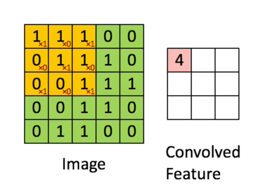

# 卷积计算

## 卷积定义

是通过两个函数f 和g 生成第三个函数的一种数学算子，表征函数f 与g经过翻转和平移的重叠部分的面积。 

我们称$(f*g)(n)$为$f,g$的卷积。

其连续的定义为：
$$
(f*g)(n)=\int_{-\infty}^{+\infty}f(\tau)g(n-\tau){\rm d}x
$$
其离散的定义为：
$$
(f*g)(n)=\sum_{\tau=-\infty}^{\infty} f(\tau)g(n-\tau)
$$

## 卷积具体计算

假设有一个卷积核h，一般为3*3的矩阵：
$$
\begin{bmatrix}
   1 & 0 & 1 \\
   0 & 1 & 0 \\
   1 & 0 & 1
  \end{bmatrix}
$$

将卷积核h的中心对准x的第一个元素，然后对应元素相乘后相加。

这样结果Y中的第一个元素值为：
$$
\begin{split}
Y_{11}&=1*1+1*0+1*1+0*0+1*1+1*0+0*1+0*0+1*1\cr
&=4
\end{split}
$$
每个元素都像这样计算出来就可以得到一个输出矩阵，就是卷积结果。