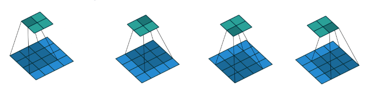
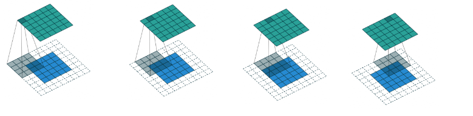
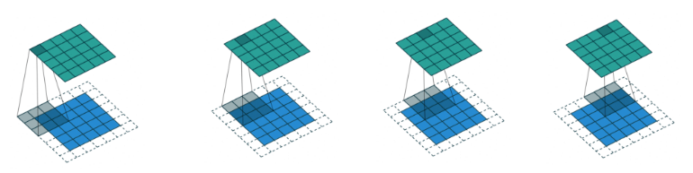
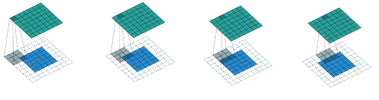
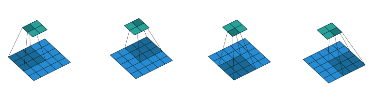
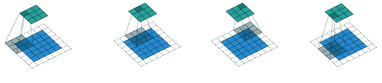

# 传统卷积使用

滑动像素的数量叫步长（stride），卷积操作存在一个问题： 图像边界信息丢失，即有些图像角落和边界的信息发挥作用较少。 以卷积核的边还是中心点作为开始/结束的依据，决定了卷积的补齐（padding）方式。此前我们看到的都是valid方式，而same方式则会在图像边缘用0补齐。

为了简化情况，假设输入(input)、特征块(kernel)、补零(padding)以及步长(strides)在不同轴上的长度均相等，分别为i、k、p、s。

No padding, no strides

$$
o=i-k+1,\\
其中s=1, p=0
$$
Arbitrary padding, no strides

在这里输入与输出的大小一样，这是一个期望的特性

$$
o=i-k+2p+1,\\
其中s=1
$$
Half padding, no strides

$$
o=i-k+2p+1=i,\\
其中s=1,k=2n+1，p=\lfloor k/2 \rfloor
$$
Full padding, no strides

当需要输出比输入更大时

$$
o=i-k+2p+1=i+k-1,\\
其中s=1，p=k-1
$$

No padding, strides=2

$$
o=\left   \lfloor { {i-k}\over{s} } \right  \rfloor + 1,\\
其中p=0,s=2
$$
Padding, strides

$$
o=\left   \lfloor { {i+2p-k}\over{s} } \right  \rfloor+1,\\
其中p=0,s=2
$$
