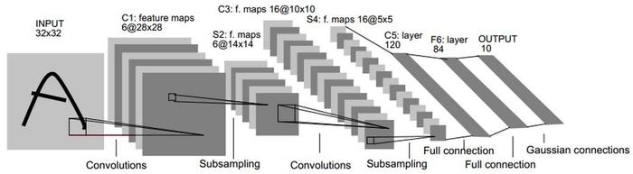

# 卷积神经网络介绍

卷积神经网络是一种多层神经网络，擅长处理图像特别是大图像的相关机器学习问题。 卷积网络通过一系列方法，成功将数据量庞大的图像识别问题不断降维，最终使其能够被训练。下图显示了其结构：输入的二维图像，先经过两次卷积层到池化层，再经过全连接层，最后使用softmax分类作为输出层。 

卷积层是卷积神经网络的核心基石。在图像识别里我们提到的卷积是二维卷积，即离散二维滤波器（也称作卷积核）与二维图像做卷积操作，简单的讲是二维滤波器滑动到二维图像上所有位置，并在每个位置上与该像素点及其领域像素点做内积。卷积操作被广泛应用与图像处理领域，不同卷积核可以提取不同的特征，例如边沿、线性、角等特征。在深层卷积神经网络中，通过卷积操作可以提取出图像低级到复杂的特征。

 卷积神经网络过程如下：

CNN最早由Yann LeCun提出并应用在手写字体识别上（MINST）。LeCun提出的网络称为LeNet，用于实现手写识别的7层CNN（不包含输入层）， 其网络结构如下： 

输入原始图像的大小是32×32，卷积层用  表示，子采样层（pooling）用表示，全连接层用表示，x 代表层数。 

