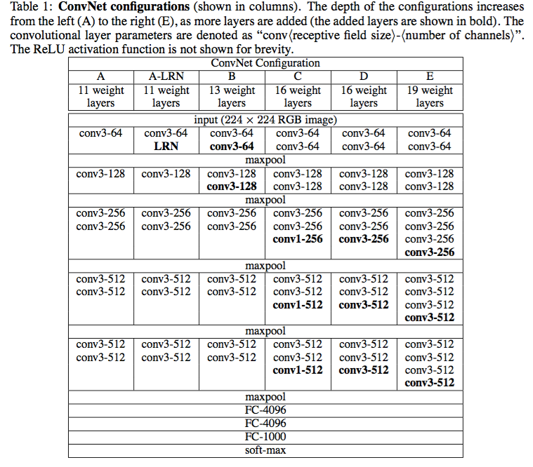

# VGG

arxiv:1409.1556v6

VGG是牛津大学的K. Simonyan和 A. Zisserman在论文《Very Deep Convolutional Networks for Large-Scale Image Recognition》，该模型在ImageNet上取得了92.7%的Top5成绩。

其网络结构图如下：

具体网络结构如下：

## 网络特点

相较于AlexNet网络使用11x11，5x5这种大尺寸的卷积核，VGG中大量使用了3x3和1x1的卷积核。3x3是可以表示（左右）、（上下）、（中心）这些模式的最小单元。而1x1的卷积核，可看做是空间的线性映射。使用多个较小卷积核的卷积层代替一个卷积核较大的卷积层，一方面可以减少参数，另一方面作者认为相当于是进行了更多的非线性映射，可以增加网络的拟合/表达能力。

VGG前面几层是卷积层的堆叠，后面几层是全连接层，最后是softmax层，所有隐层的激活单元都是ReLU。论文中介绍几个不同的网络结构，只有其中一个应用了局部响应归一化层（Local Response Normalisation）。

可以看出，VGG比AlexNet更深，更宽，拥有更多的参数。

