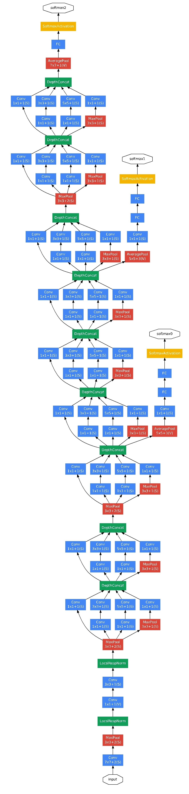
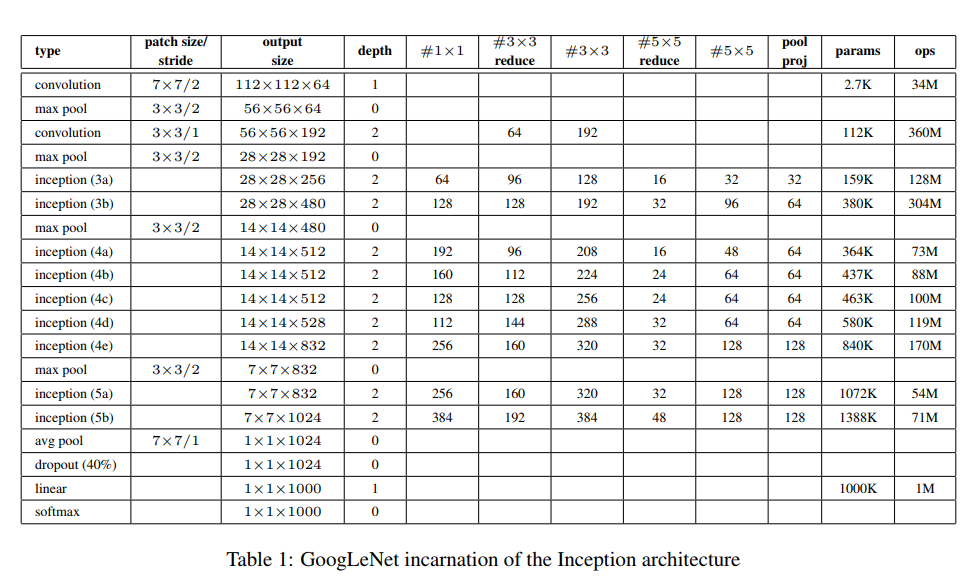
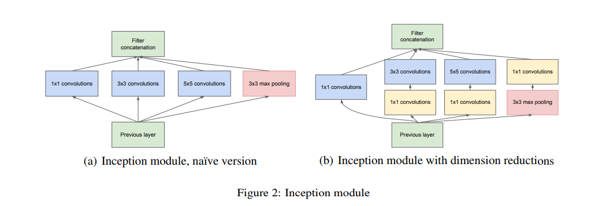

# GoogleLeNet

arxiv：1409.4842

网络结构示意图如下：

网络具体结构如下

## inception结构

GoogleLeNet，被认为是Inception结构的成功。在该论文中出现的是inceptionv1的版本，其结构如下：

inception结构的使用，一方面增加了网络的宽度，另一方面，其成功在于增加了网络的多样性。通过同时引入1x1,3x3,5x5的结构，并对其结果进行拼接操作，使得网络能够在训练中根据数据自动的选择合适的卷积方式。

后续发展中，出现了inception v2,v3,v4的版本，都是在之前版本的基础上增加了一些新的结构。

同时，GoogleLeNet本身也是一个更深的网络。