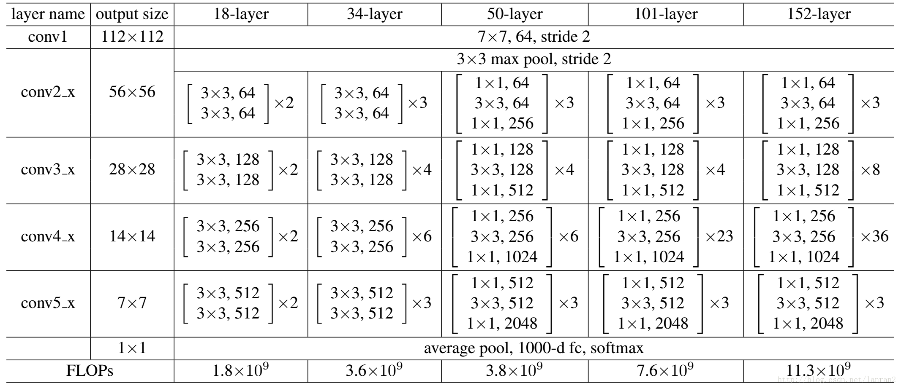
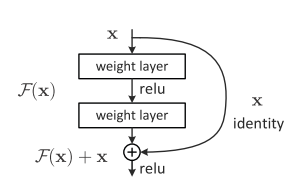

# resnet

arxiv：1512.03385

随着网络深度的增加，网络训练的难度越来越大，训练难以收敛，针对这类问题，微软亚洲研究院的何凯明等人提出了Residual的结构，并发展出resnet，即深度残差网络。

参考上图，左边为VGG的网络结构，中间为加深了的的网络结构，可以看出，除了深度更大之外，与VGG没有本质上的区别。右边为加了residual结构的网络，其中跳接的部分就是residual。

## ResNet结构

residual使用了一种叫做shortcut connection的结构来连接网络的不同部分。顾名思义，shortcut就是“抄近道”的意思

其中，论文中提出了两种不同的residual结构，如下图：

其中，左图用在上述网络ResNet34中（上述最右边的网络结构），而右边则被称为residual bottleneck，用于ResNet50/101/152中。

可以看出，右图中的结构是两边厚中间薄的一个结构，输入的数据为256个channel，经过1x1的卷积，变成64个channel，之后经过3x3的卷积，再由1x1的卷积恢复通道数为256。这样设计的目的是为了减少参数量。如果直接使用两个3x3的卷积，如左图，计算可得3x3x256x256x2 = 1179648，使用1x1的卷积为：1x1x256x64 + 3x3x64x64 + 1x1x64x256 = 69632，差了16.94倍。

具体的网络结构如下：

## residual的解释

### 退化问题

随着网络层数的增加，但是在训练集上的准确率却饱和甚至下降了。这显然不是overfitting。设想通过浅层网络添加 y=x 横等映射构造深层模型，那么，这种假想的深层网络应该与对应的浅层网络有相同的性能。但是拥有更多参数的实际深层网络却不能表现出更优秀的性能，因此作者推断退化问题可能是因为深层的网络并不是那么好训练，目前的训练方式并不能在有效的时间训练可用的模型。

### 对退化问题的解决

如果深层网络的后面那些层是恒等映射，那么模型就退化为一个浅层网络。而浅层网络已经被证明可以很好的拟合数据了，所以，如果能做到让深层模型，在浅层模型的基础上，增加一些横等映射的层，就可以直接构造一个深层模型了。

作者就是基于这种看上去很简单的假设构造了residual的模块。

考虑不带residual的网络，其要学习一个横等映射 $H(x)=x$，这个过程本身是困难的，因为有梯度消失之类的问题，加上前置的浅层网络的数据映射关系在训练中是一直变化的。但是如果加上residual，则网络就变成了学习$H(x) = F(x)+x$，再变换一下，得到$F(x) = H(x)-x$，只要能学习到$F(x)=0$，也就是实现假想的横等操作，就可以实现不弱于浅层网络的性能。

或者，从比较直观的角度，如果shortcut跳过的内容，直接被网络忽略，那么一个深层网络就会退化为一个浅层网络，而浅层网络已经被证明可以收敛。

另一种解释认为，residual实现了将浅层网络的特征送入深层，使深层网络同时可以看到浅层包含更多细节的底层特征以及深层经过处理的高层特征，并学习理解其中的差异和联系，因而能加快网络的学习过程。
