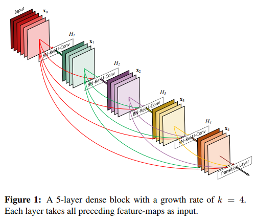
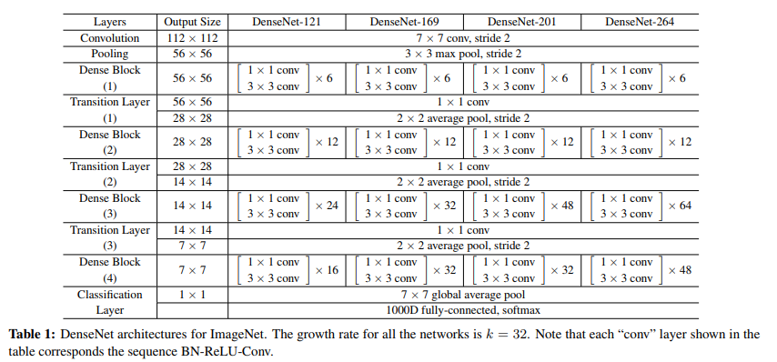

# densenet

arxiv:1608.06993

在ResNet中已经被证明有效的residual在densenet中被从另一个角度利用了起来。

回忆ResNet中，residual的使用，可以让网络浅层的特征直接进入深层进行学习。densenet则最大化的利用了residual的这一特点，将特征向每一层网络进行了传递。如下图：

这样设计的好处，每一层都能直接看到上层网络的特征，并能直接连接到最终的loss层获取到更新权重的梯度。这样，网络可以做到很深（201层）而仍然能够容易训练。同时，保证了网络性能的前提下，densenet的网络不需要像inception那样有很多的分支，也就是网络不用很宽。这样，参数量可以做到比较少。

同时，通过使用bottleneck和transition layer，在每一个dense block之间将channel降维以减少参数量。可以进一步减少参数量。

## 网络结构

