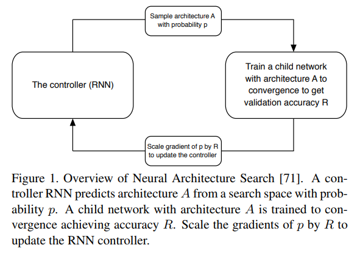
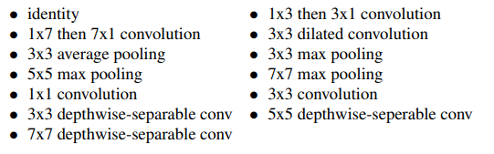
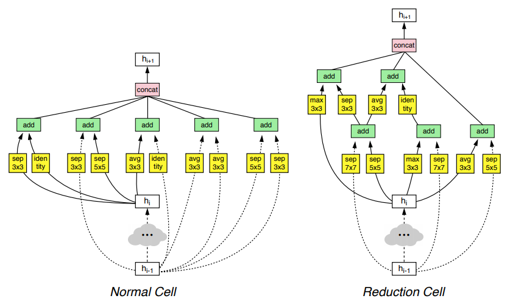
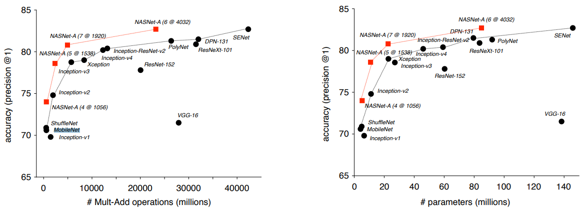

# nasnet

nasnet是Google Brain团队的作品，其主要思想是用强化学习的方式，从已知的网络结构出发，进行自动的组合筛选并验证，从而搜索到最优化的网络结构。流程如下图所示：

首先RNN控制器生成一个网络A，接着在一定的条件下训练这个网络A收敛并得到准确率R，再利用这个准确率R来产生梯度，去更新作为控制器的RNN。这样完成一个训练的循环过程。可以看到，这种模式与训练模型的模式如出一辙。

搜索的已知结构如下：

整个训练过程，在论文的介绍中，最终生成了两种效果比较好的网络结构：

需要注意的是，搜索的结构中，其实并没有residual的结构，但是整个系统通过不断的学习，仍然的到了类似residual的shortcut connection结构，从另一个方面也说明residual结构的高效。

另外，对于这种有一些比较难以理解的结构，作者尝试手动进行修改，网络性能并没有提高。

## 网络特点

nasnet的网络虽然有着难以理解的结构，但是在同等表现的模型中，参数量和运算量都是最小的。参考下图：

但是需要注意的是，整个项目对网络结构的搜索，涉及不同结构网络的训练过程，因此运算量极大。论文中指出，整个训练流程使用了500块GPU进行运算。