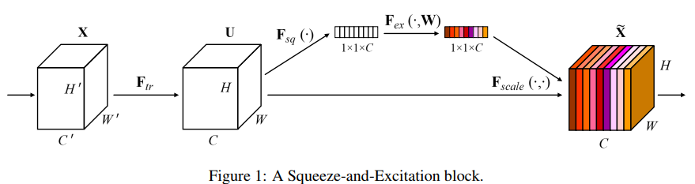
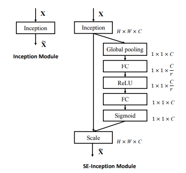
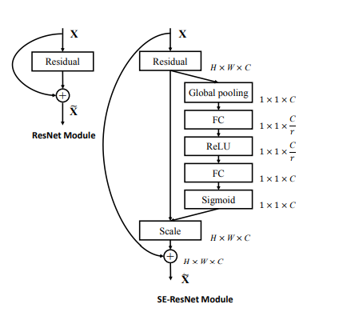

# se-net

arxiv:1709.01507

Squeeze-and-Excitation Networks，简称se-net。作者注意到，作为卷积神经网络核心的卷积功能，利用了不同的卷积核，对输入进行卷积并生成特征。在这个过程中，各卷积核是独立工作的。换言之，最后生成的特征是本层卷积核独立运算之后得到的。而作者认为，对应输出各个通道的各个卷积核，其重要程度应该是不一样的。因此作者设计了sequeeze和excitation两个操作来对卷积输出的特征进行权重的重新分配，通过学习的方式来自动获取到每个特征通道的重要程度，然后依照这个重要程度去增强有用的特征并抑制对当前任务用处不大的特征。让网络利用全局信息有选择的增强有益feature通道并抑制无用feature通道，从而能实现feature的通道自适应校准。

参考下图：

## sequeeze

sequeeze过程就是在对数据X进行卷积得到U之后，通过全局平均池化操作，对特征进行压缩，最终生成$1\times1\times C$的一个数据，这个数据每个元素的值大小可以看做是对应通道的特征的重要程度。
$$
z_c = F_{sq}(u_c) = \frac{1}{H\times W} \sum^H_{i=1}\sum^W_{j=1}u_c(i,j)
$$
同时，因为池化是针对整个特征图进行操作的，是特征的全局信息。所以可以避免避免由于卷积的感受野太小导致卷积核无法看到整个输入的信息。

## excition

已经取得了上述针对全局的特征池化信息，之后，作者以sigmoid函数处理通道的权重，再通过简单的加权乘法操作，就实现了通过特征的重要程度对特征进行重新组合的操作。
$$
\widetilde X_c=F_{scale}(u_c,s_c)=s_c\cdot u_c
$$
这里，为了降低模型的复杂度，提高模型泛化能力，在特征的处理上加了一层变换，先对特征权重进行降维，经过ReLU激活，再升维之后再进行sigmoid运算。
$$
s=F_{ex}(z,W)=\sigma(g(z,W))=\sigma(W_2\delta (W_1z))
$$
作为一个比较简单的模块，sequeeze-excetion（se）可以方便的加入到任何网络中。下图是加入了se的inception模块：

下面是加入了se的ResNet：

