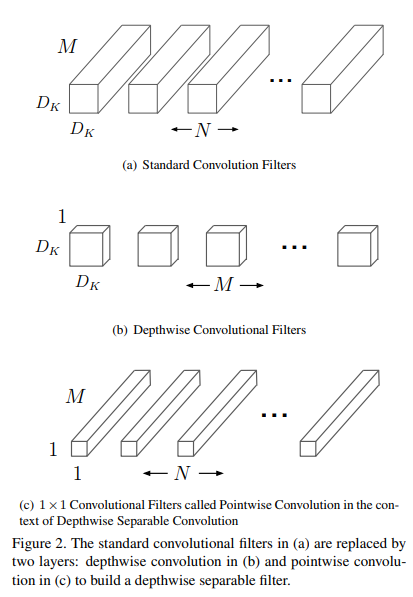
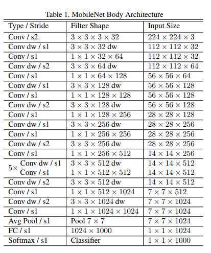
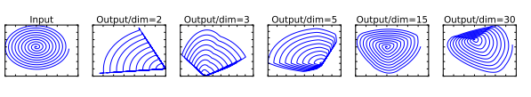
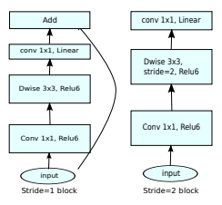
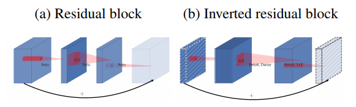
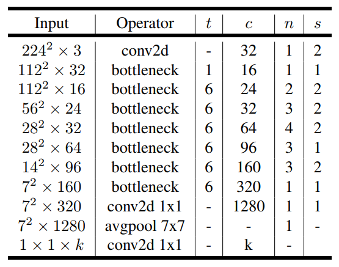

# MobileNet v1/v2

近些年，随着人工智能的发展，算力的提高，深度学习的模型向着越来越大，越来越复杂的方向发展，特别是ResNet提出之后，更深的网络的训练也不再那么的困难，网络深度更是突破了1000层。同时，inception类网络为代表的网络，也向着更宽的网络方向迈进。

很多的实验证明，在一定的条件下，参数越多，规模越大的模型确实拥有更好的性能。但是巨型网络带来的运算量也是巨大的。而现实应用中，很多场景下，设备运算能力是受各种条件限制的，如移动设备的功率等。

Google团队的深度可分离卷积及以此基础构建的MobileNet系列模型在一定程度上，取得了模型规模和性能的平衡，并提供了一些超参数可以根据不同的应用场景选择不同规模的模型。

## 深度可分离卷积

考虑传统卷积，假设使用stride1，适当的padding，则运算量为：
$$
D_K \cdot D_K \cdot M \cdot N \cdot D_F \cdot D_F
$$
其中 $D_K$$为卷积核尺寸，$$M,N$分别为输入输出通道数，$D_F$为特征图尺寸。这里只考虑正方形的情况，长宽不一致的情况也适用。

这里的卷积运算是三维的，也就是卷积核要在长宽和深度上对输入进行卷积，考虑多个卷积核，输出为多个通道，运算两还会进一步加大。

针对卷及运算，考虑如下的替代运算方式：

- 先在深度上对特征进行卷积，即不考虑输出channel，针对输入的每一个channel，使用一个$D_F$尺寸的卷积核进行卷积，仍然输出M个channel，对应于输入的M个channel。
- 针对上述输出的M个channel，使用1x1xM的卷积核N个，执行传统的卷积，这时，输出为N个channel。

上述过程运算量为(作为第二步卷积核尺寸的1被省略了)：
$$
D_K \cdot D_K \cdot M \cdot D_F \cdot D_F + M \cdot N \cdot D_F \cdot D_F
$$
对比原始的卷积定义，这里定义的深度可分离卷积的运算量计算可得：
$$
\frac{D_K \cdot D_K \cdot M \cdot D_F \cdot D_F + M \cdot N \cdot D_F \cdot D_F}{D_K \cdot D_K \cdot M \cdot N \cdot D_F \cdot D_F}=\frac{1}{N} + \frac{1}{D_K^2}
$$
MobileNetV1网络结构定义如下：

模型提供一个multipler超参数控制网络的层数和宽度等参数，用以适应不同场景的需求。

## Inverted Residuals and Linear Bottlenecks

Google研究人员猜测，激活函数ReLU虽然极大的加快了模型训练的速度，但是因为其本身是利用截断的操作直接丢掉了一些特征，因此对特征中携带的信息是有一定的损失的，特别是在输出的通道数比较低的时候。通过对数据进行降维之后经过ReLU激活再还原的方式，Google的研究人员证实了低维情况ReLU会造成特征的信息的较大损失：

为此，Google的研究人员提出了Inverted Residuals and Linear Bottlenecks，输入经过1x1的卷积升高维度，并进行几层深度可分离卷积和ReLU激活，再由1x1的卷积降低维度。但在低维度不再进行ReLU激活，也就是只进行线性变换。同时，参考传统的residual，在整个模块上添加residual的shortcut连接。整个网络不使用pooling的方式进行特征图尺寸缩减，只使用stride为2的卷积来替代pooling。考虑使用和不使用stride的情况，MobielNetV2有两种基本结构，带residual和不带residual：

之所以叫做inverted residual，是因为区别与传统的residual先降维再升维的方式，这里是先升维再降维的方式：

> 先升维度再降维度的一种解释是，根据纳什嵌入理论（Nash embedding theorem），高维空间中，特征纠缠减少，因此变的更加线性可分，利用ReLU之类的激活函数可以起到特征选择的作用。而降维是一种特征压缩和重组的过程，相当与对选择之后的特征进行了重新组合。

MobileNetV2的网络结构如下：

MobileNetV2同样提供了超参数用于控制模型规模。

