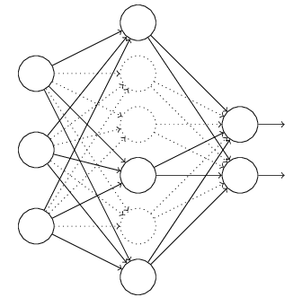

# 已被证明有效的基础模块

## 深度网络模型的设计

深度网络模型的设计一直以来都是热门的研究方向。随着算力和一些经验性指导意见的验证，模型设计也不再像早期那样，完全依靠经验推测和异想天开的方式。而arxiv1611.00847更是总结了深度网络的14种设计范式：

1. Architectural Structure follows the Application 
2. Proliferate Paths 
3. Strive for Simplicity 
4. Increase Symmetry 
5. Pyramid Shape 
6. Over-train 
7. Cover the Problem Space 
8. Incremental Feature Construction 
9. Normalize Layer Inputs 
10. Input Transition 
11. Available Resources Guide Layer Widths 
12. Summation Joining 
13. Down-sampling Transition
14. Maxout for Competition

但是深度学习的理论基础仍然不够扎实，模型设计也没有很通用性的指导原则。这里只提供一些已经在各种模型中被大量应用的基础模块，供模型设计的过程中参考。

## 基础模块

### 卷积

卷积神经网络的基础，通过共享参数的方式来减少网络的参数。

### pooling

max池化通过创造竞争条件，实现对特征中信息的选择。而average池化则将特征中的信息做平均处理，综合考虑一定区域内的所有特征。

### dropout
dropout通过随机丢弃一些神经元的输出来强制对模型进行正则化，提高模型的稀疏性，减少泛化错误。

>近来一些新的模块的发明和广泛使用，dropout在一些网络中已经渐渐被减少使用。但是对于一些比较大的模型，dropout仍然是一种有效的正则化手段。

### BatchNormal
BatchNormal通过一对可学习的参数$\gama, \beta$来对神经元的输出进行归一化处。通过建立数据破坏和重建的平衡来加速网络的训练。

>以上提到的是神经网络的基础模块，基本是每个神经网络必备的模块。

### 1x1 conv

因为1x1的卷积输入输出的长宽完全相同，因此经常被用来进行channel的增加和减少的情况，同时，1x1的卷积本身也可以增加参数，增大模型的规模。

> 很多文献资料中，出现1x1conv的结构被称为bottle neck结构。从网络整体结构上看，1x1出现的部分经常是网络结构最“窄”的部分。

### 特征组合

特征的组合，有直接进行算术运算和连接两种。连接的方式着眼于特征的选择，也就是不同的特征channel之间会有一个隐含的选择过程。算数运算如加法等操作则着眼与特征的融合，也就是参与运算的特征都会被考虑进来。

### conv classifier
传统分类网络设计通过卷积层输出特征，最后进入全连接层得到最终的分类结果。用卷积的方式替换全连接，运算量以及数学意义上都是等价的。但是好处在于卷积对输入参数的尺寸没有要求，只要不小于最低输入尺寸即可。再在后面加上一个全局pooling和dimision sequeeze（去掉为1的维度，注意与squeeze and excetion net中的sequeeze区别）。则模型可以适应任何尺寸的输入。

### residual
为解决深度网络退化问题加入的shortcut connection连接，目前已经是深度网络的基础模块之一。

### dense connection

通过将所有输入和输出直接连接的方式，加速梯度的传递和特征的学习。

> 需要注意的是，由于梯度的传递并不是同步的，short connection方式的梯度需要保存起来等待其他梯度计算完毕之后才能一起进行更新，因此如果训练框架没有做特别优化的话，residual方式的网络在训练的时候会特别的耗费内存，如果在GPU上训练则表现为耗费显存。同样大的显存，训练有residual的网络只能用比较小的batch size。
>
> 在densenet这种大量使用residual的网络上，这种显存耗费现象尤其突出。
>
> 针对residual的优化，不同的框架有不同的实现方式，具体请参考相关框架文档。

### inception

通过加入不同结构的卷积实现分支，在模型训练的过程中自动学习最合理的路径的方式。

### 深度可分离卷积

通过拆分深度卷积的方式来实现运算量的降低，满足算力受限场景的运算需求。

### Inverted residual

利用高维度对特征进行选择重组，在低维度不进行激活的一种设计。

### channel shuffle

shufflenet（arxiv:1707.01083）中针对mobilenet中，深度卷积输出的特征，各个通道是独立的情况，对通道数据进行shuffle，融合各个通道的数据进行处理。

### Squeeze-and-Excitation

通过对卷积输出的各个通道的数据进行权重的重新分配，抑制不重要的通道，强化重要的通道来强化对重要特征的学习。

### nasnet-block

google的研究人员通过深度强化学习的方式，由深度网络自行搜索出来的一种比较难理解但是效果很好的网络结构。

